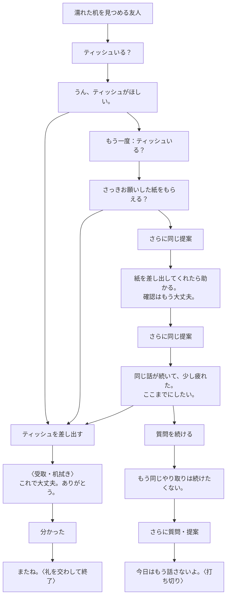
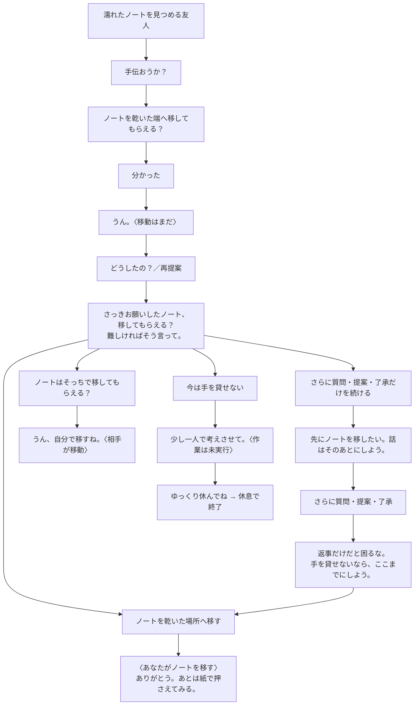
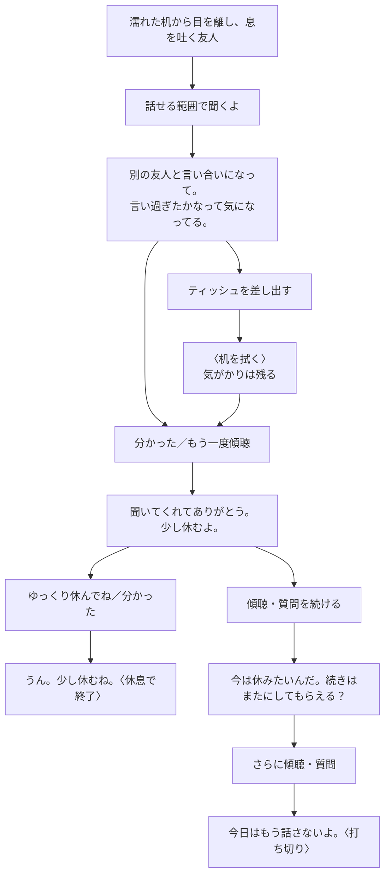

# コーヒー場面：繰り返しと会話の区切り

現行実装の代表経路です。台詞は抜粋。人物の事情・既知情報・プレイヤーの推測を分け、質問の正解順は設けません。紙やノートの実行は、提案・了承とは別です。

## 紙の提案：確認から催促へ

後から来た友人、片付けたい事情。質問せず直接差し出しても受け取ります。

途中に「大丈夫？」や観察を挟んでも、紙の提案の記憶は消えません。A/Cの片付け事情では「手伝おうか？」も同じ紙の話題です。ほかの質問同士を交互に繰り返す場合も、再回答の累積5回で境界を伝えます。1回の再質問では打ち切りません。

実際の受渡し・ノート移動/処置・初めての傾聴で状況が進めば、反復の段階を仕切り直します。物・知識・履歴は消しません。終了意思を伝える前なら謝罪で一度だけ確認のしつこさを和らげられます。謝罪だけで物は動きません。境界が「休みたい」「そっとしてほしい」の場合は、援助を押し通して再開できません。

## ノート：了承した依頼を放置する循環

見えているのは濡れたノート。大切さや背景は、本人が話すまで既知にしません。

了承後の実行なしの応答を記憶します。最初の寄り道で催促、2回目で作業への希望、3回目で終了意思を伝えます。観察・距離取りは質問連打に含めません。紙を直接差し出す経路も残り、相手の受取後の退避・手当て・机拭きは自動です。移動だけでは水気は取れず、処置後も染みは残ります。

「分かった」は物を動かしません。「手を貸せない」は断り、「そっちで移して」は委任です。終了意思の後も実際の作業で対応し直せますが、質問を2回続ければ打ち切ります。

## 傾聴後：悩みが残ったまま休む

嫌な出来事が重なった友人。紙より先に話を聞いても構いません。

休息の意思は、傾聴後の了解・二度目の傾聴・片付けと傾聴の後の援助提案で表明します。その後の了解・別れ・謝罪・距離取り・静かな観察で区切ります。机が濡れていれば濡れたまま終了し、悩みを解消したことにはしません。ノート事情も、机が乾いただけでは終了せず「じゃあ、またね」で締められます。

## 終わり方と範囲

- **礼を交わす**：片付けたい事情で机が乾き、了解または別れを返す。
- **休息**：本人の休息希望に最後の一言を返すなどして区切る。
- **自分から切り上げる**：「じゃあ、またね／では、失礼します」。初手でも可能。「そっとしておく」は途中の距離取りで、単独では場面を終了しない。
- **相手の打ち切り**：終了意思の後も2回問いかける。Bで紙を差し出し「そっとしておいてください」と断られた後も同様。単なる漠然とした援助の辞退とは区別する。

終了後は状態更新・履歴追加・自由入力の適用を停止。残った机・ノートや聞いた悩みに応じた結びと、履歴・やり直しを残します。勝敗や得点はありません。

同じ話題4回または再回答累積5回は暫定基準です。観察・未分類入力は反復圧力に加えません。新しい事実が増えたからといって毎回全記憶を消さず、物の変化と初回の傾聴でのみ段階を更新します。謝罪や責任の基本規則は維持しています。

未実装案：人物ごとの忍耐差、もっと自然な断り方のバリエーション。今回の仕組みが初見で伝わるかを先に観察します。

正本：[会話の境界](../prototypes/001-nadameyo/src/lib/coffeeConversation.js)・[既存の場面規則](../prototypes/001-nadameyo/src/lib/coffeeRules.js)・[事情別規則](../prototypes/001-nadameyo/src/lib/coffeeCircumstances.js)。実施済みの範囲と未確認事項は[STATUS](STATUS.md)。全順列の網羅図ではありません。
