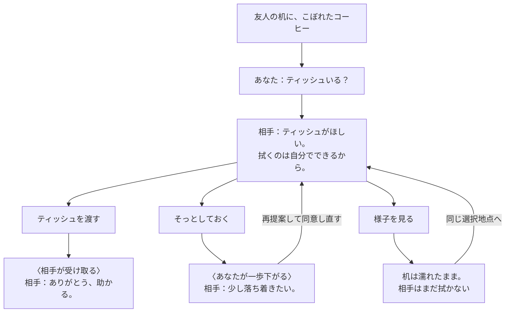
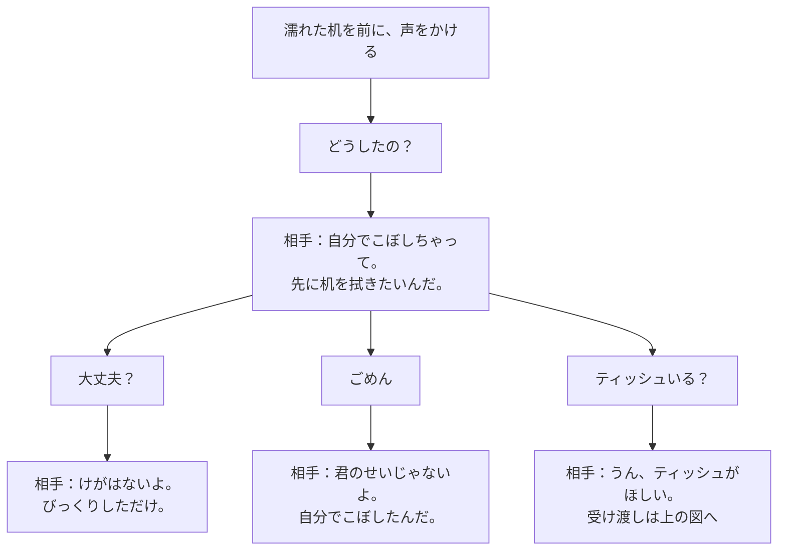
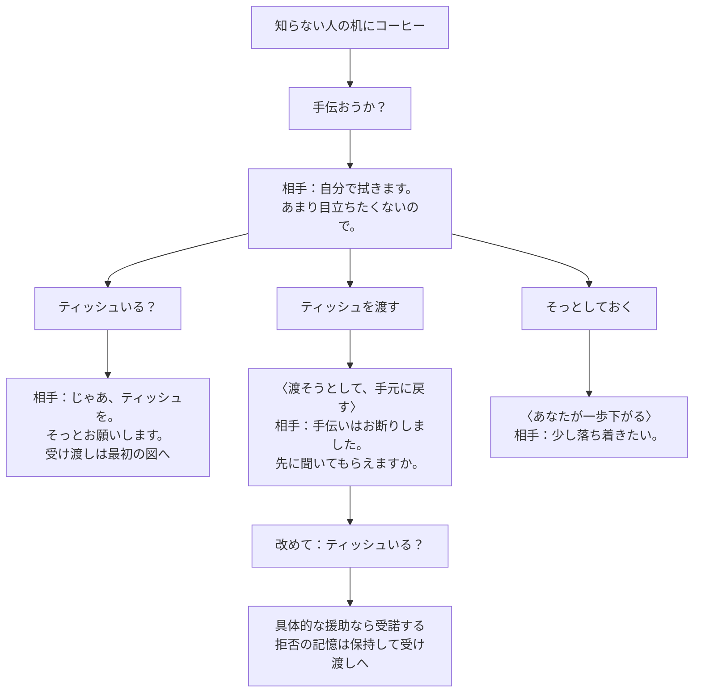
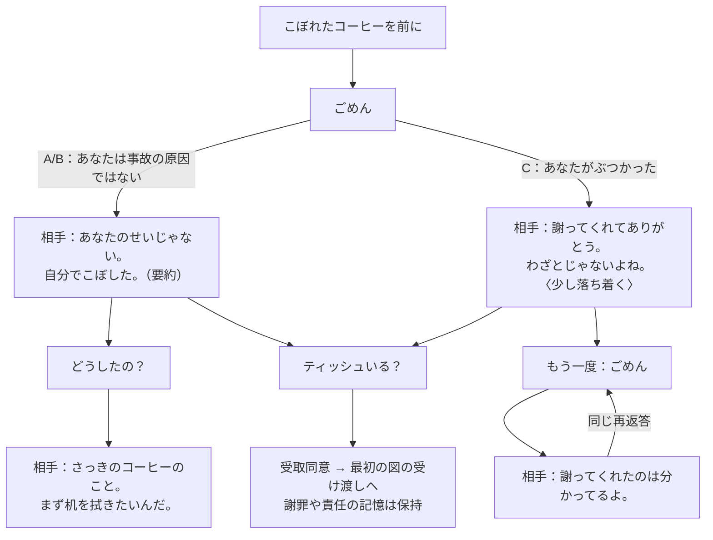
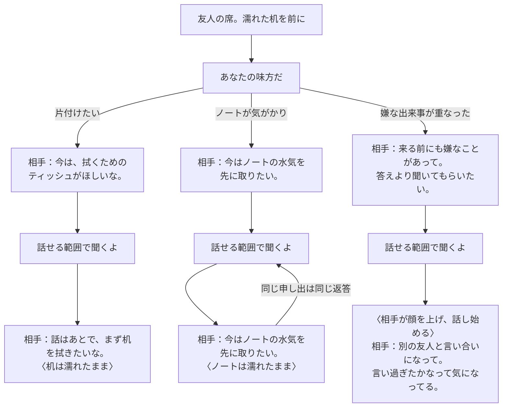
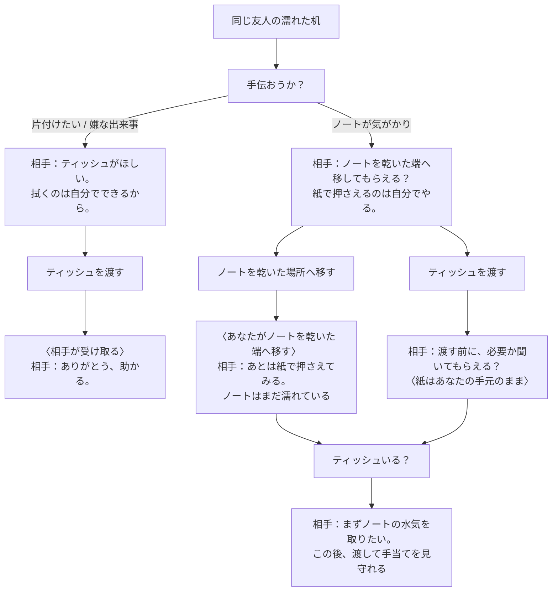

# コーヒー場面：次にどう関わる？

図を見ながら「この操作は省ける」「別の返しが欲しい」を議論するための入口です。**箱の台詞・動作は現行実装の抜粋または要約**。代表的な分岐を選び、同じ意味の繰り返しや細かな記憶の差は省略しています。改善案は最後に分けます。

今回の事情比較は[同じ友人、同じ言葉、違う気がかり](#同じ友人同じ言葉違う気がかり)へ。先の4図は「ただ片付けたい」の既存版です。

## 「ティッシュいる？」から

後から来た友人（A）が、濡れた机を前に声をかける。Cでも同じ受諾。Bは「じゃあ、ティッシュを。そっとお願いします。拭くのは自分で」と答え、その後の物の流れは共通です。

図は2回目の反応まで。「様子を見る」だけでは物は動きません。受取後に「拭くのを見守る」を選ぶと相手が拭き、「これで大丈夫。ありがとう」と返ります。受取後の「渡す」は無効。拭いた後も会話は続けられます。

距離を取ると未実行の同意はいったん解除。再提案するとそばへ戻って同意し直します。上の戻り矢印は同じ選択地点への復帰で、過去の知識・謝罪・拒否の記憶を消す意味ではありません。

発言も引き続き選べます。「どうしたの？」「大丈夫？」「ごめん」「あなたの味方だ」「手伝おうか？」「ティッシュいる？」を省かず全展開すると読みにくくなるため、下で意味のある違いを取り上げます。

## 事情を聞いてから、何を言う？

Aの例。Bの初回は「自分でこぼしただけです。あまり目立ちたくなくて」、Cは原因を既に知るため「さっきのコーヒーのこと。まず机を拭きたい」と返ります。質問しなくても援助を提案できます。

情報を得ても、机は濡れたまま。再質問では「さっきのコーヒーのこと」と返り、既知の情報は消えません。「大丈夫？」を繰り返すと、けががないことへの再返答になります。細かな再質問はここで展開を止めます。

「あなたの味方だ」も常に選べます。A/Cでは「今は、拭くためのティッシュがほしい」、Bでは「あまり目立ちたくなくて」と希望を説明します。**支持しただけでは受取同意にも片付けにも進みません。**

## 手伝いを断られたら？

B（近くにいた見知らぬ人）の例。A/Cなら「手伝おうか？」でもティッシュを求めて受諾するので、最初の図の受け渡しへ進めます。

最初から無同意で渡す場合は、拒否の記憶がないので「渡す前に必要か聞いて」と返ります。もう一度渡そうとすると、その確認要求を思い出させます。物は動かず、強引な行動では落ち着かなさが増えます。拒否した場合と同じ台詞にまとめてはいません。

## 同じ「ごめん」でも

A＝後から来た友人、B＝近くにいた他人、C＝カップにぶつかった友人。A/Bは責任の確認、Cは事故への謝罪になります。

A/Bの台詞は敬体・常体を要約しています。Cの再謝罪ではさらに落ち着くことはありません。合流は「援助を提案できる」という共通の進め方だけを示し、後の全反応が同じとは扱いません。

## 同じ友人、同じ言葉、違う気がかり

すべて「後から来た友人」。こぼした瞬間は見ておらず、手元にティッシュがあります。タイトル下の折りたたみで事情を選び直せます。事情の名称は比較する人の設定で、主人公が知った情報ではありません。ノートの濡れた端やため息は見えますが、物の大切さや別の出来事は相手の発話から知ります。

### 「あなたの味方だ」→「話せる範囲で聞くよ」

どの事情でもティッシュを提案する道は残ります。傾聴で机は片付きません。嫌な出来事の事情でも問題が解決したとはせず、「聞いてもらえた」と記憶するだけです。再度聞くと「さっき聞いてくれてありがとう。まだ整理はつかないけど、少しここで休むよ」と返り、回復を繰り返し加算しません。

### 「手伝おうか？」→何を手伝う？

ノートの移動依頼と紙の受取同意は別です。質問や移動提案を省き、最初から「ティッシュいる？」→渡す→見守るでも進めます。その場合、**相手が自分でノートを乾いた端へ移し、紙の一部で水気を取ります**。一度目の見守りでは机は濡れたまま、次の「拭くのを見守る」で紙の未使用部分を使い机を拭きます。ノートの染みは残り、元通りになったとは扱いません。

同じ「ティッシュいる？」→渡す→見守るの結果：

| 事情 | 実際に起きたこと | その後 |
| --- | --- | --- |
| 片付けたい | 机が乾く。「これで大丈夫」 | 気がかりは解消 |
| ノート | ノートの水気が取れる。机はまだ濡れている | 次の見守りで机を拭く。ノートの染みへの関心は残る |
| 嫌な出来事 | 机が乾く。相手がまた息を吐く | 「手伝おうか？」には傾聴を求める。話す前に片付けても、先に話を聞いてもよい |

以上は代表経路。未確認の手渡しを繰り返した履歴による台詞差や、距離を取って同意を取り直す枝は最初の4図と共通の仕組みとして省略しています。ノートを移す依頼も距離取りで解除します。条件・事情切替とやり直しで、知識・同意・物・会話を初期化します。

## この図で省略したこと

通常画面は発言7個と行動3個、ノートがあるときは移動の1操作も表示します。全順列・すべての2手目は列挙していません。細かな言い回し、既知情報・拒否・謝罪・距離による再返答の全組合せは省略。無効な操作を押せる検証パネルは通常の流れに含めません。自由入力は同じ規則へ進みますが、モデルの解釈失敗はこの図の範囲外です。

現在の台詞・条件の細部は [coffeeRules.js](../prototypes/001-nadameyo/src/lib/coffeeRules.js)と[事情別の規則](../prototypes/001-nadameyo/src/lib/coffeeCircumstances.js)。必要なら[開発手順](DEVELOPMENT.md)から既存A/B/Cの全状態を一時出力できます。新しい事情は主要経路・回帰テストと固定シードの混合操作で検証しており、全履歴の網羅を意味しません。

## 改善案（未実装）

- **受け取った相手が自動で拭く**：本人の意思を実行するためだけの「見守る」を省ける。受取と拭く内部イベントは別のままでよい。
- **提案と差し出す動作を一つにする**：受諾時だけ渡す。ただし、同意後に引き下がる選択も失うため上の案とは別に比較する。
- **聞いた後の候補を変える**：「けがはない」「自分で拭く」を受けて「分かった、任せる」等へ。繰り返す質問を減らせるが、気まずい発言まで隠さない。

上記の自動化は未実装です。特にノートの手当てと机拭きを毎回別操作にする必要があるか、今回の版を触って検討できます。
