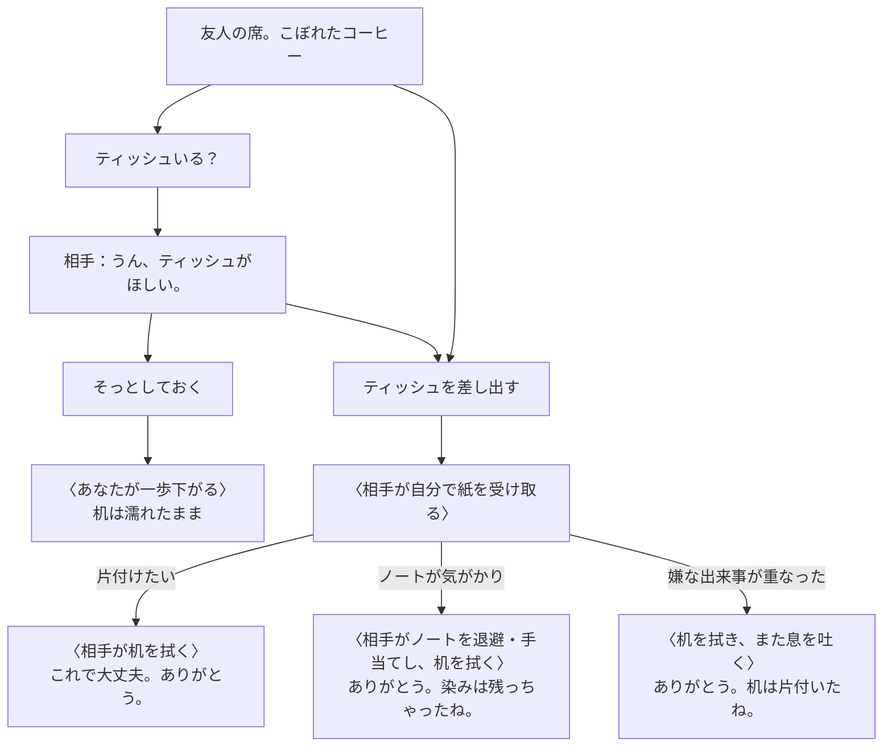
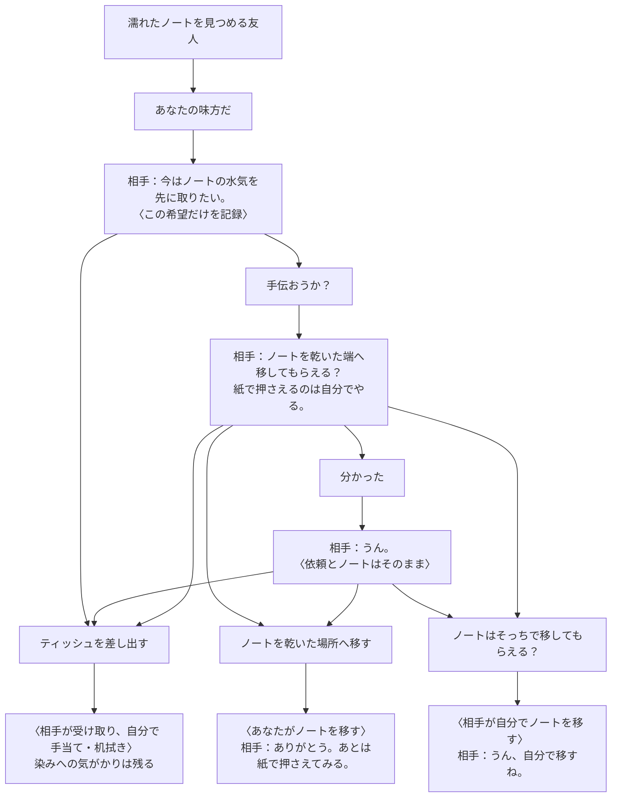
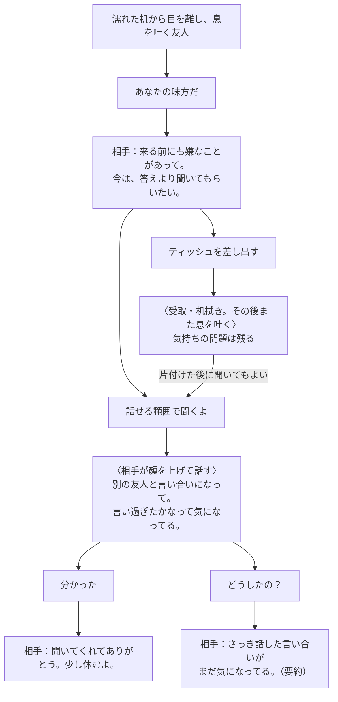

# コーヒー場面：次にどう関わる？

会話の自然さと操作の省略を議論するための代表図です。箱は現行実装の台詞・動作の抜粋または要約。全順列を列挙せず、意味が変わる分岐を示します。事情は下部の検証欄で指定でき、「事情を知らずに始める」から設定名を伏せた試遊もできます。

**本人の事情／主人公が見聞きした事実／プレイヤーの推測は別です。** 設定を知っていても、主人公の既知情報には入りません。一方、知らなくても紙を差し出せます。

## 紙を差し出す：確認の儀式を減らす

「差し出す」は、相手が受け取るか選べる援助です。「ティッシュいる？」を先に聞いてもよいですが、必須ではありません。話しただけでは物は移りません。

受取・ノート移動・水気取り・机拭きは別の内部イベントで、同じ操作に続いて相手が実行します。「見守る」を押す必要はありません。ノートは既に退避していれば動かし直さず、紙は1組の一部でノート、未使用部分で机を拭く簡略表現です。染みや別の出来事への関心は残ります。

紙の使用後は「差し出す」が無効になり、「分かった」で返せます。「様子を見る」は観察だけで、片付けを再実行しません。検証欄から差し出しを繰り返すと「もう使わせてもらったよ」。物は増えません。

B（他人）でも、漠然とした手伝いを断ることと紙の受取は別です。ただし、一度そっとしておいた後に再接近して差し出すと「今は、そっとしておいてください」。再び「ティッシュいる？」と話しかけて受諾を得れば受け取ります。拒否の履歴や物の状態を消して合流する意味ではありません。

## ノート：何を聞いたかで、次の選択が変わる

Aの友人。最初から見えるのは濡れた端だけで、大切さや背景はまだ知りません。「あなたの味方だ」は自由入力・検証で試せます（通常ボタンには出しません）。

移動だけでは水気は取れません。どちらからも紙を差し出す経路へ続けます。「分かった」は了承のみ。「ノートはそっちで移してもらえる？」は作業を本人へ委ねる応答で、主人公が実行したことにはしません。了承の繰り返しでも物は動きません。

希望は引用付きで記録します。「水気を取りたい」や「移してもらえる？」だけで「大事なノート」と推測して記録しません。「どうしたの？」や「大丈夫？」で本人が大切さを話したときに初めて知ります。再質問・片付け後も、その知識は消えません。

最初からノートを動かそうとすると「待って、触る前に聞いて。大事なノートなんだ」。紙の差し出しとは踏み込み方が違います。その後は手伝いを提案して移すことも、紙だけ差し出すこともできます。確認したいのは物への介入であり、唯一の質問順を要求してはいません。

## 話を聞く：片付けと気持ちを分ける

同じ友人でも、「片付けたい」なら傾聴には「話はあとで、まず机を拭きたいな」、ノートなら「水気を先に取りたい」と返します。以下は嫌な出来事が重なった場合です。

最初から「話せる範囲で聞くよ」でも本人が話し始めます。紙より先に聞いても構いません。話しただけでは机は乾きません。同じ傾聴の再選択は「さっき聞いてくれてありがとう」と返り、回復を加算しません。再質問でも、具体的に聞いた話を未開示へ巻き戻しません。

## 関係の違いと、図の省略範囲

| 同じ言葉 | 後から来た友人 / 他人 | カップにぶつかった友人 |
| --- | --- | --- |
| ごめん | 「君のせいじゃない / あなたのせいじゃありません」と原因を説明 | 「謝ってくれてありがとう」。初回だけ落ち着く |
| 再度のごめん | 原因を説明する。紙や机は変えない | 「謝ってくれたのは分かってるよ」。再加算しない |

通常画面では了解の返答を会話開始後に出し、ノート移動は物が見えるときだけ表示します。「味方だ」や事故に関与していない側の「ごめん」は通常ボタンから外し、自由入力・検証で扱えます。検証欄は全13操作を扱います。

細かな再返答・謝罪・距離・知識の全組合せは省略。合流は共通の操作へ進めるという意味で、履歴を消すものではありません。台詞と効果の正本は[共通規則](../prototypes/001-nadameyo/src/lib/coffeeRules.js)・[事情別規則](../prototypes/001-nadameyo/src/lib/coffeeCircumstances.js)、検証範囲は[STATUS](STATUS.md)、開発方法は[DEVELOPMENT](DEVELOPMENT.md)。

## 次に議論すること（未実装）

- 一連の手当ては番号付き動作列で順を示す。初見でも伝わるか。時間差の演出を足す前に確認し、操作待ちは戻さない。
- 了承と委任を分けた。「ノートはそっちで移してもらえる？」が意図を伝えるか、初見の人に確かめたい。
- ノートへの心配に「乾くまで待とう」と返す等の言葉が必要か。選択肢の総数を増やす前に観察する。
