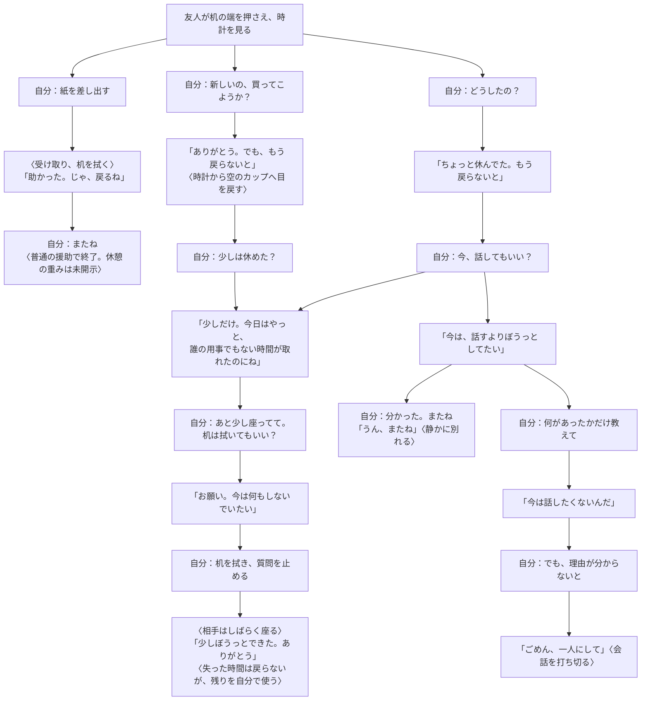
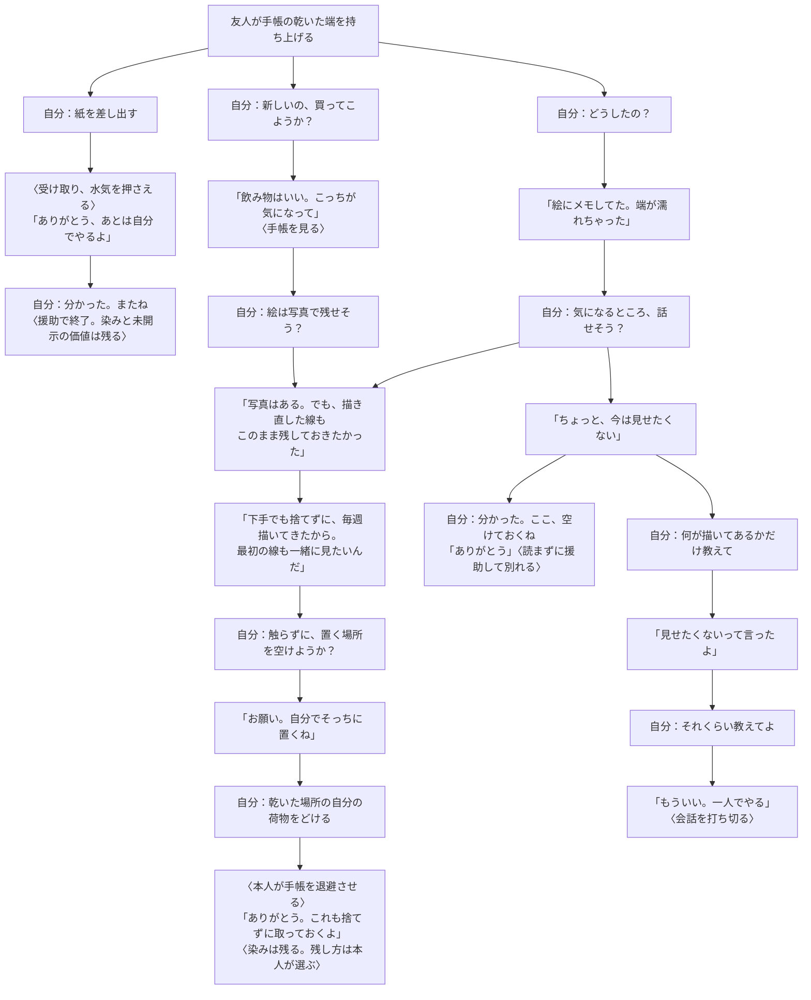
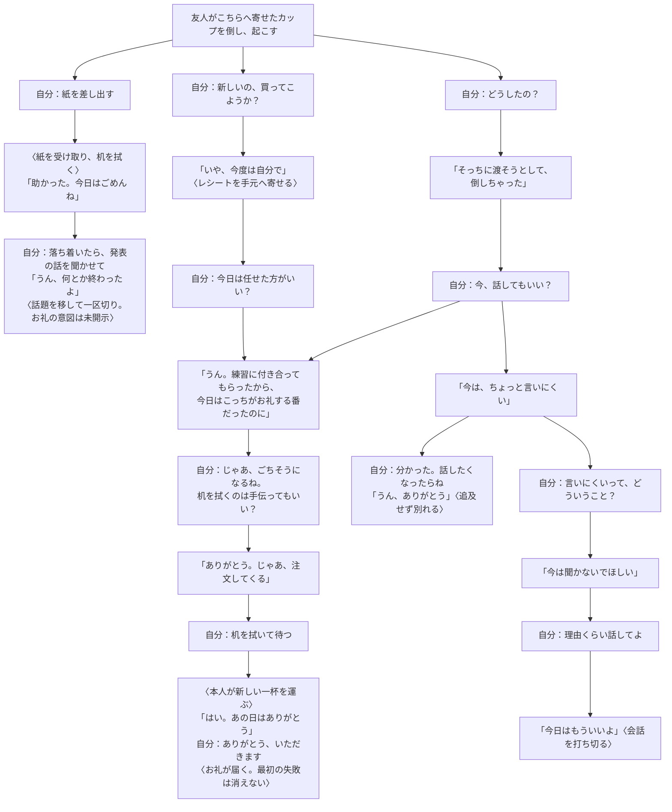

# コーヒーの意味が見え直す三案

**すべて未実装の設計候補。今回は推薦までで、実装の決定ではない。** 現行の関係条件A/B/Cや三事情とは別の案であり、[実装済みの分岐図](COFFEE_FLOW.md)は変更しない。思想は[設計思想](DESIGN_PHILOSOPHY.md)、背景を選び維持する方針は[開発資料](DEVELOPMENT.md#coffee-value-experiment)。

まず [A：時間](#time)、[B：物](#object)、[C：関係と行為](#reciprocity)の図を見比べ、最後に[比較・推薦](#recommendation)を読む。

## 共通の読み方

三案とも気軽に話せる友人同士で、相手自身がカップを倒した。主人公には紙があり、相手にも自分で対処する能力がある。助けを待つために動作を不自然に止めない。共通の入口候補は「どうしたの？」「ティッシュいる？」「新しいの、買ってこようか？」「今、話してもいい？」と、紙を差し出す行動・別れ。図はその一部の代表経路で、全操作の仕様ではない。

図では「自分：」が選択、かぎ括弧が相手の発話、〈 〉が実際の動作。援助の提案だけでは物を動かさない。核心が語られるのは一例で、質問回数による固定解放ではない。初期の手掛かりだけで背景を断定しない。

各図の二つの入口（善意のずれ／丁寧な問い）は、**図に書いた発言内容まで共有した後だけ**合流する。通常援助・話さない結末とは既知情報を統合しない。図で省略した操作や台詞を実装済みとみなさない。

## A：取り戻せない、自分だけの休憩

| 設計すること | 内容 |
| --- | --- |
| 場面・関係・初期知識 | 同じ建物で働く友人を休憩先のカフェで見かける。主人公は相手の仕事と顔を知るが、今日の休憩事情は知らない。相手は自分でカップを倒し、机の端を手持ちの薄いナプキンで押さえている |
| なぜここで飲むか | 職場では休憩中も声をかけられるため、昼休みの最後の10分だけ外へ出た。次の持ち場の開始時刻は動かせない |
| 大切なもの・背景・喪失 | 最近は同僚の相談や頼まれ事を優先し、自分の休憩を後回しにしていた。今日はやっと、誰の用事も引き受けず好きな一杯を飲むと決めた。その短い時間が片付けに変わった。飲み物の代金より「自分のために使えたはずの時間」が惜しい |
| 最初の説明・語りにくさ | 「ちょっと休んでた。もう戻らないと」。愚痴を言うために来たのではなく、話すと残り時間も使ってしまう。友人なら勤務の忙しさは分かるだろう、と省略することもある |
| 手掛かり | 買い直しの提案に時計を見る。紙を受け取ってもすぐ立とうとせず、椅子に座り直す。時間切れや単なる予定でも説明でき、これだけでは背景は分からない |
| 見え直し・その後の対応 | 時計とため息は「急いで片付けたい」だけでなく「休憩がまた用事で終わる」残念さにも見える。残り時間を尋ね、許可を得て机を拭く／もう質問せず静かに別れる。買い直しを撤回しても、失った時間は戻らない |

**現実性の点検：** 主人公にシフト変更や仕事の肩代わりをさせない。相手は最初から流れる液を押さえ、紙を渡せば自分でも片付けられる。会話は短い発話数個に留め、長い身の上話の間だけ時計が止まる構成にしない。勤務の説明は既知として繰り返さず、今日選びたかった休み方だけを語る。

### 会話案：片付けを急ぐことと、休憩を守ること

図の「やっと」だけを核心の説明完了にしない。希望があれば「職場だと休憩でも声をかけられるから。今日はここまで出てきた」と補えるが、詳しい日々を語らせることは結末の条件にしない。援助後に同じ丁寧な問いへ進むことも可能な案であり、紙を先に渡すと開示の機会を失う設計にはしない。

## B：上手な絵より、描いてきた跡

| 設計すること | 内容 |
| --- | --- |
| 場面・関係・初期知識 | 散歩のあとカフェで合流する友人。主人公は相手が最近スケッチを始めたことは知るが、ノートの使い方や価値は知らない。見えるのは開いた手帳と濡れたページの端。内容を勝手に読んだことにしない |
| なぜここで飲むか | 散歩で見た店先の絵に日付と色のメモを足す、週末の習慣。手帳を閉じようと伸ばした腕がカップに当たった |
| 大切なもの・背景・喪失 | 以前は下手な絵を捨てていたが、この一冊では消し直しや失敗も残し、毎週一枚続けてきた。最初の迷った線と今の線を並べて見ることが「続けられた自分」の手応え。画像保存や描き直しでは、同じ紙に重ねてきた跡は置き換わらない |
| 最初の説明・語りにくさ | 「さっきの絵にメモしてた。端が濡れちゃった」。作品として誇るほどではない、と感じていて、失敗した線まで惜しいとは少し言いにくい。趣味を始めた経緯を友人へ再説明しない |
| 手掛かり | カップよりページの端を見る。乾いた部分を持ち、水が広がらないよう傾ける。写真の提案には「写真は撮ってあるんだけど」。仕事の原本や借り物でもあり得るため、見ただけで思い出の品と断定しない |
| 見え直し・その後の対応 | 写真を断るのは保存を軽視するからではなく、残したいものが完成画像だけではないから。線を消さず本人の扱いに従って退避を手伝う／染みの良し悪しを勝手に評価せず、一緒に残す方法を考える |

**現実性の点検：** カフェで使う日常の手帳であり、厳重保管すべき貴重品を都合よく置いた設定にしない。相手は既に持ち上げて対処中で、主人公は乾いた場所を空ける・紙を差し出す役を担える。紙質に依存する復元術や、拭けば元通りという結果を約束しない。閉じる・こする・勝手に移す行為は、本人の指示なしに実行しない。

### 会話案：画像が残ることと、この一冊が残ること

「染みも思い出になる」と主人公が価値を上書きしない。図の本人の結論も一つの反応案で、必ず前向きに受け入れるとは固定しない。背景を知らず場所を空けても同じ援助は成立する。先に場所を空けた場合、後から同じ作業を繰り返させず、そのまま本人に扱いを委ねる。

## C：今日は、自分がお礼を渡したかった

| 設計すること | 内容 |
| --- | --- |
| 場面・関係・初期知識 | 相手に誘われカフェへ来た友人。主人公は先週、相手の発表練習を聞いたこと、発表は終わったこと、今日は相手が二人分を注文したことを知る。「今日はお礼をするつもり」はまだ聞いていない |
| なぜここで飲むか | 発表を終えた相手が、相談や練習をいつも頼む主人公へ一杯おごり、結果も自分から報告したかった。注文後、主人公へカップを寄せようとして倒した |
| 大切なもの・背景・喪失 | 日頃は主人公が段取りや助言を引き受けてくれる。今日は自分で店を選び、誘い、渡す側に回りたかった。奢りの金額や借りの清算ではなく、頼るだけではない自分からの働きかけが大切。すぐ主人公に買い直してもらうと、また世話をされる側に戻ったと感じる |
| 最初の説明・語りにくさ | 「そっちに渡そうとして、倒しちゃった」。お礼のつもりは渡すときに自然に言う予定で、失敗の弁明として宣言するのは照れくさい。発表練習そのものは共有済みで再開示しない |
| 手掛かり | 主人公側へ向けたカップ、自分で拾うレシート、買い直しに「今度は自分で」。遠慮・節約・責任感でも説明でき、お礼だとは断定できない |
| 見え直し・その後の対応 | 買い直しを断るのは援助全般の拒否ではなく、もてなす役を守りたいからかもしれない。片付けだけ引き受けて次の注文を委ねる／新しい一杯がなくてもお礼を受け取り、発表の話を本人のペースで聞く |

**現実性の点検：** こぼれたのは主人公へ渡す一杯で、相手の飲み物は無事。相手はカップを起こし、紙で広がりを止め始める。主人公は片付けの補助ができ、相手は自分で再注文できる。お礼のために必ず追加出費させず、主人公から金を押し付けたり、相手の支払いを勝手に済ませたりしない。親しい相手に「あなたとの相互性を…」と説明させず、「今日はこっちがお礼する番」と短く言わせる。

### 会話案：助けを断ることと、お礼を受け取ってほしいこと

深い関わりの別案は「誘ってくれたの、うれしい。今日はこのまま話さない？」→「うん、発表の話、聞いてもらおうかな」。本人がそれを選べば買い直さず、お礼を受け取って話を聞く結末も成立する。主人公の「買わなくていい」を本人の希望より優先する正解にはしない。

## 結末をどう検討するか

「トゥルーエンド」は設計上の仮称。将来アプリが観測できるのは作中の言葉・行動・相手の応答であり、プレイヤー本人のひらめきではない。

| 案 | 深い関わりの結末候補で観測できること | 残るもの |
| --- | --- | --- |
| 時間 | 本人が望む残りの過ごし方を確認し、同意された片付けを行う／質問を止め静かに別れる。相手が「少し休めた」と応じる | 失った休憩、職場の日常は戻らない |
| 物 | 残したい扱い方に従い、場所を空ける等の援助を実行。勝手な復元・評価をせず、本人が残し方を選ぶ | 染みや線の損傷は残る |
| 関係と行為 | 相手がお礼をする働きかけを受け取り、必要な補助だけ行う。買い直し・会話のどちらにするか本人の選択が尊重される | こぼした一杯や気まずさがなかったことにはならない |

どの対応も背景を知らずに選べる。開示の全回収を条件にせず、同じ援助を知識フラグの差だけで無価値にしない。一つの台詞ではなく、提案→本人の選択→実行/控える行動→応答のつながりを候補にする。普通の援助・話さない希望を尊重した別れも独立して意味のある終了で、失敗の格下エンドにしない。

「理解した」と認定する表示や数値はまだ設計しない。人間が実際に見え方を変えたかは、試遊後に任意で「最初のため息／断りが、今はどう見えるか」を聞いて確かめる。あらかじめ核心を教えるアンケートや、システムの成立条件との同一視は避ける。

## 比較・推薦

| 観点 | A：時間 | B：物 | C：関係と行為 |
| --- | --- | --- | --- |
| 背景・開示の自然さ | 短い休憩と省略が自然。長話には不向き | 日常の習慣として自然。手帳への価値観は個人差が大きい | 共有済みの練習から短く語れる。お礼の意図が最初から明白になりやすい |
| 見え直す瞬間 | 時計が「急ぎ」から「自分の時間を惜しむ」へ | 写真があっても惜しい線、というずれが明瞭 | 援助の拒否が「渡す側に立ちたい」へ変わる |
| 理解後の対応 | 話す/急いで解決するから、時間を使わせない援助へ | 保存方法の押し付けから、本人の扱いを支える援助へ | 代行から補助へ。お礼を受け取る行為が生まれる |
| 既存場面からの変更 | 小〜中：時間の手掛かり、本人の休息と机拭きの分担。実時間タイマーは不要 | 中：既存ノートを活用できるが、内容と置き場所・扱いの区別が必要 | 中〜大：二杯の所有・招待の既知情報・注文と受取の行為が必要 |

**推薦はA：時間。** 最小の物の追加で、善意の「買い直す」「話を聞く」が時間を奪うこともある、と対応を見直せる。紙を渡すだけでも役立つ現行の良さを残し、「片付ける速さ」以外の価値へ進める。

弱点は「忙しい人だから急ごう」で理解が止まりやすいことと、休憩の背景を説明するほど本人の休憩を奪う矛盾。「今日は誰の用事でもない時間が欲しかった」という短い開示と、援助後に座り直す姿で重みが伝わるかを先に読む試遊で確かめたい。時計だけの推測で背景を確定せず、発話の短縮や補足量はその結果で決める。Bは物への注意が視覚的に伝わりやすい対案、Cは主人公の役割そのものが見え直す対案として残す。

## 今回の確認範囲

背景→カフェにいる理由→事故→本人の初動→主人公の援助を通して点検し、説明の追加が必要な超常的な救済や深刻な悲劇は入れていない。各図は普通の援助、ずれからの理解、衝突しない理解、開示拒否の尊重/追及を代表経路として含む。相手が語る側と語らない側の条件の細分化、台詞が実際の人に自然か、結末の実装判定は未検証・未決。Mermaid三図を画像へ描画し、分岐・合流・日本語の見切れを目視確認した。文書リンクも確認済み。C案の未開示の希望を前提にした質問と、招待直後に帰る援助ルートを修正した。アプリの実装・テスト・lint・buildは行っていない。設計案の読み合わせが次の作業で、アプリへの導入は別途判断する。
