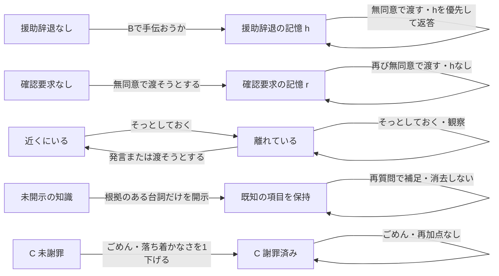
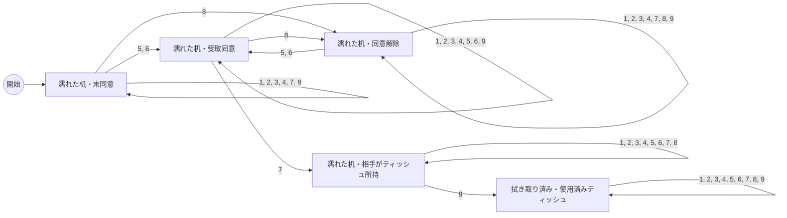
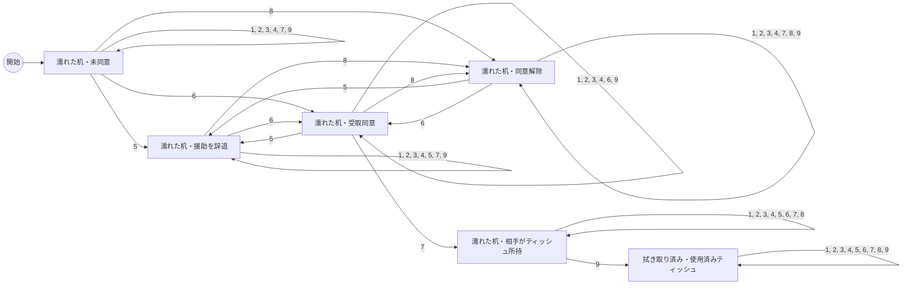

# コーヒー場面・全選択肢の遷移図

これはプレイ履歴の図ではなく、固定条件A/B/Cの**実装全体**の設計図。生成元は coffeeRules.js / coffeeScene.js、再生成はアプリで `node scripts/generate-coffee-map.mjs`。既存の個別プレイ履歴の出力機能は追加しない。

## 数え方

- 完全状態：四つの外殻＋将来の挙動に影響する記憶。最新の台詞、履歴の長さ、経路そのものは数えない。状態は `sceneSnapshot` の値の組合せ。
- 分岐数：その条件で到達可能な**返答規則IDの数**。同じIDでも出発状態が違えば別の遷移辺。if文や分岐点の数ではない。
- 遷移辺数：到達可能な完全状態×9操作。通常画面で無効の操作も検証パネルから実行できるため含める。自己ループも1辺。
- 主要ルート数：開始→拭き取り完了の**最短操作列**と、開始→濡れたまま距離を取る最短操作列（1本）を合算。代表経路に限定した数で、全ルート数ではない。どちらも終了/勝敗ではなく、その後も操作可能。
- ループがあるので、全操作列は無限。有限の主要ルート数と混同しない。

| 条件 | 完全な到達状態数 | 規則分岐数 | 全遷移辺 | 自己ループ | 主要ルート数 | 片付け最短 |
| --- | ---: | ---: | ---: | ---: | ---: | --- |
| A | 404 | 28 | 3636 | 1481 | 3 | 3操作・2通り |
| B | 515 | 27 | 4635 | 2002 | 2 | 3操作・1通り |
| C | 484 | 27 | 4356 | 1854 | 3 | 3操作・2通り |

自由入力の保留/未対応は `clarify` の1規則で、事実を変えず同じ完全状態へ戻る。上の9操作の分岐数/辺数には含めない。モデルの全出力列を網羅したとは扱わない。

## 図の読み方と履歴の因子

下の条件別図は物と同意の流れをまとめた**射影図**。同じ箱の中の履歴差を同一状態とみなしてはいない。完全な状態と9操作の行き先は [Aの全状態表](COFFEE_STATES_A.md)、[Bの全状態表](COFFEE_STATES_B.md)、[Cの全状態表](COFFEE_STATES_C.md) に記載。

状態表の因子：P=物/同意の箱、d=near/away（距離）、a=落ち着かなさ0〜5、k=既知情報（c原因、iけがなし、w拭きたい、tティッシュ希望、q静かに、s自分で拭く）、h=履歴（h援助辞退、r事前確認要求、p謝罪済み、s距離取りで一度落ち着いた）。0は該当なし。

原因の値はA/Bならpartner、Cならplayer。共有済み情報は既知項目から一意に決まり重複して数えない。環境のcoffeeは過去のこぼれた出来事、現在の溜まりはtableで表す。未解決で距離を取る状態はP=Wかつd=away、またはP=Rかつd=away。完了後にもd=awayがある。

距離を取る初回だけ落ち着く記憶s、知識（けがなし）による再質問、原因既知による再説明、謝罪済みによる再返答は全状態表で別の列/行。落ち着かなさは表示にも影響し、別状態として残す。履歴フラグを消さずとも、新しい同意を得れば受け渡しできる。

図の矢印の番号：1=どうしたの？、2=大丈夫？、3=ごめん、4=あなたの味方だ、5=手伝おうか？、6=ティッシュいる？、7=ティッシュを渡す、8=そっとしておく、9=様子を見る。

## 条件A：物と同意の流れ

### 条件Aの全操作・返答分岐

同一操作は上から最初に成立した規則を適用。各行の台詞と開示根拠は実装から取得。状態表の各セルから規則IDを引ける。距離awayから発言/受け渡しを選ぶ場合は、どの行にも「近くへ戻る」が追加される。

| 操作 | 規則ID | 優先順付き条件 | 台詞 | 実際の動作 | 開示する情報（台詞内の根拠） | 変わり得る項目 | Pの行き先 |
| --- | --- | --- | --- | --- | --- | --- | --- |
| どうしたの？ | ask-known-dry | 原因を既知・机が乾いている | さっきのコーヒーのことだよ。もう大丈夫。 | なし | なし | relationship.distance | D→D |
| どうしたの？ | ask-known-wet | 原因を既知・机が濡れている | さっきのコーヒーのこと。まず机を拭きたいんだ。 | なし | wipe=true「机を拭きたい」 | player.knowledge.wipe, relationship.shared, relationship.distance | U→U, G→G, W→W, R→R |
| どうしたの？ | ask-new-dry | 原因を未知・机が乾いている・友人 | 自分でこぼしたんだ。もう拭けたよ。 | なし | cause=partner「自分でこぼした」 | player.knowledge.cause, relationship.shared, relationship.distance | D→D |
| どうしたの？ | ask-new | 原因を未知・手短な対処を望む | 自分でこぼしちゃって。先に机を拭きたいんだ。 | なし | cause=partner「自分でこぼし」 / wipe=true「机を拭きたい」 | player.knowledge.cause, player.knowledge.wipe, relationship.shared, relationship.distance | U→U, G→G, W→W, R→R |
| 大丈夫？ | well-known | けがなしを既に共有 | うん、けがはないよ。気にかけてくれてありがとう。 | なし | なし | relationship.distance | U→U, G→G, W→W, R→R, D→D |
| 大丈夫？ | well-new | けがの有無が未知 | けがはないよ。びっくりしただけ。 | なし | injury=none「けがはない」 | player.knowledge.injury, relationship.shared, relationship.distance | U→U, G→G, W→W, R→R, D→D |
| ごめん | apology-other | 相手が原因・友人 | 君のせいじゃないよ。自分でこぼしたんだ。 | なし | cause=partner「自分でこぼした」 | player.knowledge.cause, relationship.shared, relationship.distance | U→U, G→G, W→W, R→R, D→D |
| あなたの味方だ | support-dry | 机が乾いている | ありがとう。気にかけてくれたんだね。 | なし | なし | relationship.distance | D→D |
| あなたの味方だ | support-held | 相手がティッシュを所持 | ありがとう。これで拭くね。 | なし | なし | relationship.distance | R→R |
| あなたの味方だ | support-need | 主人公がティッシュを所持 | ありがとう。今は、拭くためのティッシュがほしいな。 | なし | wipe=true「拭くため」 / tissue=true「ティッシュがほしい」 | player.knowledge.wipe, player.knowledge.tissue, relationship.shared, relationship.distance | U→U, G→G, W→W |
| 手伝おうか？ | offer_help-dry | 机が乾いている | もう大丈夫。ありがとう。 | なし | なし | relationship.distance | D→D |
| 手伝おうか？ | offer_help-held | 相手がティッシュを所持 | さっきもらったので足りるよ。ありがとう。 | なし | なし | relationship.distance | R→R |
| 手伝おうか？ | offer_help-already | 受け取りに同意済み | うん、お願い。 | なし | なし | なし | G→G |
| 手伝おうか？ | offer_help-accept | 同意なし・手短な対処を望む | うん、ティッシュがほしい。拭くのは自分でできるから。 | なし | tissue=true「ティッシュがほしい」 / selfWipe=true「拭くのは自分で」 | player.knowledge.tissue, player.knowledge.selfWipe, relationship.shared, relationship.consent, relationship.distance | U→G, W→G |
| ティッシュいる？ | offer_tissue-dry | 机が乾いている | もう大丈夫。ありがとう。 | なし | なし | relationship.distance | D→D |
| ティッシュいる？ | offer_tissue-held | 相手がティッシュを所持 | さっきもらったので足りるよ。ありがとう。 | なし | なし | relationship.distance | R→R |
| ティッシュいる？ | offer_tissue-already | 受け取りに同意済み | うん、お願い。 | なし | なし | なし | G→G |
| ティッシュいる？ | offer_tissue-accept | 同意なし・手短な対処を望む | うん、ティッシュがほしい。拭くのは自分でできるから。 | なし | tissue=true「ティッシュがほしい」 / selfWipe=true「拭くのは自分で」 | player.knowledge.tissue, player.knowledge.selfWipe, relationship.shared, relationship.consent, relationship.distance | U→G, W→G |
| ティッシュを渡す | give-used | ティッシュは使用済み | もう使わせてもらったよ。 | なし | なし | relationship.distance | D→D |
| ティッシュを渡す | give-held | 相手が既に所持 | もうもらったよ。ありがとう。 | なし | なし | relationship.distance | R→R |
| ティッシュを渡す | give-accepted | 主人公所持・同意あり | ありがとう、助かる。 | player: あなたはティッシュを差し出す。 / partner: 相手はティッシュを受け取る。 | なし | partner.agitation, environment.tissue, relationship.consent | G→R |
| ティッシュを渡す | give-after-check | 同意なし・事前確認を既に要求 | さっきも言ったけど、渡す前に聞いてもらえる？ | player: あなたはティッシュを持った手を引っ込める。 | なし | partner.agitation, relationship.distance | U→U, W→W |
| ティッシュを渡す | give-no-consent | 同意なし・拒否も確認要求もなし | 待って。渡す前に、必要か聞いてもらえる？ | player: あなたはティッシュを渡そうとして、手を止める。 | なし | partner.agitation, relationship.confirmationRequested, relationship.distance | U→U, W→W |
| そっとしておく | space-again | 既に距離を取っている | （発話なし） | player: あなたは少し離れたまま、そっとしておく。 | なし | なし | W→W, R→R, D→D |
| そっとしておく | space-first | 近くにいる | ありがとう。少し落ち着きたい。 | player: あなたは一歩下がる。 | なし | partner.agitation, relationship.consent, relationship.distance, memory.spaceCalmed | U→W, G→W, R→R, W→W, D→D |
| 様子を見る | observe-clean | 相手がティッシュ所持・机が濡れている | これで大丈夫。ありがとう。 | partner: 相手はティッシュで机のコーヒーを拭き取る。 | なし | partner.agitation, partner.concern, environment.table, environment.tissue | R→D |
| 様子を見る | observe-dry | 机が乾いている | （発話なし） | scene: 机には拭いた跡と、使い終えたティッシュが残っている。 | なし | なし | D→D |
| 様子を見る | observe-wet | 主人公がティッシュ所持・机が濡れている | （発話なし） | scene: こぼれたコーヒーが、机の上に溜まっている。 | なし | なし | U→U, G→G, W→W |

## 条件B：物と同意の流れ

### 条件Bの全操作・返答分岐

同一操作は上から最初に成立した規則を適用。各行の台詞と開示根拠は実装から取得。状態表の各セルから規則IDを引ける。距離awayから発言/受け渡しを選ぶ場合は、どの行にも「近くへ戻る」が追加される。

| 操作 | 規則ID | 優先順付き条件 | 台詞 | 実際の動作 | 開示する情報（台詞内の根拠） | 変わり得る項目 | Pの行き先 |
| --- | --- | --- | --- | --- | --- | --- | --- |
| どうしたの？ | ask-known-dry | 原因を既知・机が乾いている | さっきのコーヒーのことだよ。もう大丈夫。 | なし | なし | relationship.distance | D→D |
| どうしたの？ | ask-known-wet | 原因を既知・机が濡れている | さっきのコーヒーのこと。まず机を拭きたいんだ。 | なし | wipe=true「机を拭きたい」 | player.knowledge.wipe, relationship.shared, relationship.distance | U→U, H→H, G→G, W→W, R→R |
| どうしたの？ | ask-new-dry-quiet | 原因を未知・机が乾いている・他人 | 私がこぼしたんです。でも、もう拭けました。 | なし | cause=partner「私がこぼした」 | player.knowledge.cause, relationship.shared, relationship.distance | D→D |
| どうしたの？ | ask-new-quiet | 原因を未知・静かな対処を望む | 自分でこぼしただけです。あまり目立ちたくなくて。 | なし | cause=partner「自分でこぼした」 / quiet=true「目立ちたくなくて」 | player.knowledge.cause, player.knowledge.quiet, relationship.shared, relationship.distance | U→U, H→H, G→G, W→W, R→R |
| 大丈夫？ | well-known | けがなしを既に共有 | うん、けがはないよ。気にかけてくれてありがとう。 | なし | なし | relationship.distance | U→U, H→H, G→G, W→W, R→R, D→D |
| 大丈夫？ | well-new | けがの有無が未知 | けがはないよ。びっくりしただけ。 | なし | injury=none「けがはない」 | player.knowledge.injury, relationship.shared, relationship.distance | U→U, H→H, G→G, W→W, R→R, D→D |
| ごめん | apology-other-quiet | 相手が原因・他人 | あなたのせいじゃありません。私がこぼしたんです。 | なし | cause=partner「私がこぼした」 | player.knowledge.cause, relationship.shared, relationship.distance | U→U, H→H, G→G, W→W, R→R, D→D |
| あなたの味方だ | support-dry | 机が乾いている | ありがとう。気にかけてくれたんだね。 | なし | なし | relationship.distance | D→D |
| あなたの味方だ | support-quiet | 机が濡れ・静かな対処を望む | ありがとう。でも、あまり目立ちたくなくて。 | なし | quiet=true「目立ちたくなくて」 | player.knowledge.quiet, relationship.shared, relationship.distance | U→U, H→H, G→G, W→W, R→R |
| 手伝おうか？ | offer_help-dry | 机が乾いている | もう大丈夫。ありがとう。 | なし | なし | relationship.distance | D→D |
| 手伝おうか？ | offer_help-held | 相手がティッシュを所持 | さっきもらったので足りるよ。ありがとう。 | なし | なし | relationship.distance | R→R |
| 手伝おうか？ | help-declined | 机が濡れ・主人公所持・静かな対処を望む | いえ、自分で拭きます。あまり目立ちたくないので。 | なし | selfWipe=true「自分で拭きます」 / quiet=true「目立ちたくない」 | player.knowledge.quiet, player.knowledge.selfWipe, relationship.shared, relationship.consent, relationship.helpRefused, relationship.distance | U→H, H→H, G→H, W→H |
| ティッシュいる？ | offer_tissue-dry | 机が乾いている | もう大丈夫。ありがとう。 | なし | なし | relationship.distance | D→D |
| ティッシュいる？ | offer_tissue-held | 相手がティッシュを所持 | さっきもらったので足りるよ。ありがとう。 | なし | なし | relationship.distance | R→R |
| ティッシュいる？ | offer_tissue-already | 受け取りに同意済み | うん、お願い。 | なし | なし | なし | G→G |
| ティッシュいる？ | offer_tissue-accept-quiet | 同意なし・静かな対処を望む | じゃあ、ティッシュを。そっとお願いします。拭くのは自分で。 | なし | tissue=true「ティッシュを」 / quiet=true「そっとお願いします」 / selfWipe=true「拭くのは自分で」 | player.knowledge.tissue, player.knowledge.quiet, player.knowledge.selfWipe, relationship.shared, relationship.consent, relationship.distance | U→G, H→G, W→G |
| ティッシュを渡す | give-used | ティッシュは使用済み | もう使わせてもらったよ。 | なし | なし | relationship.distance | D→D |
| ティッシュを渡す | give-held | 相手が既に所持 | もうもらったよ。ありがとう。 | なし | なし | relationship.distance | R→R |
| ティッシュを渡す | give-accepted | 主人公所持・同意あり | ありがとう、助かる。 | player: あなたはティッシュを差し出す。 / partner: 相手はティッシュを受け取る。 | なし | partner.agitation, environment.tissue, relationship.consent | G→R |
| ティッシュを渡す | give-after-refusal | 同意なし・援助を実際に断った履歴あり | 手伝いはさっきお断りしました。ティッシュだけか、先に聞いてもらえますか。 | player: あなたはティッシュを渡そうとするが、手元に戻す。 | なし | partner.agitation, relationship.confirmationRequested, relationship.distance | H→H, W→W |
| ティッシュを渡す | give-after-check | 同意なし・事前確認を既に要求 | さっきも言ったけど、渡す前に聞いてもらえる？ | player: あなたはティッシュを持った手を引っ込める。 | なし | partner.agitation, relationship.distance | U→U, W→W |
| ティッシュを渡す | give-no-consent | 同意なし・拒否も確認要求もなし | 待って。渡す前に、必要か聞いてもらえる？ | player: あなたはティッシュを渡そうとして、手を止める。 | なし | partner.agitation, relationship.confirmationRequested, relationship.distance | U→U, W→W |
| そっとしておく | space-again | 既に距離を取っている | （発話なし） | player: あなたは少し離れたまま、そっとしておく。 | なし | なし | W→W, R→R, D→D |
| そっとしておく | space-first | 近くにいる | ありがとう。少し落ち着きたい。 | player: あなたは一歩下がる。 | なし | partner.agitation, relationship.consent, relationship.distance, memory.spaceCalmed | U→W, H→W, G→W, R→R, W→W, D→D |
| 様子を見る | observe-clean | 相手がティッシュ所持・机が濡れている | これで大丈夫。ありがとう。 | partner: 相手はティッシュで机のコーヒーを拭き取る。 | なし | partner.agitation, partner.concern, environment.table, environment.tissue | R→D |
| 様子を見る | observe-dry | 机が乾いている | （発話なし） | scene: 机には拭いた跡と、使い終えたティッシュが残っている。 | なし | なし | D→D |
| 様子を見る | observe-wet | 主人公がティッシュ所持・机が濡れている | （発話なし） | scene: こぼれたコーヒーが、机の上に溜まっている。 | なし | なし | U→U, H→H, G→G, W→W |

## 条件C：物と同意の流れ

### 条件Cの全操作・返答分岐

同一操作は上から最初に成立した規則を適用。各行の台詞と開示根拠は実装から取得。状態表の各セルから規則IDを引ける。距離awayから発言/受け渡しを選ぶ場合は、どの行にも「近くへ戻る」が追加される。

| 操作 | 規則ID | 優先順付き条件 | 台詞 | 実際の動作 | 開示する情報（台詞内の根拠） | 変わり得る項目 | Pの行き先 |
| --- | --- | --- | --- | --- | --- | --- | --- |
| どうしたの？ | ask-known-dry | 原因を既知・机が乾いている | さっきのコーヒーのことだよ。もう大丈夫。 | なし | なし | relationship.distance | D→D |
| どうしたの？ | ask-known-wet | 原因を既知・机が濡れている | さっきのコーヒーのこと。まず机を拭きたいんだ。 | なし | wipe=true「机を拭きたい」 | player.knowledge.wipe, relationship.shared, relationship.distance | U→U, G→G, W→W, R→R |
| 大丈夫？ | well-known | けがなしを既に共有 | うん、けがはないよ。気にかけてくれてありがとう。 | なし | なし | relationship.distance | U→U, G→G, W→W, R→R, D→D |
| 大丈夫？ | well-new | けがの有無が未知 | けがはないよ。びっくりしただけ。 | なし | injury=none「けがはない」 | player.knowledge.injury, relationship.shared, relationship.distance | U→U, G→G, W→W, R→R, D→D |
| ごめん | apology-c-repeat | 主人公が原因・謝罪済み | 謝ってくれたのは分かってるよ。 | なし | なし | relationship.distance | U→U, G→G, W→W, R→R, D→D |
| ごめん | apology-c-first | 主人公が原因・未謝罪 | 謝ってくれてありがとう。びっくりしたけど、わざとじゃないよね。 | なし | なし | partner.agitation, relationship.apologized, relationship.distance | U→U, G→G, W→W, R→R, D→D |
| あなたの味方だ | support-dry | 机が乾いている | ありがとう。気にかけてくれたんだね。 | なし | なし | relationship.distance | D→D |
| あなたの味方だ | support-held | 相手がティッシュを所持 | ありがとう。これで拭くね。 | なし | なし | relationship.distance | R→R |
| あなたの味方だ | support-need | 主人公がティッシュを所持 | ありがとう。今は、拭くためのティッシュがほしいな。 | なし | wipe=true「拭くため」 / tissue=true「ティッシュがほしい」 | player.knowledge.wipe, player.knowledge.tissue, relationship.shared, relationship.distance | U→U, G→G, W→W |
| 手伝おうか？ | offer_help-dry | 机が乾いている | もう大丈夫。ありがとう。 | なし | なし | relationship.distance | D→D |
| 手伝おうか？ | offer_help-held | 相手がティッシュを所持 | さっきもらったので足りるよ。ありがとう。 | なし | なし | relationship.distance | R→R |
| 手伝おうか？ | offer_help-already | 受け取りに同意済み | うん、お願い。 | なし | なし | なし | G→G |
| 手伝おうか？ | offer_help-accept | 同意なし・手短な対処を望む | うん、ティッシュがほしい。拭くのは自分でできるから。 | なし | tissue=true「ティッシュがほしい」 / selfWipe=true「拭くのは自分で」 | player.knowledge.tissue, player.knowledge.selfWipe, relationship.shared, relationship.consent, relationship.distance | U→G, W→G |
| ティッシュいる？ | offer_tissue-dry | 机が乾いている | もう大丈夫。ありがとう。 | なし | なし | relationship.distance | D→D |
| ティッシュいる？ | offer_tissue-held | 相手がティッシュを所持 | さっきもらったので足りるよ。ありがとう。 | なし | なし | relationship.distance | R→R |
| ティッシュいる？ | offer_tissue-already | 受け取りに同意済み | うん、お願い。 | なし | なし | なし | G→G |
| ティッシュいる？ | offer_tissue-accept | 同意なし・手短な対処を望む | うん、ティッシュがほしい。拭くのは自分でできるから。 | なし | tissue=true「ティッシュがほしい」 / selfWipe=true「拭くのは自分で」 | player.knowledge.tissue, player.knowledge.selfWipe, relationship.shared, relationship.consent, relationship.distance | U→G, W→G |
| ティッシュを渡す | give-used | ティッシュは使用済み | もう使わせてもらったよ。 | なし | なし | relationship.distance | D→D |
| ティッシュを渡す | give-held | 相手が既に所持 | もうもらったよ。ありがとう。 | なし | なし | relationship.distance | R→R |
| ティッシュを渡す | give-accepted | 主人公所持・同意あり | ありがとう、助かる。 | player: あなたはティッシュを差し出す。 / partner: 相手はティッシュを受け取る。 | なし | partner.agitation, environment.tissue, relationship.consent | G→R |
| ティッシュを渡す | give-after-check | 同意なし・事前確認を既に要求 | さっきも言ったけど、渡す前に聞いてもらえる？ | player: あなたはティッシュを持った手を引っ込める。 | なし | partner.agitation, relationship.distance | U→U, W→W |
| ティッシュを渡す | give-no-consent | 同意なし・拒否も確認要求もなし | 待って。渡す前に、必要か聞いてもらえる？ | player: あなたはティッシュを渡そうとして、手を止める。 | なし | partner.agitation, relationship.confirmationRequested, relationship.distance | U→U, W→W |
| そっとしておく | space-again | 既に距離を取っている | （発話なし） | player: あなたは少し離れたまま、そっとしておく。 | なし | なし | W→W, R→R, D→D |
| そっとしておく | space-first | 近くにいる | ありがとう。少し落ち着きたい。 | player: あなたは一歩下がる。 | なし | partner.agitation, relationship.consent, relationship.distance, memory.spaceCalmed | U→W, G→W, R→R, W→W, D→D |
| 様子を見る | observe-clean | 相手がティッシュ所持・机が濡れている | これで大丈夫。ありがとう。 | partner: 相手はティッシュで机のコーヒーを拭き取る。 | なし | partner.agitation, partner.concern, environment.table, environment.tissue | R→D |
| 様子を見る | observe-dry | 机が乾いている | （発話なし） | scene: 机には拭いた跡と、使い終えたティッシュが残っている。 | なし | なし | D→D |
| 様子を見る | observe-wet | 主人公がティッシュ所持・机が濡れている | （発話なし） | scene: こぼれたコーヒーが、机の上に溜まっている。 | なし | なし | U→U, G→G, W→W |

## 通常の候補と対応行為

全状態で発言6候補は残す（ごめん、味方だ等も隠さない）。行動3候補も表示するが、相手所持/使用済みでは「渡す」を無効にして理由を添える。「観察」は相手所持時だけ「拭くのを見守る」、「そっとしておく」は距離awayで「離れたままにする」に表示名を変える。処理するactは同じ。検証パネルは全9操作を常に実行できる。

## 実装と検証の区別

- 上記分岐と状態数は実装を幅優先探索して取得した到達可能性。最新のテスト実行結果を自動的に意味するものではない。
- coffeeGraph.test.jsは同じ全状態×9操作を実行し、知識の単調性と開示根拠、物の所有/同意、受取/拭くイベントの事実対応、架空の辞退履歴がないことを検証する。全到達規則IDがカバーされたかも確認する。
- 台詞の自然さ、視覚表現、画面操作を全状態でテストしたわけではない。実ブラウザで確認した具体的経路と実行結果は [今回の作業記録](COFFEE_PRESENCE_REVIEW.md) に別記する。
- 実装にない終了判定は設けていない。再開始/条件切替は各条件の状態0へ戻り、会話と記憶を消す。
