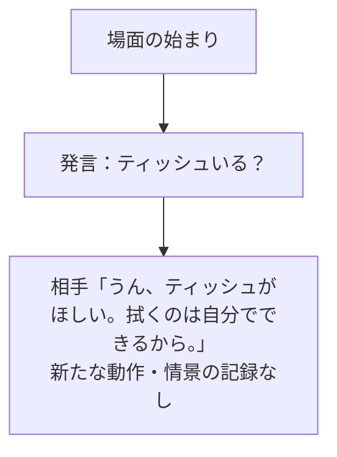
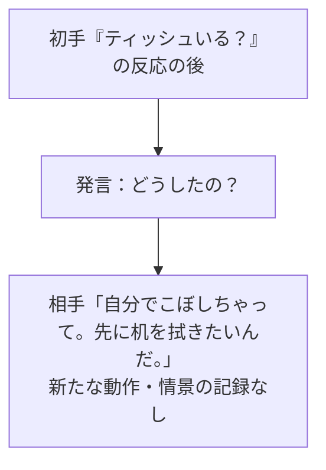
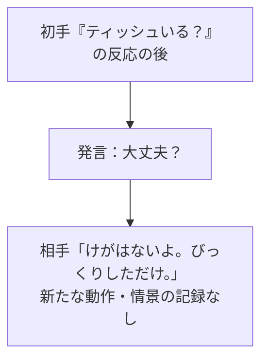
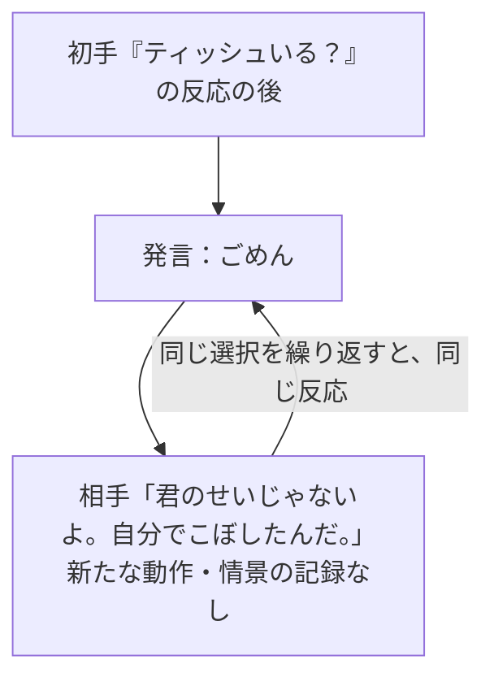
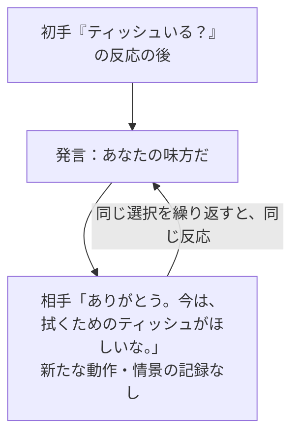
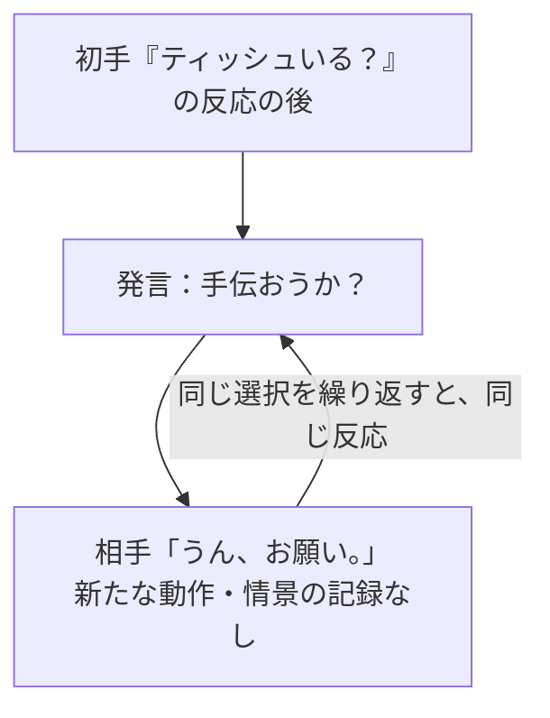
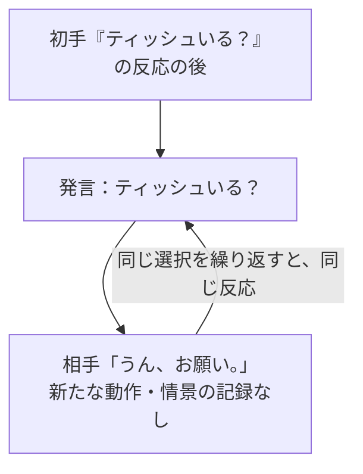
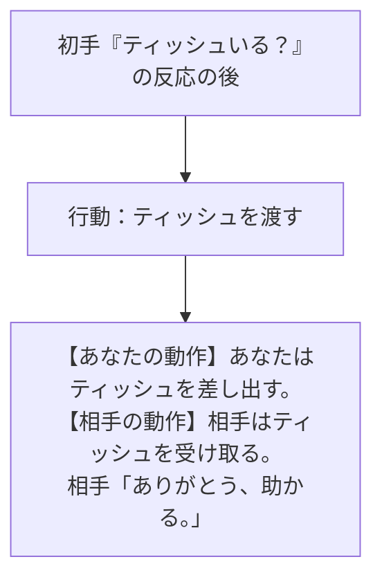
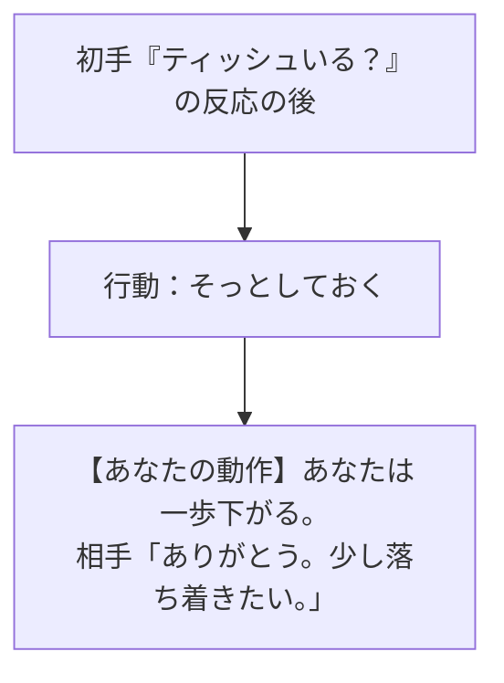
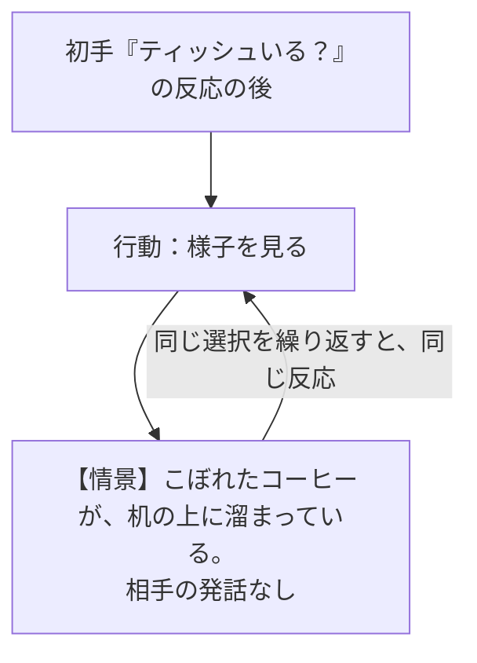

# A：初手「ティッシュいる？」から

[後から来た友人の初手一覧](A.md) / [入口](../COFFEE_PLAYER_FLOW.md)

友人の席に着くと、倒れたカップと濡れた机が目に入った。こぼした瞬間は見ていない。手元にはティッシュがある。

## 初手と、その直後

ここから下は、同じ初手の直後から選べる**別々の2手目**。上から順に押す手順ではない。発言も行動も選べる。

## 2手目：どうしたの？

**この後の通常候補**：「どうしたの？」 ／ 「大丈夫？」 ／ 「ごめん」 ／ 「あなたの味方だ」 ／ 「手伝おうか？」 ／ 「ティッシュいる？」 ／ 「ティッシュを渡す」 ／ 「そっとしておく」 ／ 「様子を見る」

この地点で引き継ぐこと（他の枝とは合流しない）

机はコーヒーで濡れている。あなたの持ち物：ティッシュ1組。相手が自分でこぼしたと聞いた。けがの有無はまだ聞いていない。机を拭きたいと聞いた。ティッシュがほしいと聞いた。自分で拭くと聞いた。ティッシュを受け取る同意がある。事故への謝罪はまだ成立していない。手伝いを断られた記憶なし。渡す前の確認を求められた記憶なし。今は近くにいる。距離取りによる落ち着きはまだない。表示に影響する落ち着かなさ：3。

3手目以降の返答の全面展開はこの図では省略。上の候補から続行できる。[続きの読み方](CONTINUE.md)を参照。

## 2手目：大丈夫？

**この後の通常候補**：「どうしたの？」 ／ 「大丈夫？」 ／ 「ごめん」 ／ 「あなたの味方だ」 ／ 「手伝おうか？」 ／ 「ティッシュいる？」 ／ 「ティッシュを渡す」 ／ 「そっとしておく」 ／ 「様子を見る」

この地点で引き継ぐこと（他の枝とは合流しない）

机はコーヒーで濡れている。あなたの持ち物：ティッシュ1組。こぼした原因はまだ知らない。けがはないと聞いた。ティッシュがほしいと聞いた。自分で拭くと聞いた。ティッシュを受け取る同意がある。事故への謝罪はまだ成立していない。手伝いを断られた記憶なし。渡す前の確認を求められた記憶なし。今は近くにいる。距離取りによる落ち着きはまだない。表示に影響する落ち着かなさ：3。

3手目以降の返答の全面展開はこの図では省略。上の候補から続行できる。[続きの読み方](CONTINUE.md)を参照。

## 2手目：ごめん

**この後の通常候補**：「どうしたの？」 ／ 「大丈夫？」 ／ 「ごめん」 ／ 「あなたの味方だ」 ／ 「手伝おうか？」 ／ 「ティッシュいる？」 ／ 「ティッシュを渡す」 ／ 「そっとしておく」 ／ 「様子を見る」

この地点で引き継ぐこと（他の枝とは合流しない）

机はコーヒーで濡れている。あなたの持ち物：ティッシュ1組。相手が自分でこぼしたと聞いた。けがの有無はまだ聞いていない。ティッシュがほしいと聞いた。自分で拭くと聞いた。ティッシュを受け取る同意がある。事故への謝罪はまだ成立していない。手伝いを断られた記憶なし。渡す前の確認を求められた記憶なし。今は近くにいる。距離取りによる落ち着きはまだない。表示に影響する落ち着かなさ：3。

3手目以降の返答の全面展開はこの図では省略。上の候補から続行できる。[続きの読み方](CONTINUE.md)を参照。

## 2手目：あなたの味方だ

**この後の通常候補**：「どうしたの？」 ／ 「大丈夫？」 ／ 「ごめん」 ／ 「あなたの味方だ」 ／ 「手伝おうか？」 ／ 「ティッシュいる？」 ／ 「ティッシュを渡す」 ／ 「そっとしておく」 ／ 「様子を見る」

この地点で引き継ぐこと（他の枝とは合流しない）

机はコーヒーで濡れている。あなたの持ち物：ティッシュ1組。こぼした原因はまだ知らない。けがの有無はまだ聞いていない。机を拭きたいと聞いた。ティッシュがほしいと聞いた。自分で拭くと聞いた。ティッシュを受け取る同意がある。事故への謝罪はまだ成立していない。手伝いを断られた記憶なし。渡す前の確認を求められた記憶なし。今は近くにいる。距離取りによる落ち着きはまだない。表示に影響する落ち着かなさ：3。

3手目以降の返答の全面展開はこの図では省略。上の候補から続行できる。[続きの読み方](CONTINUE.md)を参照。

## 2手目：手伝おうか？

**この後の通常候補**：「どうしたの？」 ／ 「大丈夫？」 ／ 「ごめん」 ／ 「あなたの味方だ」 ／ 「手伝おうか？」 ／ 「ティッシュいる？」 ／ 「ティッシュを渡す」 ／ 「そっとしておく」 ／ 「様子を見る」

この地点で引き継ぐこと（他の枝とは合流しない）

机はコーヒーで濡れている。あなたの持ち物：ティッシュ1組。こぼした原因はまだ知らない。けがの有無はまだ聞いていない。ティッシュがほしいと聞いた。自分で拭くと聞いた。ティッシュを受け取る同意がある。事故への謝罪はまだ成立していない。手伝いを断られた記憶なし。渡す前の確認を求められた記憶なし。今は近くにいる。距離取りによる落ち着きはまだない。表示に影響する落ち着かなさ：3。

3手目以降の返答の全面展開はこの図では省略。上の候補から続行できる。[続きの読み方](CONTINUE.md)を参照。

## 2手目：ティッシュいる？

**この後の通常候補**：「どうしたの？」 ／ 「大丈夫？」 ／ 「ごめん」 ／ 「あなたの味方だ」 ／ 「手伝おうか？」 ／ 「ティッシュいる？」 ／ 「ティッシュを渡す」 ／ 「そっとしておく」 ／ 「様子を見る」

この地点で引き継ぐこと（他の枝とは合流しない）

机はコーヒーで濡れている。あなたの持ち物：ティッシュ1組。こぼした原因はまだ知らない。けがの有無はまだ聞いていない。ティッシュがほしいと聞いた。自分で拭くと聞いた。ティッシュを受け取る同意がある。事故への謝罪はまだ成立していない。手伝いを断られた記憶なし。渡す前の確認を求められた記憶なし。今は近くにいる。距離取りによる落ち着きはまだない。表示に影響する落ち着かなさ：3。

3手目以降の返答の全面展開はこの図では省略。上の候補から続行できる。[続きの読み方](CONTINUE.md)を参照。

## 2手目：ティッシュを渡す

**この後の通常候補**：「どうしたの？」 ／ 「大丈夫？」 ／ 「ごめん」 ／ 「あなたの味方だ」 ／ 「手伝おうか？」 ／ 「ティッシュいる？」 ／ ~~ティッシュを渡す~~（無効：手元にティッシュがない） ／ 「そっとしておく」 ／ 「拭くのを見守る」

この地点で引き継ぐこと（他の枝とは合流しない）

机はコーヒーで濡れている。ティッシュは相手の手元（まだ使っていない）。こぼした原因はまだ知らない。けがの有無はまだ聞いていない。ティッシュがほしいと聞いた。自分で拭くと聞いた。同意したティッシュを渡した。事故への謝罪はまだ成立していない。手伝いを断られた記憶なし。渡す前の確認を求められた記憶なし。今は近くにいる。距離取りによる落ち着きはまだない。表示に影響する落ち着かなさ：2。

→ [受け取った直後からの共通の続き](CONTINUE.md#受け取った直後)。上の知識・記憶を引き継ぐ。

## 2手目：そっとしておく

**この後の通常候補**：「どうしたの？」 ／ 「大丈夫？」 ／ 「ごめん」 ／ 「あなたの味方だ」 ／ 「手伝おうか？」 ／ 「ティッシュいる？」 ／ 「ティッシュを渡す」 ／ 「離れたままにする」 ／ 「様子を見る」

この地点で引き継ぐこと（他の枝とは合流しない）

机はコーヒーで濡れている。あなたの持ち物：ティッシュ1組。こぼした原因はまだ知らない。けがの有無はまだ聞いていない。ティッシュがほしいと聞いた。自分で拭くと聞いた。距離を取り、以前の同意はいったん解除した。事故への謝罪はまだ成立していない。手伝いを断られた記憶なし。渡す前の確認を求められた記憶なし。今は少し離れている。距離を取って一度落ち着いた。表示に影響する落ち着かなさ：2。

3手目以降の返答の全面展開はこの図では省略。上の候補から続行できる。[続きの読み方](CONTINUE.md)を参照。

## 2手目：様子を見る

**この後の通常候補**：「どうしたの？」 ／ 「大丈夫？」 ／ 「ごめん」 ／ 「あなたの味方だ」 ／ 「手伝おうか？」 ／ 「ティッシュいる？」 ／ 「ティッシュを渡す」 ／ 「そっとしておく」 ／ 「様子を見る」

この地点で引き継ぐこと（他の枝とは合流しない）

机はコーヒーで濡れている。あなたの持ち物：ティッシュ1組。こぼした原因はまだ知らない。けがの有無はまだ聞いていない。ティッシュがほしいと聞いた。自分で拭くと聞いた。ティッシュを受け取る同意がある。事故への謝罪はまだ成立していない。手伝いを断られた記憶なし。渡す前の確認を求められた記憶なし。今は近くにいる。距離取りによる落ち着きはまだない。表示に影響する落ち着かなさ：3。

3手目以降の返答の全面展開はこの図では省略。上の候補から続行できる。[続きの読み方](CONTINUE.md)を参照。

[初手一覧へ戻る](A.md) / [内部状態の詳細検証資料](../COFFEE_STATES_A.md)
