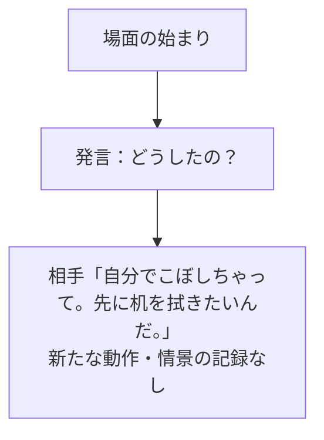
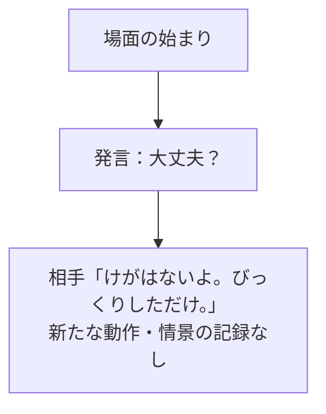
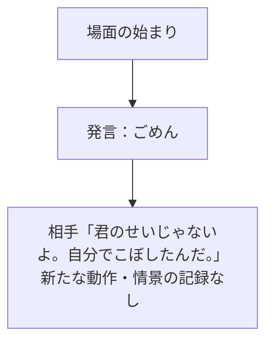
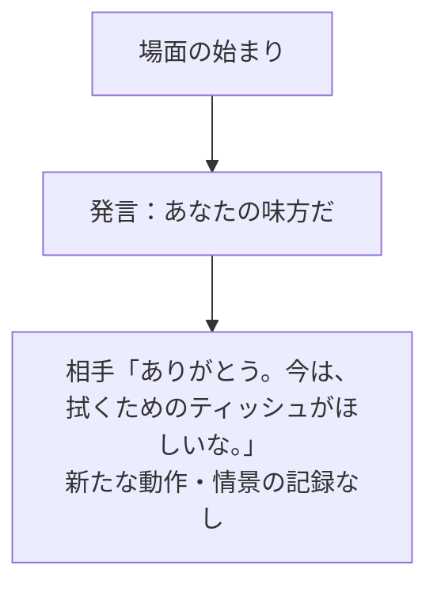
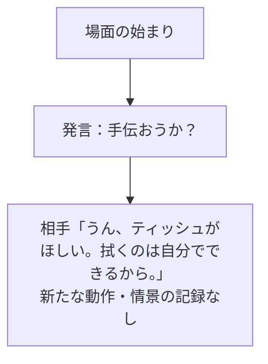
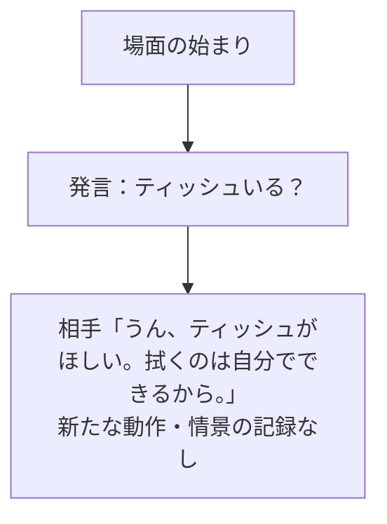
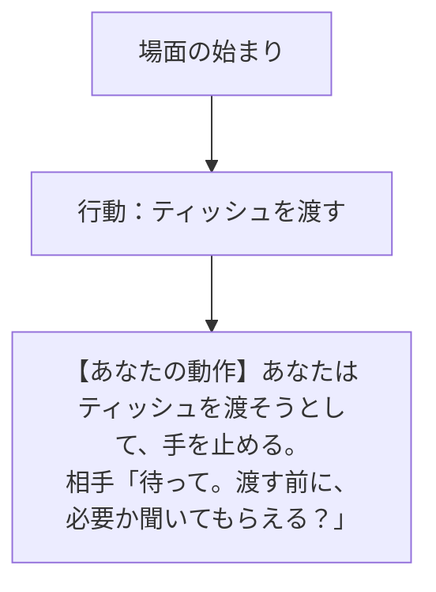
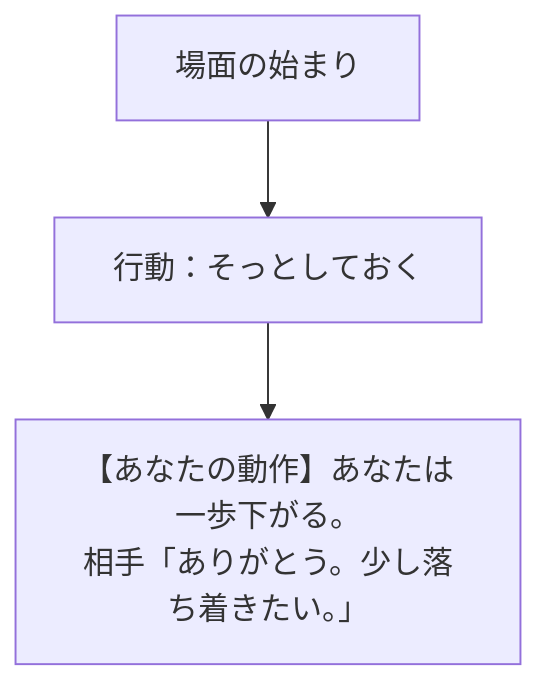
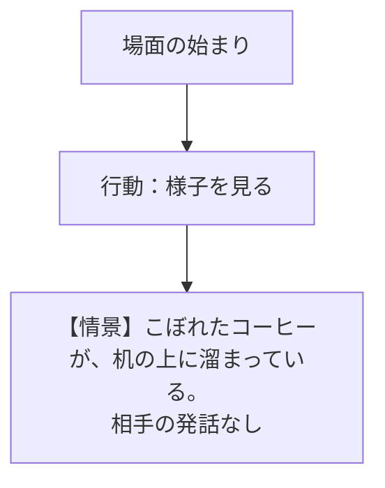

# A：後から来た友人 — 初期状態から選ぶ

[プレイヤー視点の入口へ](../COFFEE_PLAYER_FLOW.md)

友人の席に着くと、倒れたカップと濡れた机が目に入った。こぼした瞬間は見ていない。手元にはティッシュがある。

【情景】相手は濡れた机を見つめている。 相手の発話はまだない。

以下が通常画面の初手の全9候補。図ごとに同じ初期状態から始まる。細かい文字に縮めないため、選択ごとに分割した。2手目は各詳細リンクへ。

## 発言：どうしたの？

[この初手から、2手目の全選択と反応を見る](A-ask_event.md)

## 発言：大丈夫？

[この初手から、2手目の全選択と反応を見る](A-check_wellbeing.md)

## 発言：ごめん

[この初手から、2手目の全選択と反応を見る](A-apologize.md)

## 発言：あなたの味方だ

[この初手から、2手目の全選択と反応を見る](A-support.md)

## 発言：手伝おうか？

[この初手から、2手目の全選択と反応を見る](A-offer_help.md)

## 発言：ティッシュいる？

[この初手から、2手目の全選択と反応を見る](A-offer_tissue.md)

## 行動：ティッシュを渡す

[この初手から、2手目の全選択と反応を見る](A-give_tissue.md)

## 行動：そっとしておく

[この初手から、2手目の全選択と反応を見る](A-give_space.md)

## 行動：様子を見る

[この初手から、2手目の全選択と反応を見る](A-observe.md)
