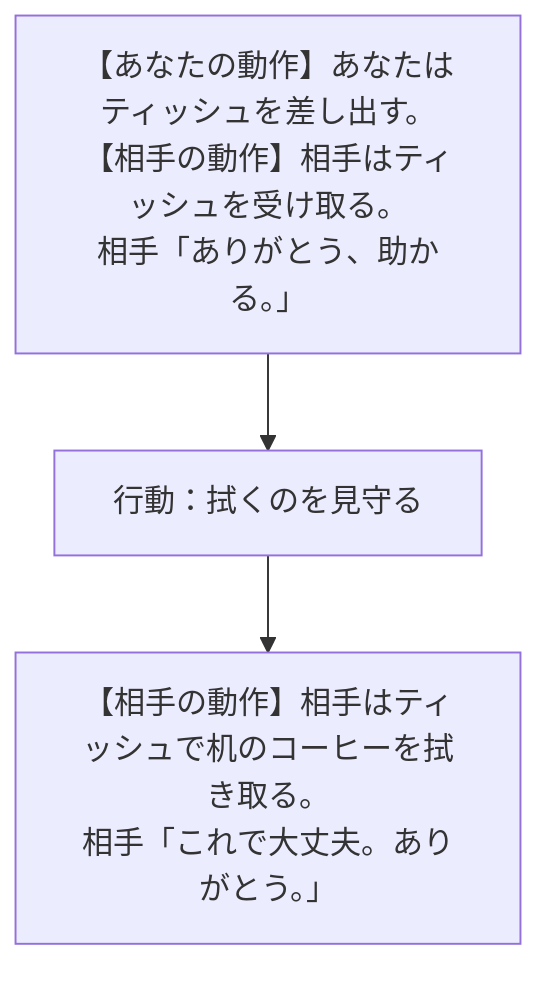

# 2手目の後を読む

[入口](../COFFEE_PLAYER_FLOW.md)

2手目までの各枝は、台詞が同じでも合流していない。各地点の「この後の通常候補」と「引き継ぐこと」が続行時の前提。ループ矢印は、同じ操作をもう一度した結果の発話・動作・全更新状態が一致する場合だけ付けている。別の操作へ変えるときは、その記憶を保持する。

3手目以降の全返答は未展開。全履歴を図へ膨らませず、議論したい初手・2手目を入口にする。詳しい条件差は[内部図と全状態表](../COFFEE_TRANSITIONS.md)に残した。

## 受け取った直後

以下は現在の実装にある、Aで「ティッシュいる？」→「ティッシュを渡す」の続き。受取直後は全条件でこの「拭くのを見守る」に同じ台詞と動作が返るが、他の発言への反応や知識・謝罪・拒否の記憶まで同じにはしない。自動進行ではない。

**受取直後の全候補**：「どうしたの？」 ／ 「大丈夫？」 ／ 「ごめん」 ／ 「あなたの味方だ」 ／ 「手伝おうか？」 ／ 「ティッシュいる？」 ／ ~~ティッシュを渡す~~（無効：手元にティッシュがない） ／ 「そっとしておく」 ／ 「拭くのを見守る」

**拭いた後の全候補**：「どうしたの？」 ／ 「大丈夫？」 ／ 「ごめん」 ／ 「あなたの味方だ」 ／ 「手伝おうか？」 ／ 「ティッシュいる？」 ／ ~~ティッシュを渡す~~（無効：手元にティッシュがない） ／ 「そっとしておく」 ／ 「様子を見る」

「ティッシュを渡す」は無効なので、通常画面で再度押して相手の台詞を得る経路はない。検証パネルだけの操作をこの図に混ぜない。拭いた後も場面は終了せず、会話・距離取り・観察を続けられる。
