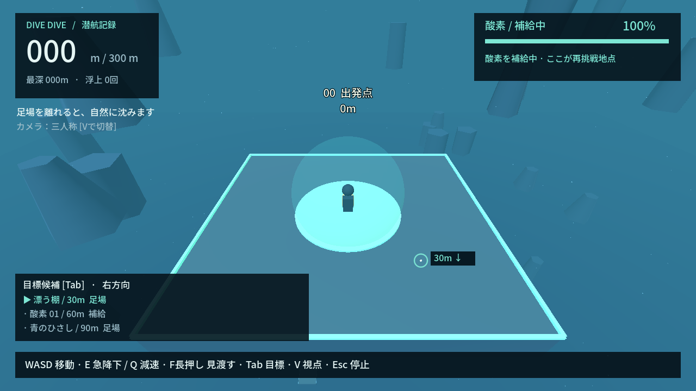
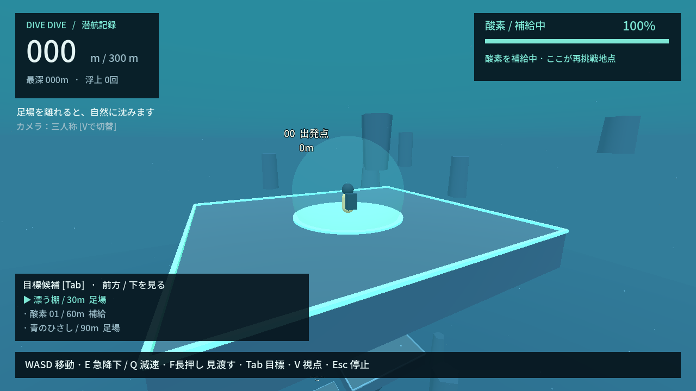
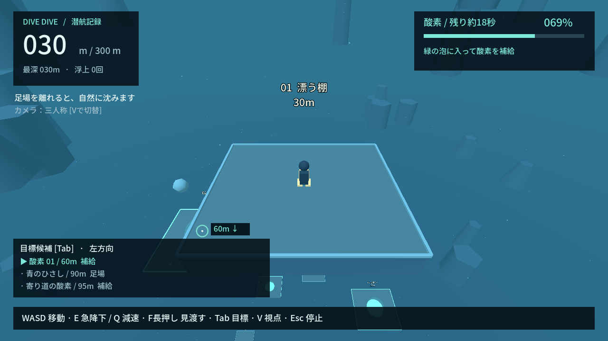
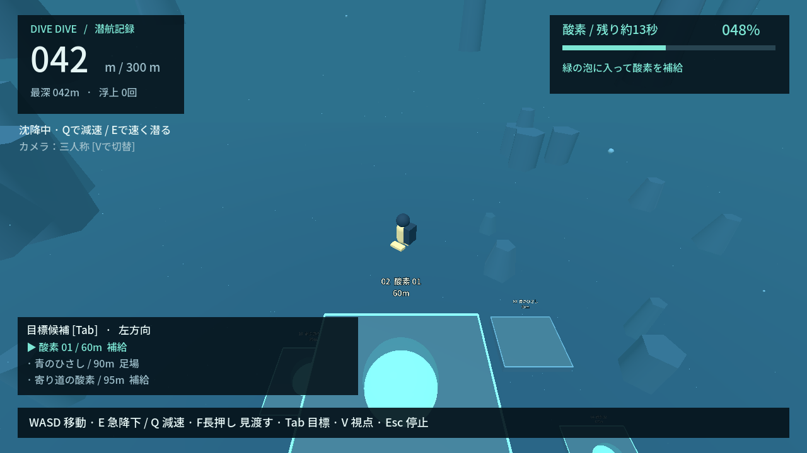
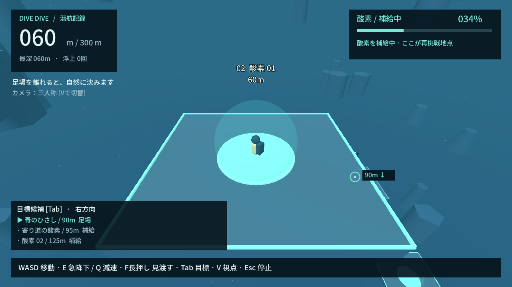
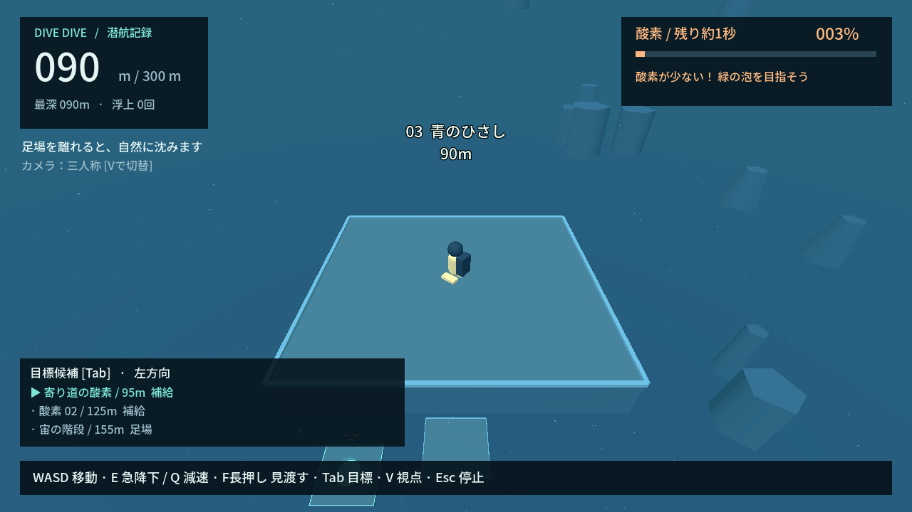
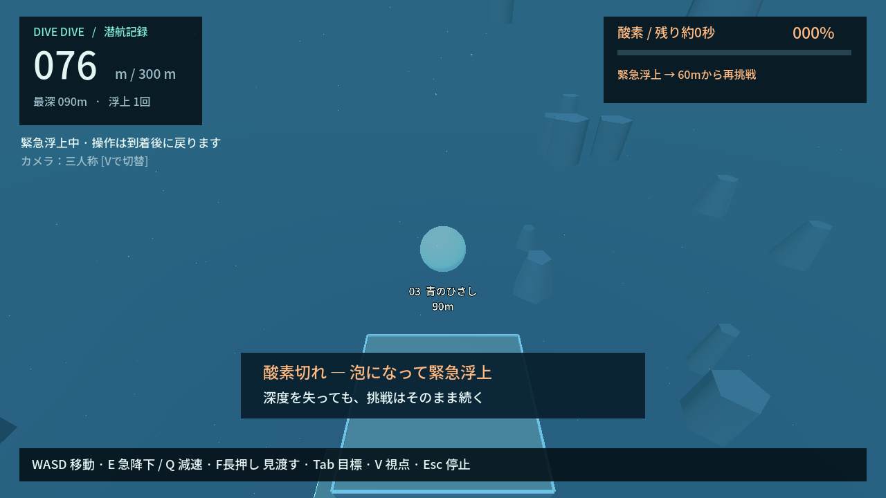
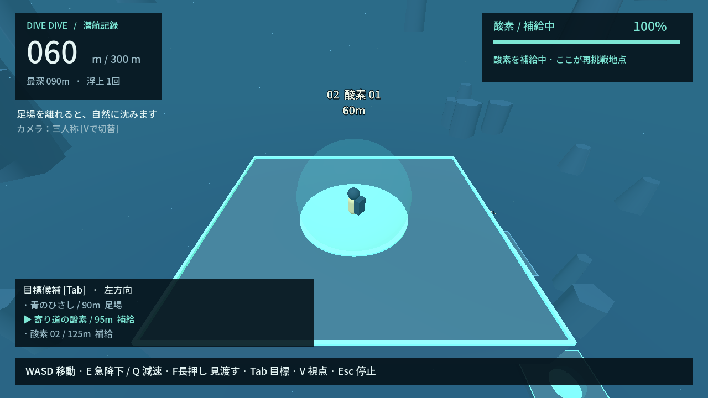

# DIVE DIVE

**広い海で足場をたどり、ひたすら下へ進む3Dアクション。** 足場を離れると沈み、着地すると止まる。酸素を補給しながら300mの「海底の灯」を目指す、人間レビュー用の試作です。

## 今すぐ遊ぶ（Windows）

1. このPCでは `build/windows/DIVE DIVE.exe` をダブルクリック。
2. 「潜りはじめる」またはEnter。WASDで出発点の足場から離れると沈み始める。
3. マウスで下を見て、次の足場へ移動。緑の泡の中心に着地して酸素を補給する。
4. 300mのゴール足場に着地するとクリア。深度300mを通過するだけではクリアにならない。

別PCへ渡すときは `build/DIVE-DIVE-windows.zip` を展開して起動。Godot/Pythonのインストール不要。[GitHub Actions](https://github.com/shirai-masatomo/whitespace/actions/workflows/dive-dive.yml) の **DIVE-DIVE-windows** artifactからも取得できます。

| 操作 | 動作 |
| --- | --- |
| WASD / 矢印 | 水平移動（沈んでいる間も方向転換可能） |
| マウス | 視点 |
| E | 速く沈む |
| Q | 沈む速度を落とす。浮上・空中停止はできない |
| F長押し / Tab | 俯瞰で見渡す / 目標候補を切替（俯瞰中も時間は進む） |
| V | 三人称 / 一人称 |
| Esc / Enter | 一時停止 / 再開 |

**普通の足場上でも酸素は減る。** 酸素0で泡になって上昇し、最後に補給した地点で操作と酸素が戻る。そこでほぼ深度を失わない場合は一つ前の補給地点へ戻る。死亡画面・ロード・ワープは使わない。フォーカスを外すと一時停止。ルートを大きく外れた場合も救助する。セーブ・音・Steam SDK・オンラインは未導入。

最新の短い評価と判定は [REVIEW_PACKET](REVIEW_PACKET.md)、AIレビューは [AI_REVIEW](AI_REVIEW.md)。可逆な改善は人間確認を挟まず継続します。

## 今回の評価資料

2026-09-19、圧力・待機回復と円筒壁を撤去し、自然沈降・足場・酸素・泡での再挑戦へ変更。以下は実際のゲームシーンを入力相当の操作で進めて撮影したもの。加工や別シーンによる再現ではありません。

| 開始地点 | 広い海 |
| --- | --- |
|  |  |
| 足場上 | 足場間を沈降 |
|  |  |
| 酸素スポット | 酸素切れ直前 |
|  |  |
| 泡で強制浮上 | 60mの再挑戦地点 |
|  |  |

### 仮の調整値

| 項目 | 現在値 |
| --- | --- |
| 自然沈降 | 最大5m/s |
| Eで下降 / Qで減速 | 最大9m/s / 2m/s（縦加速度12m/s²） |
| 水平移動 | 最大7m/s、斜め移動も同じ上限 |
| 水中の軌道修正 | 全方向へ加速度10m/s²。静止→最大速0.7秒、逆方向の最大速まで1.4秒。足場上は22m/s² |
| 酸素満タン→空 | 25秒（100から毎秒4消費） |
| 酸素スポットで空→満タン | 4秒（毎秒25回復）。救助完了時は即満タン |
| 緊急浮上 | 最大32m/s。上昇→安全地点の上へ水平移動→着地 |
| 酸素切れで失う平均深度 | **106.45m：下記4条件の等重みテスト平均**。実プレイヤーの平均ではない |

深度損失の測定条件: 60m補給地点を登録し、足場のない水中で満タンから自然沈降 / E / Qを維持すると、それぞれ124.08 / 221.84 / 49.88mを失う。90mの普通の足場で待つ場合は30m。実際の損失はルートと失敗位置によって変わる。代表画像の失敗は90m→60mで30m損失。元の9区間をたどる自動操作は104.03秒、失敗0回でクリア（各補給4秒固定）。最新の3経路比較は満タンになり次第出発する条件で [REVIEW_PACKET](REVIEW_PACKET.md) に掲載。

### カメラ比較と今の問題点

同じ位置・角度で比較: [三人称](review/03-platform.png) / [一人称](review/camera-first-person.png)。三人称は足元・足場の縁・下の複数足場を見渡せるため標準に採用。一人称は海への没入感がある一方、足場中央から下を見ると床が画面を占め、着地位置も分かりにくい。Vで随時比較可能。三人称カメラは足場との遮蔽をレイ判定で避ける。F長押しの [俯瞰](review/route-survey.png) では下の足場をまとめて確認できる。Tabで候補を選び、画面外でも方向案内が残る。

- 11足場・6補給地点。95mの追加補給を通る分岐と、通常足場を省いて補給地点へ直接進む経路を検証済み。難易度はまだ仮。
- 通常視点では自分の足場が次の着地点を隠す。俯瞰と方向表示で補助するが、見渡す操作の好みは未評価。
- 水中らしさは色・霧・遠景・浮遊物まで。音や着地感、泡化の演出は簡易。遠景の岩は着地できない装飾。

次は「着地の操作感」「酸素25秒の忙しさ」「深度損失と再挑戦したさ」を触って評価する。改善候補は [TASKS](TASKS.md)。

## 開発と検証

Windows x64、開発時のみPython 3.12以上が必要。リポジトリルートから:

```powershell
cd projects/001-first-release
./tools/setup.ps1
./dev.ps1 check
./dev.ps1 play
```

スクリプト実行が制限される場合は、信頼したこのスクリプトだけ `powershell -NoProfile -ExecutionPolicy Bypass -File ./dev.ps1 check` とする。マシン全体のポリシーは変更しない。

- `setup`: Godot 4.7.2とWindowsテンプレートを公式SHA512で検証して取得。専用venvへ固定版のツールを導入。初回テンプレート取得は約1.3GB。
- `check`: format / lint / 開発依存整合性 / import / ルール・シーンテスト / evaluate / Windows release build / 出力EXEのheadless起動 / 配布zip。
- `evaluate`: 3経路の到達時間・酸素余裕・足場間隔・通常/俯瞰の遮蔽と救助時間を測る。結果は `artifacts/evaluation.json`。到達失敗・酸素余裕不足・俯瞰の目標遮蔽はCIを失敗させる。
- `visual`: GPUで8状態・カメラ比較・浮上後のゴール・再プレイ・960×540のポーズを検証。`artifacts/*.png` を目視確認し、レビュー用8枚と一人称・俯瞰の比較を `review/` へ更新する。
- `format` / `test` / `lint` / `build` / `editor`: 個別実行。ログは `artifacts/*.log`、再現測定値は `artifacts/metrics.json`。Git対象外。

GitHub ActionsはWindows上でsetup/checkを実行し、配布zipとログを保存する。GPU画面確認はローカルで実施。`review/.gdignore` とexport除外指定により評価画像はゲームに混入しない。

## 構造

- `game/dive_model.gd`: 描画から独立した移動・上面着地・酸素・安全地点・救助・ゴール。
- `game/dive_config.gd` / `default_config.tres`: 消費/回復・移動速度などの調整値。
- `game/stage_layout.gd`: 足場の位置・大きさ・酸素/ゴール区分。描画とルールが共有する正本。
- `game/main.gd`: 入力・カメラ・進行。`world.gd`: プリミティブ空間。`hud.gd`: 日本語表示。
- `tests/`: headlessルール、実シーンの入力/ポーズ/カメラ、実描画ルート。`route_driver.gd` は入力のみで足場をたどる検証用操縦。
- [PROJECT_STATE](PROJECT_STATE.md) / [TASKS](TASKS.md) / [AUTONOMY](AUTONOMY.md): 新しいセッションで最初に読む。AI_REVIEWがあれば必読。

Godotを継続採用。既存CLI/Windows export/自動テストを使って、この規模の3D試作を反復できるため。現在は300m固定ステージで、物理は足場の上面への着地を扱う簡易モデル。

## 素材と権利

他ゲームの素材・ステージ・演出は使用していない。コード生成のプリミティブ空間のみ。
日本語フォントは [Noto Sans JP](https://github.com/google/fonts/tree/main/ofl/notosansjp)、[SIL OFL](assets/fonts/OFL.txt)を同梱。Godotの [著作権・第三者ライセンス表示](assets/GODOT_COPYRIGHT.txt)も配布zipへ同梱する。
