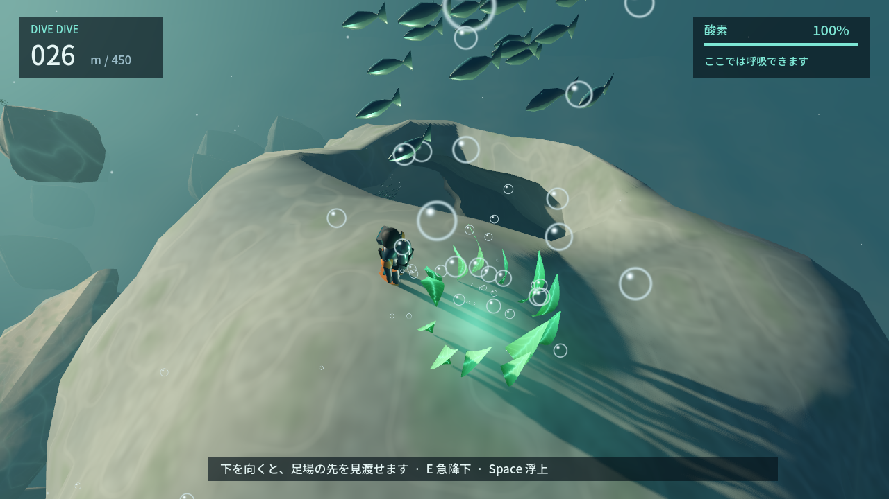
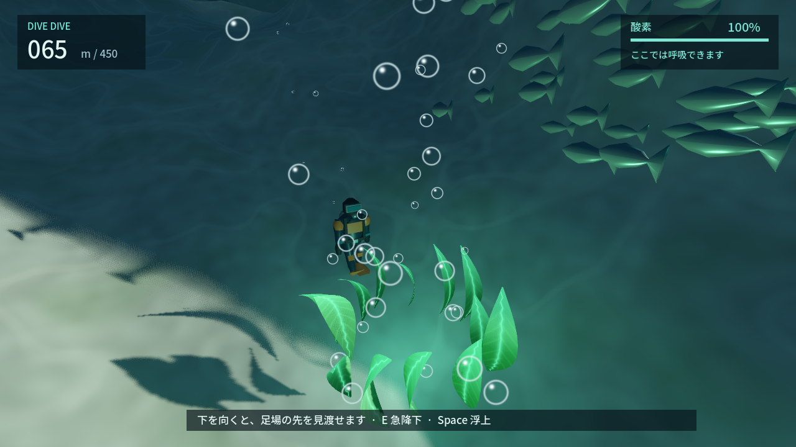

# DIVE DIVE — REVIEW PACKET

2026-09-20 / `codex/dive-dive-playground` / **CHANGES・SELF_CONTINUE**。同一Codexの自己評価。人間への再試遊依頼ではありません。

## 今回の画面批評: プレイヤーは何を考えられるか

最新main `8b49a60` の外部レビューと今回の相談を受領。以下は実装commit `289d598` に保存された実GPU画像の自己批評。ここで書く変更案は未実装で、画像は改善後の予想図ではありません。今回の基準テスト/経路/lintは成功。使用中プレビューへのbuild置換が失敗したため、別出力でexportとheadless EXE起動を確認しました。

### 1. 入水 — 補給へ寄るか、横を調べるか、深く賭けるか

**現状**: 中央の泡・魚・海藻に視線が集まる。左右は青い余白で、別の行き先の入口や到着後の見返りを読めない。3経路がデータ上にあっても、この画面では選べない。
**変更案**: 中央前景の泡に切れ目を作り、片側は近い藻の安全地帯、反対側は魚群の向こうに奥行きのある横穴、下方は一部が隠れた裂け目へ視線が抜ける配置を小さく比較する。新しい物を増やす前に既存の地形とカメラの向きを試す。
**確認**: 通常の入水カメラで用途の違う候補が読めるか。酸素100%/35%で、横への寄り道と深部へ進む判断が変わるか。全行き先や答えをHUDで説明しない。

### 2. 洞窟の屋根 — 既知の休息へ戻るか、外側の未知へ進むか

**現状**: 目立つのは藻と上の穴。補給後は穴に落ちる以外の魅力が見えない。周回成功22.90秒は、この不足を埋めない。
**変更案**: 穴は既知の休息への帰路として残し、外縁を歩くと先の入り江/別出口を覗ける輪郭と見通しを試す。魚がいるだけの案と、魚の先に実際の抜け道がある案を区別する。
**確認**: 補給後に二つの異なる期待があるか。周回しなくても先へ進めるか。見えている外縁を実際に歩き、戻れるか。

### 3. 洞窟出口 — 岸壁を伝うか、沖を横切るか

**現状**: 藻・泡・魚が近景を占め、出口の先の地形と進路が読み取れない。暗いだけでは未知への期待にならない。
**変更案**: 出口に立った位置から、歩ける段丘の輪郭と沖へ開く見通しを比較。遠くの全貌は隠しつつ、入れそうな口や光の抜けを残す。160m前後の半囲い/峡谷へ繋がる景観と遊べる領域を一致させる。
**確認**: 岸壁は本当に歩けるか。沖側は短さと酸素リスクで違いがあるか。魚を隠しても場所そのものから選択肢を読めるか。

各変更は同じ位置・カメラ・酸素状態の前後比較と実操作で判定。今回、この3画面の相談に対するゲームコードの変更・新規撮影は行っていません。新しい人間レビュー待ちには戻しません。

## 今どう遊べるか

海へ飛び込み、横の魚群と海藻林へ泳ぐと岩礁を歩けます。洞窟の中で空気を補給し、側面の穴から出て泡の流れへ乗ると、屋根へ回れます。屋根の藻で補給して見回し、上の穴へ落ちると、さっき歩いた洞内へ。別の水中出口から先へ進むこともできます。左の巨大泡/潮流と既存450m経路も維持しています。

最新版は`build/windows-preview/DIVE DIVE.exe`。[起動・操作](README.md)。自然沈降5 / E急降下15 / Space浮上6 / 水平7m/s。通常25秒、E10秒で酸素切れ。上昇流からは横移動やEで離脱できます。

## 前回実装での採用・棄却

- 最新mainのEXTERNAL_AI_REVIEW/HUMAN_DIRECTIONを取り込み、単独のギミックから「場所を周回する」試作へ。
- 上昇流の弱い周期と屋根の着地点を改善。屋根の酸素藻で、急いで穴へ落ちるだけにならない余裕を追加。
- 格子を抜いただけの穴を、不規則で連続した輪郭へ。壁と水際にも左右差を追加。
- 過密な海藻案を棄却し、群落と補給地点の空きを分ける。
- 主人公を常に写す見上げカメラ案は、体が穴を隠したため棄却。空気中をSpaceで飛ぶ案も採用しない。

## 実画面と連続操作

[入水](review/51-enter-ocean.png) / [海藻林の空き](review/53-kelp-from-sea.png) / [洞内から上の穴](review/47-air-cave.png) / [泡から屋根へ](review/56-column-to-roof.png) / [屋根の藻と穴](review/57-roof-opening.png) / [上を覗く](review/58-chimney-from-inside.png)。

[GLの屋根](review/compatibility/57-roof-opening.png) / [GLの洞内](review/compatibility/47-air-cave.png)。

[連続画像](review/sequence/index.html): 「岩礁→洞窟→125m合流」は桟橋から連続実入力。「洞窟→泡→屋根→上穴→別出口」は洞内を開始地点にした独立試走で、周回中の位置ジャンプなし。通常/E落下や別方向の衝突は別fixtureです。

## 前回実装の検証と限界

- 全check/build成功。ルール479・シーン430・音57・実衝突689、既存11経路、新空間129・入水6。メッシュ2688点は補助証拠。
- Forward+/Compatibilityで自動プレイ・実画面確認、Windows配布EXEも各120フレーム成功。画面外/無音/非捕捉。
- 洞窟周回22.90秒、最低酸素35.50%。桟橋から洞窟横断37.73秒、125m合流まで57.67秒。
- 同じ途中地点で酸素35%なら側面穴は5.65秒で補給、外側継続は8.75秒で酸素切れ。
- 新しい藻5群落の救助と操作復帰、上穴の通常/E着地、穴の縁への実カプセル接触を確認。

[測定JSON](review/playground.json)。理想操縦の数値であり、初見時間/楽しさの証明ではありません。CIは最初の探索commit `dec6b4a` のみ確認済み。以後のローカル差分は前回の自動承認によるpush拒否で未同期。[GitHub状態](PROJECT_STATE.md)。

## まだ不満 / 次

回れる場所は増えましたが、岩や海藻はまだ模型的で、初見で寄り道したくなるかは未合格。洞窟を出た後の未知への誘いと140m以降の反復が弱い。次は入水の視線の抜け、出口の発見、深部の場所づくりを比較します。[自己批評](AI_REVIEW.md)。**SELF_CONTINUE / CHANGES**。
