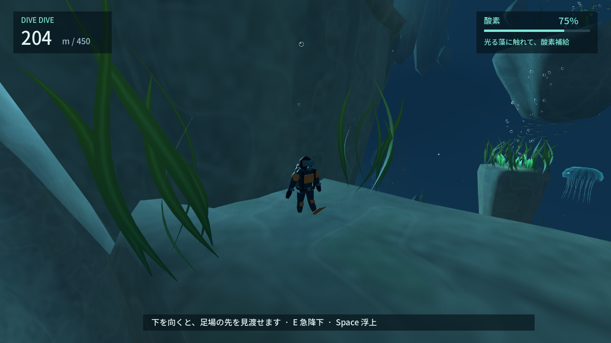

# DIVE DIVE — REVIEW PACKET

2026-09-19 / **次版のHUMAN_REVIEW候補、最終CI確認中**。前回レビューを受け4サイクル改善。実装者による自己評価で、面白さの外部認定ではありません。

## 現在どう遊べるか

海へ飛び込み、光る酸素藻へ寄るか、沖のクラゲや流木へ進むか、岸壁を歩くかを選び450mへ。深くなると岩の屋根や裂け目が近づき、外側には開けた別経路が残ります。何もしなければ沈降、Eは速い代わりに酸素を多く消費、Spaceで浮上。酸素0は泡で浅い地点へ救助され、そのまま再挑戦。

[起動方法](README.md#今すぐ遊ぶwindows): **build/windows/DIVE DIVE.exe** →「潜りはじめる」。WASD/マウス/E/Space。案内は初期OFF、必要ならH。海中の普通の足場でも酸素が減り、藻のそばでは落ち着いて見渡せます。

## 今回変わったこと

- 上面だけの判定を廃止し、固体メッシュに沿う全方向の実衝突へ。枝・岸壁・薄物・下面も検査。
- 岸壁を歩く道、岩の屋根、再び開ける海を追加。26足場・16補給群落。
- 魚群とエイ、沖のクラゲ/動く流木、任意の道案内。酸素残量で寄り道の価値が変わる分岐。
- 300〜450mに狭い裂け目/沖側/近道を追加。後続世界は未実装。
- 遠すぎる見下ろしと、上を見ると主人公が画面を塞ぐカメラを修正。

## 代表画面・連続プレイ

| 場面 | 場面 | 場面 |
| --- | --- | --- |
| [海上](review/01-surface-start.png) | [飛び込み](review/02-water-entry.png) | [水面直下の太陽光](review/03-sunlight.png) |
| [広い海](review/04-open-ocean.png) | [沈降](review/06-sinking.png) | [E急降下](review/07-fast-descent.png) |
| [Space浮上](review/08-space-ascent.png) | [補給](review/09-oxygen.png) | [潮流・粒子](review/13-current-particles.png) |
| [魚群とエイ](review/27-ray-and-coast.png) | [岸壁の藻庭](review/28-cliff-garden.png) | [岩棚歩行](review/29-rock-passage.png) |
| [再び開ける海](review/30-open-water-again.png) | [沖のクラゲ](review/31-offshore-jelly.png) | [動く流木](review/32-drifting-refuge.png) |
| [深部の裂け目](review/33-deep-rift.png) | [外側の迂回](review/35-updraft-bypass.png) | [450m到達](review/34-rift-opening.png) |

[酸素切れ直前](review/low-oxygen.png) → [泡で救助](review/emergency-ascent.png) → [再挑戦](review/retry.png)。[連続画像プレイヤー](review/sequence/index.html)はローカル保存してブラウザで開きます。操作/失敗32枚と、岸壁探索〜裂け目69枚を切替可能。2秒刻みの同一プレイで、編集動画ではありません。[GitHub画像一覧](review/sequence/)。

## テスト・現在値

成功: format/lint/依存整合性、ルール479・シーン430・音53・実プレイヤー衝突689検査、実シーン11経路、Windows Release build。上面比較2688点は補助、軽量モデルの11経路/操作中断147ケースは見積もりとして別管理。Forward+/GLで失敗→再挑戦→450mと岸壁/沖側を実GPU確認。配布EXEも両rendererで起動成功。Actionsはheadlessで、画質の判定は含みません。[CI状態](PROJECT_STATE.md)。

| 項目 | 実測/設定 |
| --- | --- |
| 通常沈降 / 急降下 / 浮上 | 5 / 15 / 6 m/s |
| 水平 / 水中軌道修正 | 7 m/s、加速度10 m/s² |
| 酸素100→0 / 急降下消費 | 通常25.02秒 / E連続10.00秒、2.5倍 |
| 藻での回復 | 接触tickで100%、待ち0秒 |
| 実衝突付き岸壁経路 | 129.93秒、最低酸素37.73%、平均区間9.28秒 |
| 実衝突付き近道 | 50.02秒、最低酸素19.10%、平均区間8.34秒 |
| 実衝突付き沖側急降下経路 | 73.80秒、最低酸素11.23%（余裕が小さい） |
| 同一地点での選択 | 100%は直行/藻へ寄る双方成功、30%は直行失敗/近くの藻は成功 |
| 救助 | 代表固定条件は30m損失・2.27秒復帰。実GPUの長距離例は3.48秒。損失は進路・訪問地点による |

[実衝突/経路測定](review/player-collision.json) / [速度・軽量モデル](review/evaluation.json) / [中断試験](review/route-resilience.json) / [音](review/audio-metrics.json)。経路時間は理想的な自動操縦で、人間の迷い・楽しさ・失敗率ではありません。救助の多数プレイヤー平均は未測定です。

RTX 4070 SUPER、1280×720、6静止場面、各180フレーム/VSyncなし。Forward+中央値2.02〜3.40ms・P95最大4.18ms、GL0.91〜1.56ms・1.77ms。GPU単体時間ではなく実時間フレーム間隔。[Forward+](review/render-forward_plus.json) / [GL](review/render-gl_compatibility.json) / [GL深部画面](review/compatibility/33-deep-rift.png)。別GPUの性能は未確認。

## 自己批評と次の判断

[A〜G自己レビュー](AI_REVIEW.md)。広狭と選択の変化は画面・操作で確認でき、修正可能な衝突/カメラ問題を直してから次版にしました。一方、岩の反復や生物モデルの簡素さは残ります。1000m全体や市販作品同等品質を完成扱いしません。

次に人間が判断するのは、①藻へ寄るか近道するか迷えるか、②岩棚歩行と探索に酸素が窮屈すぎないか、③失敗後また潜りたくなるか。5〜10分の試遊でこの3点を確認します。別GPU・長時間・音色の主観評価、保存はまだ未確認/未実装です。
