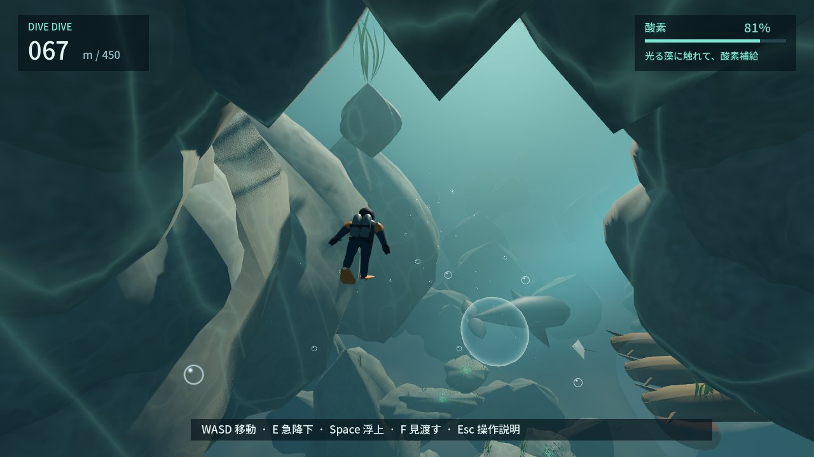

# DIVE DIVE — REVIEW PACKET

2026-09-19 / コード `bab488e` / **CHANGES・SELF_CONTINUE**。450m人間試遊は完了。今回は再提出ではなく、面白さを探す比較試作の記録。同一Codexの自己評価。

## 今どう遊べるか

海へ飛び込み、大きな泡へ入って息をつくか、そのまま潜るかを選べます。泡は少し上へ押すので、Eか横移動で外へ。泡が流れ込む岩の穴に入ると、曲がる潮流が別の景色へ運びます。穴の外を回る道も残ります。先にはもう一つの泡と大きな生物。450mの既存経路へ合流できます。

最新は **build/windows-preview/DIVE DIVE.exe**。[起動・操作](README.md)。人間試遊済みbuild/windowsは保持。再試遊の依頼はまだしません。

## 変えたこと・捨てたこと

- [18案と複数仮説](AI_REVIEW.md)から、泡の避難場所/曲がる流れ/穴/巨大影を試作。
- 巨大泡は即酸素100%、中では水中音が弱まり、上へ押される。救助地点は更新しない。
- 潮流は手を離しても曲がり角まで運び、横入力で離脱可能。アーチの内部は通過、岩の縁は実衝突。
- 整った輪・拡大したエイ・光る玉の列を棄却。岩の空洞/独自生物/小泡へ変更。魚群は生物から離れる。
- 肩越しカメラで主人公による前方の遮蔽を減らした。

## 実画面

[泡の中](review/37-inside-air.png) / [流れと岩の入口](review/39-current-entrance.png) / [大きな生物](review/41-unknown-shadow.png) / [任意の泡から見渡す](review/43-optional-air-lookout.png) / [GLの泡](review/compatibility/37-inside-air.png)。43は酸素30%比較の別試走で、連続ルートの続きではありません。

[連続画像プレイヤー](review/sequence/index.html): 探索10枚、通常操作/救助32枚、岸壁〜450m69枚。2秒刻みのモデル時刻、実入力で進み、連続記録中は位置を飛ばしていません。写真はプレイヤーが見回せるカメラで対象へ向けています。最短操縦で、人間の初見時間ではありません。

## 比較結果

| 条件 | 観測 | 意味/限界 |
| --- | --- | --- |
| 酸素30%、同じ80m地点から藻へ | 直行は3秒で酸素切れ、泡経由は7.72秒で生還 | 寄り道に機能がある。楽しさの証明ではない |
| 同じ地点・酸素100% | 泡を省き4.37秒で到達 | 必須チェックポイントではない |
| 流れの入口で4秒無入力 | 曲がり角まで: 流れあり0.37m/なし40.62m | 自力水平移動なしでも別方向へ運ばれる |
| 泡の中心で2秒無入力、初期酸素40% | 泡あり23.82m/100%、なし37m/32% | 深度と安全を交換、Eで外へ出られる |

[実測JSON](review/discovery.json)。通常沈降5/E15/Space6/水平7m/s、通常25秒/E10秒で酸素切れは維持。漂う泡の回復は即時。全員の失敗率/好みは未測定。

## 検証と自己批評

全check成功: format/lint/依存整合性、ルール479・シーン430・音57・実衝突689・新比較19、既存11実経路、Windows Release build。Forward+/GLで探索・失敗・再挑戦・450m、配布EXE起動を確認。Forward+岸壁/沖側も再試走。[CI状態](PROJECT_STATE.md)。Actionsはheadlessで画質判定を含みません。

RTX 4070 SUPER / 1280×720 / 6静止場面: Forward+中央値2.04〜3.01ms、GL1.00〜1.71ms。P95最大4.21/1.95ms。[測定](review/render-forward_plus.json)。別GPUや長時間、音色の主観評価は未確認。

**まだ不満**: 桟橋から泡へ興味を引く導入、模型的な生物、140m以降の岩の反復。泡と穴は旧版とは違う操作/判断になったが、「5分間さらに潜りたい」とはまだ判定しない。[A〜G自己批評](AI_REVIEW.md)に従い、DD-054〜056を継続。保存/Steamより先に体験を直す。
