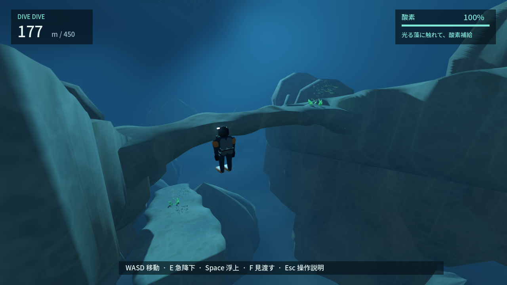

# DIVE DIVE — REVIEW PACKET

2026-09-20 / **CHANGES・SELF_CONTINUE**。同じCodexによる自己評価。人間への再試遊依頼ではない。

## 今どう遊べるか

海へ飛び込み、藻庭・岩礁・空気洞を探索。125mの補給地点から横へ泳ぐと、160m前後から両側の岸壁が近づく。段丘を歩く、橋の上で補給する、橋の下へ潜って深度を取る、壁の切れ目から沖へ出る、を試せる。

## 前版との画面比較

峡谷の基準は `417f894`、入水の基準は直前の `7895b60`。裂け目内側は同サイクルの加工前後。峡谷は同じプレイヤー位置・視線の向き・酸素100%から通常カメラで撮影。入水は同じ入力/視線で比較し、今回修正対象のカメラ位置は変わる。GPU粒子の位相は一致しない。到達までの連続プレイと、比較用の開始点は区別する。

| 場面 | 前 | 今 | 自己批評 |
| --- | --- | --- | --- |
| 入水5m | [前](review/entry-before/51-enter-ocean.png) | [今](review/51-enter-ocean.png) | 岩礁の法線/影を修正、横の切れ目を追加。海藻の陰で入口は小さく、中央の藻へ向かう一択感は残る。未合格 |
| 裂け目内35m | [加工前](review/entry-before/66-inside-reef-cleft.png) | [今](review/66-inside-reef-cleft.png) | 垂直な板壁と格子状の縁を、窪みと連続した輪郭へ。まだ均質な岩材と細い通路感が残る |
| 岸壁の入口140m | [前](review/canyon-before/60-canyon-approach.png) | [今](review/canyon/60-canyon-approach.png) | 旧アーチの下側が塞いだ画面から、歩く段丘と横断橋が見える場所へ。壁の塊と橋は人工的 |
| 内部177m | [前](review/canyon-before/61-canyon-interior.png) | [今](review/canyon/61-canyon-interior.png) | 橋の中央を削り、上の補給/下の藻庭/外側の切れ目を観察できる。まだ均質な通路感 |

[浅海の横穴を見つける](review/65-cleft-choice.png) / [GLの横穴](review/compatibility/66-inside-reef-cleft.png) / [段丘を歩く](review/canyon/63-walk-terrace.png) / [橋の上から潜る](review/canyon/64-crossing.png) / [外側](review/canyon/62-canyon-exterior.png) / [水面光](review/52-surface-light.png) / [GL峡谷](review/compatibility/61-canyon-interior.png) / [連続画像](review/sequence/index.html)。

## この場所で何を考えるか

| 区間 | 見えるもの・迷うこと・試すこと | 前区間との違い / 密度 |
| --- | --- | --- |
| 海面〜浅海 | 藻で補給した後、岩礁を横へ歩くか、裂け目へ入り縦穴へ抜けるか。横穴は同じ岩礁の内側を使う。入口での誘いはまだ弱い | 開放感はあるが、大きな岩礁一つに視線が集まる |
| 125〜160m | 岩壁に沿う棚へ寄るか、沖側の既知の経路を保つか | 広い青から両岸に包まれる。棚は飾りでなく歩いて降りられる |
| 段丘〜岩橋 | 歩いて見渡す。橋上の藻へ戻るか、下の庭へ深度を取るか | 泳ぐ→接地して歩く→泳ぐ。上/下で同じ橋の使い方が違う |
| 横断口〜下側 | 壁の切れ目から沖へ出るか、岩の内側へ入るか | 見えている段丘・橋・斜面・下側棚は実利用可。全壁面や全遠景を踏破済みとはしない |

## 試して捨てた/直したこと

1. 初案の岩壁が外側分岐を閉鎖。実入力で詰まりを検出して横断口を拡大。旧東側アーチは場所を隠し役割も重複するため撤去。
2. 尖った壁と均一幅の板状通路を修正。欠けた層状の輪郭、幅の膨らみ、低い縁を同じ描画/衝突メッシュにした。まだ自然な岩橋には届かない。
3. 酸素は最初の仮説と実測が不一致。最初の比較開始点が岩内、到着点が補給範囲外だった問題を修正すると、旧配置の2経路は約8秒で同じだった。橋上へ藻を移し、補給へ戻る/さらに深く行く判断を作り直した。
4. 逆向き歩行で斜面入力が削られる不具合を修正。歩行中の支持面だけ入力速度を保持し、壁/天井は衝突による速度制限を保つ。

自然参照: [NOAAのPamlico Canyon写真と調査](https://oceanexplorer.noaa.gov/expedition-feature/19deepsearch-background-canyons/)。実写真で、層の出っ張り/欠けた縁/局所に集まる生物を確認。写真は素材として転載せず、形と密度の参考にした。

## 測定とテスト

[峡谷測定](review/canyon.json)。125mから段丘→橋→内部は理想操縦で約40秒。9.5秒の段丘移動は全570フレーム接地。途中の同じ分岐で、橋上補給は約4.8秒、下側の藻庭は約8.3秒。酸素100%なら両方到達、30%なら橋上は補給、下側は7.52秒で救助。初見時間や楽しさの証明ではない。

最終check/実GPU結果はPROJECT_STATEに記録。峡谷34検査は通常/E着地、側面、Spaceで橋裏、60/15Hz、逆向き歩行、実補給を含む。既存の衝突・救助・11経路も回帰対象。新しい3群落を含む藻庭救助を実試験。

## 浅海の再改善

海上→藻庭→横穴→縦穴を連続入力で約11.6秒（理想操縦）。垂直な板壁案を棄却し、縁と窪みを再生成。全外周へ同じ加工を適用した案は初回着地が引っ掛かったため、裂け目だけへ限定。旧側面試験の位置が新しい穴になったので、残る側壁と穴の両側を60/15Hzの実カプセルで再検査。全岩礁157検査が成功。

岩礁上面の法線反転を修正。透明小粒子の投影を止め、Forward+はTAA/影フィルタで近接壁のPCSS模様を軽減。影を全撤去した診断案は採用しない。RTX 4070 SUPER・720pの6場面最終測定の中央値3.16〜3.53ms（レンダー待ちの実時間、GPU単体時間ではない）。移動画像では長い残像は認めないが、別GPUと高解像度は未検証。

## 岩段差・狭棚・岩橋の再比較

[橋を削る前（333d31c）](review/canyon-before/61-pre-erosion.png) → [今](review/canyon/61-canyon-interior.png)。中央の厚さ/幅を減らして下面を曲面にし、上下の抜けを改善。[段差と狭棚](review/canyon/67-rock-steps.png)は歩いて下降/登り返し可能。粗い1mメッシュで段差が潰れた初案を細分化した。570フレーム連続接地、峡谷周回約40秒、補給の2択は約4.8/8.3秒を維持。

中央のSpace浮上は下面で止まり、端では実接触後に曲面へ沿って滑る。古い平面橋と同じ停止高さを要求する試験を修正し、中央と端を別々に検証。形は変わったが岩材・反復する側壁はまだ模型的。階段の移動感の違いも画面では弱く、DD-068/067を完了にはしない。

## 判定と次

**CHANGES / SELF_CONTINUE**。機能追加や画面の物量だけではPASSにしない。場所の選択肢と歩ける面は増えたが、浅海の初見分岐、岩橋の自然さ、地形に溶け込む生物、未知へ入る動機が弱い。DD-064→065→067で改善を続ける。人間レビュー条件はまだ満たさない。
