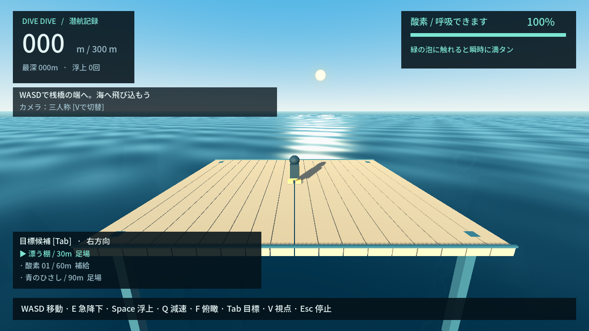
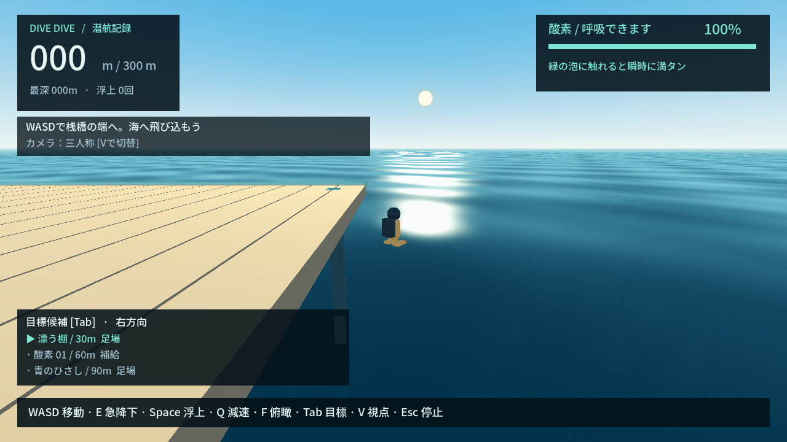
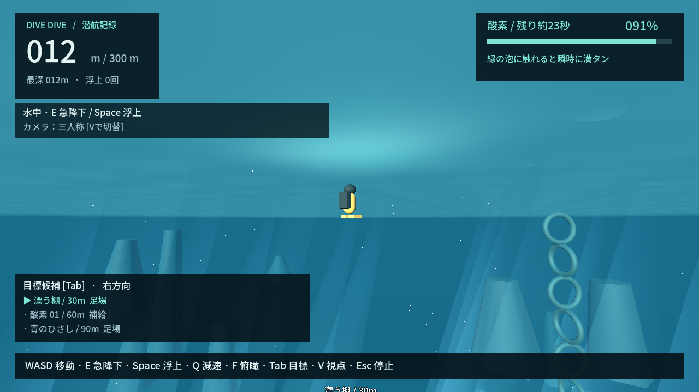
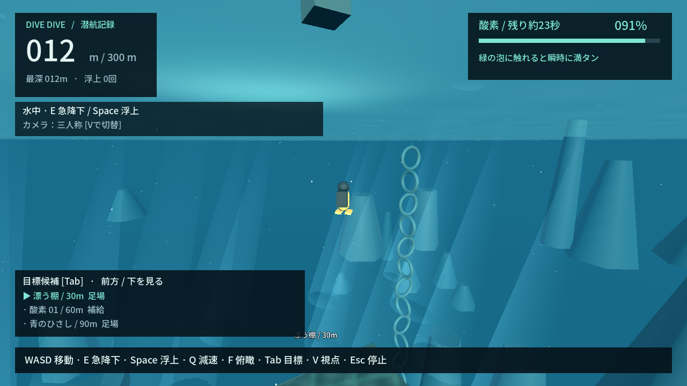
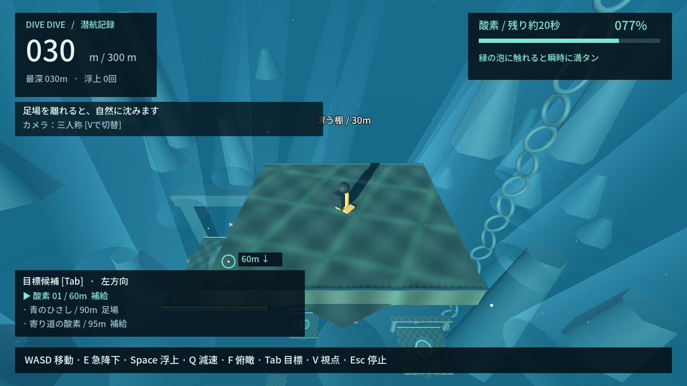
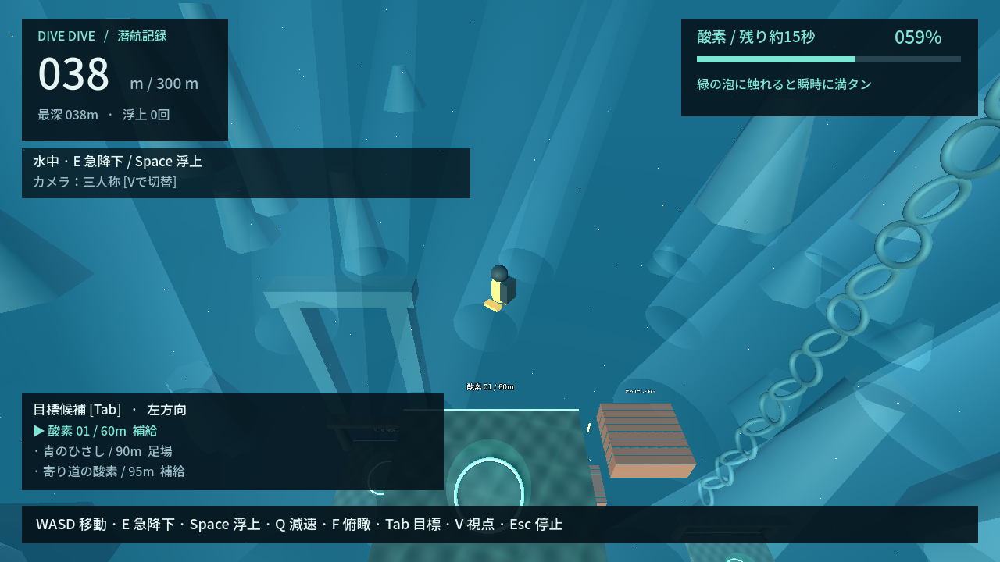
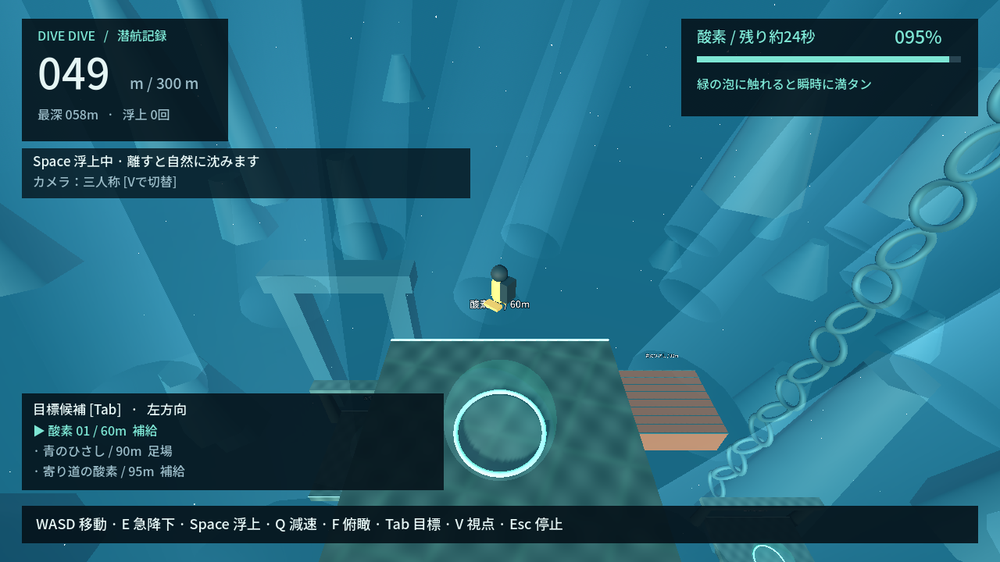
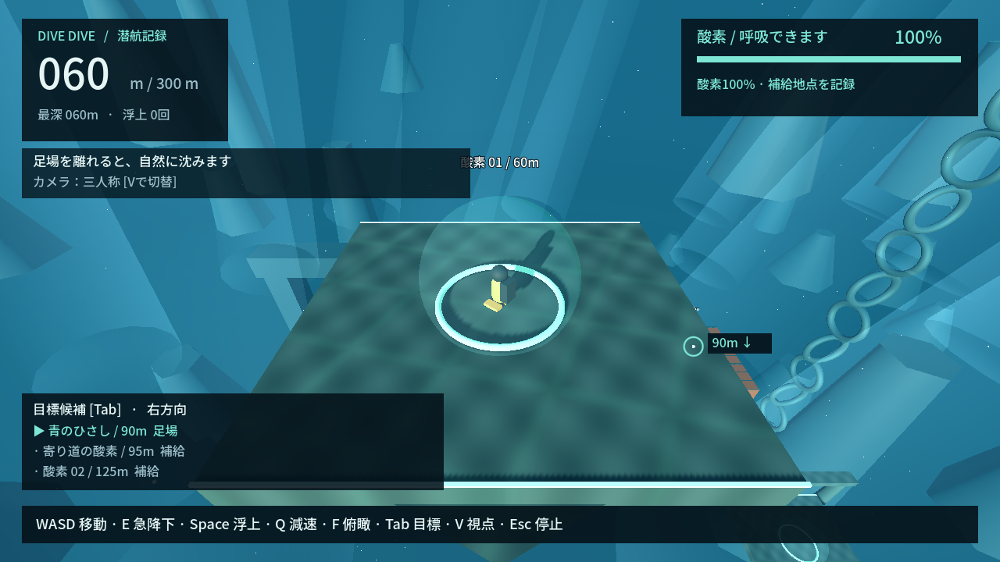
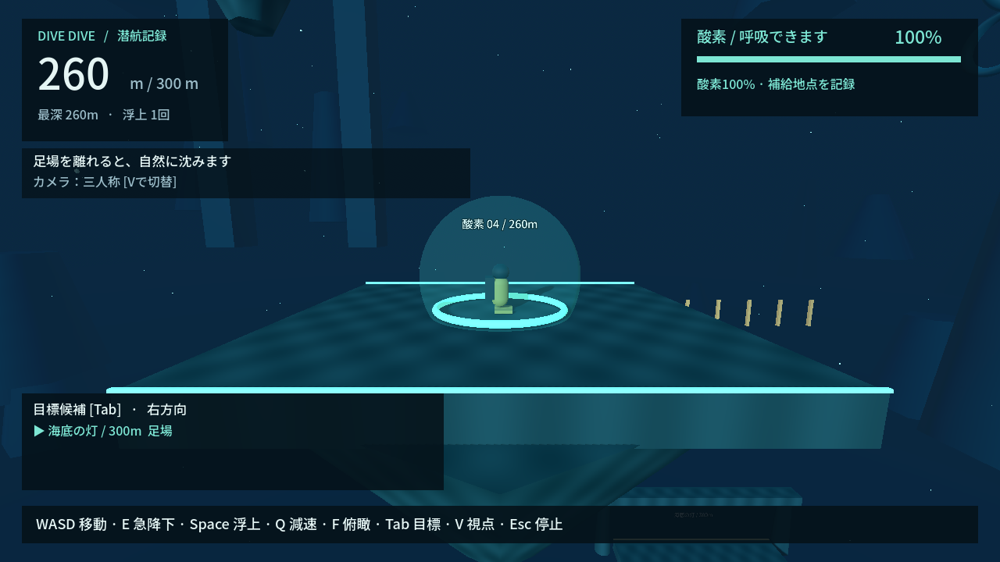

# DIVE DIVE — REVIEW PACKET

更新: 2026-09-19 / 海上開始と上下操作を含む中核レビュー。[Windows起動方法](README.md#今すぐ遊ぶwindows)。

## 現在どう遊べるか

桟橋から自分で海へ飛び込む。自然に沈みながら足場を狙い、Eで急ぐかSpaceで上へ修正するかを選ぶ。緑の泡は触れるだけで酸素満タン。酸素0でも泡で浅い地点へ戻り、同じ海で再挑戦。300mの海底の灯に着地するとクリア。

## 今回変わったこと

- Space長押しで浮上、E急降下は通常の3倍速・酸素2.5倍消費。
- 補給は接触した1フレームで100%。遊泳中でも可。待ち時間なし。
- 空と太陽の見える海上開始から、水面を越えて同一シーンで潜る。
- 浅海の光/水面反射/霧と深海の青を試作。遠景の鎖・遺跡でスケールを追加。
- 岩・遺跡・コンテナの足場と、乗ったまま横移動する155mのコンテナを追加。

## テスト・測定

**ローカル成功**: ルール274 / シーン30、3経路、自動プレイ/GPU撮影、lint、Windows release build・配布EXE起動。CI証跡は [PROJECT_STATE](PROJECT_STATE.md)。

| 項目 | 現在値 |
| --- | --- |
| 通常沈降 / E急降下 / Space浮上 | 5 / 15 / 6 m/s（最大速度） |
| 水平 / 軌道修正 | 最大7 m/s、加速度10 m/s²、足場上22 m/s² |
| 縦加速度 / Q減速 | 12 m/s² / 最大2 m/s |
| 酸素100→0 | 通常 約25秒（実測25.02）、E継続10.00秒 |
| 急降下の消費倍率 | 2.5倍（通常4、Eは10ポイント/秒） |
| 酸素回復 | 接触したフレームで100%、待機0秒 |
| 足場間の平均移動時間 | 通常経路9.72秒。下表の自動操縦条件 |
| 動くコンテナ | 横に±6m、周期約12.57秒。足場上のプレイヤーも追従 |
| 代表的な酸素切れ | 90→60m、深度30m損失、2.27秒で操作復帰 |

| 自動操作の経路 | 完走時間 | 最低酸素 | 平均区間時間 | 俯瞰の画角内・遮蔽なし |
| --- | --- | --- | --- | --- |
| 通常足場 | 87.50秒 | 24.27% | 9.72秒 | 9/9 |
| 酸素地点へ直接 | 82.33秒 | 28.33% | 16.47秒 | 5/5 |
| 95mでも補給 | 91.43秒 | 24.27% | 10.16秒 | 9/9 |

60Hzの自動操縦。通常/Qで操縦し、補給で待たない。E/Spaceは別の入力テストと連続撮影ルートで検証。速度/枯渇測定は足場のない水中のテスト条件。経路は最速保証ではなく3候補の比較、救助は代表1例で実プレイヤーの平均ではない。俯瞰は幾何判定で、読める大きさや人間の迷いは評価しない。通常視点の無遮蔽は通常経路1/9のためFと方向案内で補助する。

再現: `./dev.ps1 evaluate` → `artifacts/evaluation.json`。今回の測定を [evaluation.json](review/evaluation.json) に保存。

## 代表画面

実際のゲームシーンを入力相当で連続プレイしたviewport画像。別シーン・テレポート・画像加工による再現なし。撮影時にカメラ角度は調整。Space画像は下降の慣性で58mの補給に触れた後、49mへ浮上中なので酸素が増えている。

| 海の外の開始画面 | 海へ飛び込む瞬間 |
| --- | --- |
|  |  |
| 水面直下の光 | 広い海 |
|  |  |
| 足場上 | 足場間を自然沈降 |
|  |  |
| E急降下 | Space浮上 |
|  |  |
| 酸素スポット | 260mの深海 |
|  |  |

追加確認: [動くコンテナ](review/moving-container.png) / [酸素切れ直前](review/low-oxygen.png) / [泡で救助](review/emergency-ascent.png) / [再挑戦](review/retry.png) / [クリア・再プレイ](review/goal.png)。カメラ比較: [一人称](review/camera-first-person.png) / 上表の三人称 / [俯瞰](review/route-survey.png)。三人称は足元と着地点、俯瞰は候補全体、一人称は海中の視線に向く。V/Fで比較可能。

## Codex自身が気になる点・判定

- Spaceによる自由な修正と瞬時補給で、通常足場を飛ばしやすい。足場を使う安心感と急いで抜けるリスクが面白いかは未判断。
- 今は景観の方向を見る試作。光線・水・岩の形は簡易で、Only Up級の完成品質ではない。音/アニメーション/物理の側面衝突/低スペック性能は未対応。

**HUMAN_REVIEW**：4サイクル修正後の中核操作の節目。「上下に修正しながら足場と酸素を選ぶ遊びを、続けたくなるか」だけ人間が判断する。数値やUIの修正ごとに再承認は求めない。
