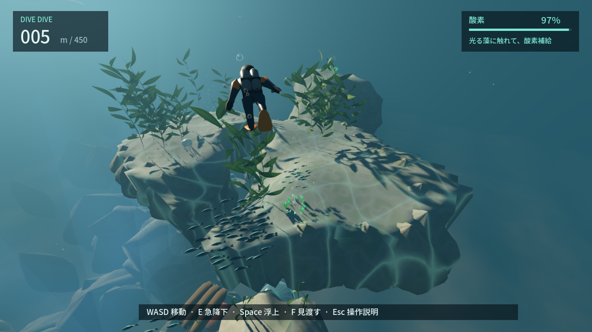

# DIVE DIVE — REVIEW PACKET

2026-09-19 / `codex/dive-dive-playground` / **CHANGES・SELF_CONTINUE**。同一Codexの自己評価。人間への再試遊依頼ではありません。

## 今どう遊べるか

海へ飛び込み、右の魚群と海藻林へ泳ぐと広い岩礁を歩けます。穴へ潜るか、縁を回るか、沖へ出るかを選べます。横の洞窟では空気の残った岸へ上がり、歩いたあと別の口から再び海へ。屋根にも着地でき、外側だけを回る道もあります。左の巨大泡と潮流、既存450m経路も残っています。

最新版は`build/windows-preview/DIVE DIVE.exe`。[起動・操作](README.md)。通常/E/Space/水平速度は5/15/6/7m/s、通常25秒/E10秒で酸素切れ。

## 変えたこと・捨てたこと

- 足場列に加え、歩ける岩礁・縦穴・二口洞窟・空気の岸を試作。
- 地形接地を足場IDと分離し、背景へ着地しても遊泳姿勢だった問題を修正。
- 板状の輪郭、巨大な草、格子状水面を改修。自然写真の観察は[AI_REVIEW](AI_REVIEW.md)へ。
- 洞窟外で無料補給できた箱判定を内部形状へ。泳ぐ/歩く境界と乾いた場所の泡を修正。
- 入水の小泡、横へ向かう魚群、細い茎と横葉の海藻を試作。

## 実画面

[岩礁歩行](review/45-reef-walking.png) / [洞窟の入口](review/46-cavern-mouth.png) / [内部の岸](review/47-air-cave.png) / [側面の抜け穴](review/54-cave-window.png) / [修正した太陽光](review/52-surface-light.png) / [別出口](review/48-other-exit.png) / [屋根](review/49-roof.png) / [GLの内部](review/compatibility/47-air-cave.png)。

[泡の上昇流](review/55-updraft.png) / [GLの上昇流](review/compatibility/55-updraft.png)。流れで上へ戻る・横へ離れる・Eで潜り抜ける操作を比較。2秒無入力でONは8.65m浮上、OFFは9m沈降。追加スポットライトは描画の筋が出るため削除。

[連続画像](review/sequence/index.html)の「岩礁→洞窟」は位置を飛ばさない実入力。屋根/外側/逆向きは別の開始地点からの比較。代表写真は同じゲームカメラで見回して撮影。

## 実測と限界

| 試走 | 結果 |
| --- | --- |
| 桟橋→岩礁→内部歩行→別出口 | 37.42秒、横方向132m |
| 藻庭→屋根 | 12.03秒、接地成功 |
| 藻庭→外側→反対口 | 通常/Eとも約18.3秒で補給。最低酸素31.73/8.33% |
| 同じ途中地点で酸素35% | 側面穴は6.58秒で補給、外側継続は8.75秒で酸素切れ |
| 逆口→内部 | 8.33秒、岸へ上がり補給 |

[測定JSON](review/playground.json)。以前の外側比較には壁の縁での足止めと異なる到達精度が混ざっていたため訂正。初見5分/楽しさ/最短経路の証明ではありません。

全check/build成功。既存ルール/音/11実経路/実衝突に、新空間96検査と入水6検査を追加。上下側面を実カプセルで60Hz/15Hz確認。Forward+/GLで新空間、Forward+で入水と配布EXEを検証。CIは[PROJECT_STATE](PROJECT_STATE.md)。

## まだ不満

太陽光の白い広がり・上向きの主人公フレーム・新しい藻の救助は修正。内部に追加した岩は浮いて見えて遊びにも弱かったため削除。洞窟の模型感、海藻林の規則性と140m以降の岩列は残る。**人間レビューへ戻さず、泡上昇流の比較と場所/現象の探索を継続。**

GitHubは最初の探索commitまで同期済み。その後のローカル改善は自動承認による追加push拒否のため未同期。[状態と許可待ち](PROJECT_STATE.md)。
