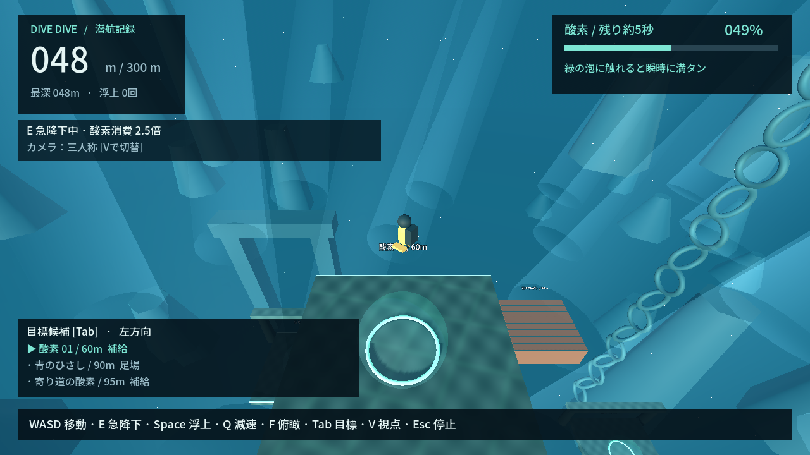

# DIVE DIVE — REVIEW PACKET

2026-09-19 / **SELF_CONTINUE** / リアル層Vertical Slice制作中。人間レビュー待ちは解除済み。

## 現在どう遊べるか

桟橋から海へ飛び込み、岩棚・海藻・流木・クラゲ・動く観測ブイをたどって300mへ。何もしなければ沈み、Eは速い代わりに酸素を多く消費。Spaceで浮上、緑の泡へ触れると即満タン。潮流に流され、クラゲは軽く反発する。酸素切れは浅い地点へ泡で救助され、同じ海で再挑戦。

[起動方法](README.md#今すぐ遊ぶwindows) / [連続プレイ32枚](review/sequence/index.html)（保存してブラウザで開く。2秒刻み、入水/足場/急降下/浮上/補給/救助。GitHubでは[画像一覧](review/sequence/)）。

## 今回変わったこと

- Forward+の体積霧・局所光、太陽/透過光/深度色。GL復帰経路を保持。
- 岸壁/自然岩/海藻/流木/クラゲ/観測ブイ、空の海から浅海への連続した景観。
- 独自メッシュの潜水服・フィン・タンクと関節姿勢。足場の曲面接地。
- 呼吸/移動/急降下/浮上/補給/救助で泡を使い分け、微粒子・植物で潮流を可視化。
- HUD整理、触手の描画最適化、連続撮影とGPU性能比較。自己レビュー5サイクル。

## 代表画面

| 場面 | 場面 | 場面 |
| --- | --- | --- |
| [海上](review/01-surface-start.png) | [飛び込み](review/02-water-entry.png) | [水面直下・太陽光](review/03-sunlight.png) |
| [広い海](review/04-open-ocean.png) | [足場上](review/05-platform.png) | [足場間の沈降](review/06-sinking.png) |
| [急降下・泡](review/07-fast-descent.png) | [Space浮上](review/08-space-ascent.png) | [酸素補給](review/09-oxygen.png) |
| [深い場所](review/10-deep-ocean.png) | [岸壁](review/11-cliff.png) | [主人公](review/12-protagonist.png) |
| [潮流・微粒子](review/13-current-particles.png) | [クラゲ](review/14-jelly.png) | [リアル層俯瞰](review/15-real-layer-overview.png) |

[酸素切れ直前](review/low-oxygen.png) → [救助](review/emergency-ascent.png) → [再挑戦](review/retry.png) → [到達](review/goal.png)。[動く観測ブイ](review/moving-container.png)。静止画では粒子の速度やアニメーションは評価できないため連続資料も参照。

## テストと実測

成功: format/lint、依存整合性、ルール381・シーン31、3経路、Windows export/headless起動、実GPU自動プレイ。Actions証跡は[STATE](PROJECT_STATE.md)。CIはGPU画質を検証しない。配布EXEの通常GPU起動と、ソース側の操作付き画面検証を区別する。

| 項目 | 実測/現在値 |
| --- | --- |
| 通常沈降 / E急降下 / Space浮上 | 5 / 15 / 6 m/s |
| 水平移動 / 水中の加速度 | 7 m/s / 10 m/s²（入力方向を変更可能） |
| 酸素満タン→0 | 通常25.02秒 / 急降下10.00秒、消費2.5倍 |
| 補給 | 接触したシミュレーションtickで100%、待ち0秒 |
| 足場間の平均移動 | 通常9.66秒 / 補給直行16.45秒 / 寄り道10.11秒 |
| 完走 | 86.93 / 82.23 / 90.95秒、最低酸素25.27%以上 |
| 救助の代表例 | 90→60m、損失30m、操作復帰2.27秒。多数プレイヤーの平均ではない |
| 潮流 / クラゲ | 中心最大1.8m/sの横流れ / 接触時4.5m/sの上向き反発 |

[測定JSON](review/evaluation.json)。自動操縦は理想的に目標へ進むため、人間の迷い・失敗率・面白さを保証しない。F俯瞰の目標は23/23。通常視点は23出発中15が画面内、直接の遮蔽なしは2/23で改善対象。

## Forward+比較

RTX 4070 SUPER / 1280×720 / MSAA 4x / VSyncなし / 12,60,155mの静止場面、各90フレーム準備＋180測定。実時間フレーム間隔でありGPU単体の処理時間ではない。

| | Forward+ | Compatibility |
| --- | --- | --- |
| 中央値（3場面） | 2.02 / 2.02 / 2.03ms | 0.98 / 1.06 / 0.92ms |
| P95最大 | 2.76ms | 1.24ms |
| 光・霧 | 体積霧/局所散乱/SSAO、補助光線 | 距離霧と近似光線 |
| 起動/自動プレイ | 成功 | 成功 |

[Forward+実測](review/render-forward_plus.json) / [GL実測](review/render-gl_compatibility.json) / [GL比較画面](review/compatibility/05-platform.png)。GL比較画像はMSAA修正・曲面接地と透過光の最終微調整前、性能JSONは最終描画構成。同じPCだけの比較で最低動作環境を確定しない。

Godotの[体積霧](https://docs.godotengine.org/en/4.7/tutorials/3d/volumetric_fog.html)はForward+向け。光と負荷の制御が可能で、今回UE5移行を要する障害は認めない。別GPU・長時間・高解像度は未確認。

## 品質評価

| 観点 | 自己評価 |
| --- | --- |
| グラフィック / 足場 | 板の連続から自然物と生物へ改善。材質反復と一部の輪郭はまだ試作的 |
| 操作感 / 視線誘導 | 全操作・曲面着地・再挑戦は成立。Fへの依存が強く、通常カメラから次足場が隠れる |
| 海の広大さ | 岸壁を片側に置き遠景/海面/水平方向を確保。遠景の密度差をさらに調整したい |
| 光 | 太陽反射・透過光・体積霧・深度変化を確認。水面近景の自然さは改善余地 |
| 泡 / 粒子 / 潮流 | 用途別の流れと、実際に流される領域。粒子の四角形と巨大化は解消 |
| 主人公 | 専用スーツ/関節動作が識別可能。泳ぎから着地の遷移は硬い |
| Godotの制約 | 低性能GPUは未確認。現時点はアート制作と配置の課題が主で、移行理由にはしない |

**動くからPASSにはしない。** 製品として見せるVertical Sliceの画質ゲートは未達。DD-032（通常視点）→DD-033（浅海アート）→DD-027（品質ゲート）を人間待ちなしで継続。
