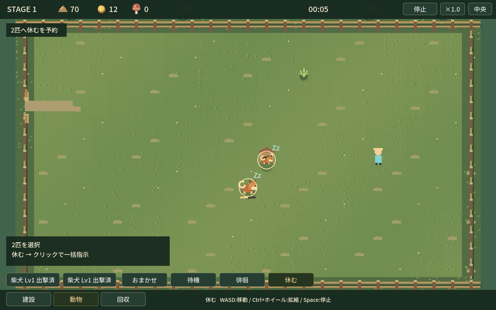

# Stage1 最新レビュー — 直接選択・一括指示・休養

- Branch: codex/sporehollow-prototype
- 対象実装SHA: e66b0b220f178574bbd9ff33e5aa669a5dfa5b68
- 比較基準: df08942（前回レビュー）/ 3c8c3ab（前回実装）
- 通常1280×800。実GPU・画面外・非フォーカス・Dummy音声。固定3枚を上書き。

## 操作の変更

盤面を直接クリックすると動物/回収/建設へ切り替わる。回収は選択枠→同じ対象を再クリック。Tab/Shift+Tabでサブ操作を選び、空き地クリックで実行。Ctrlクリックで追加/解除、Shiftドラッグで範囲選択、選択犬へ一括指示。停止中は選択と命令予約だけ。

おまかせは徘徊・警戒・戦闘・負傷時の自主休養へ判断を広げた。明示的な休むは解除まで継続し、吠え/攻撃/救出を抑制。近い空き犬小屋を予約して向かい、満員ならその場で休む。休むHP1/5秒と小屋HP1/秒は重複し、最大HPで止まる。

## 固定画面

| 画像 | 内容 |
| --- | --- |
| [placement.png](placement.png) | 主人公配置前。クリック配置すると自動開始、犬の投入は任意 |
| [combat.png](combat.png) | seed17の通常戦闘。吠える音波と敵の足止め、従来の小HUD |
| [harvest_or_build.png](harvest_or_build.png) | 複数選択から一括休む。1犬は小屋、もう1犬は外で休む。**所有柴犬2匹・襲来延期・HP20のUI検証fixture**。通常Stage1は柴犬1匹のまま |

## 検証

155回帰チェック、32seed×6条件＝192試走、Windows exportと生成exeのheadless起動が成功。実GPU入力で文脈選択、2段階回収、停止中拒否、Tab選択のみ/逆順、Ctrl追加解除、Shift範囲、停止中一括予約→再開後休養、小屋排他を確認。

休むは誘拐中にも攻撃/吠え/移動をしない。おまかせへ戻すと救出へ復帰。小屋で5秒休むとHP6、待機ならHP5、屋外休むならHP1。小屋退出/破壊時の予約解除と上限も検証。

| 条件（seed1〜32） | 防衛成功 | 運搬→救出 |
| --- | --- | --- |
| 近い正面配置 | 32/32 | 1→1 |
| 遠すぎる配置 | 0/32 | 32→0 |
| 待機から救出 | 32/32 | 32→32 |
| 遠め・無指示 | 24/32 | 32→24 |
| 同位置・待機地点指示 | 32/32 | 20→20 |
| 未出撃 | 0/32 | 32→0 |

正面の終了HP分布17×2、18×3、22×14、23×9、25×4（戦後の自主回復を含む）。攻撃各5回、非攻撃判断合計54回。接敵後初攻撃1〜4.5秒。勝率だけで面白さを合格にしない。

[stage1-observation.json](stage1-observation.json)へ実装SHA、操作検証、休養設定、AI判断/戦闘抜粋、全条件集計を更新。大量ログはartifactsへ再生成。

CI: [WHISTLE RANCH / Windows](https://github.com/shirai-masatomo/whitespace/actions/runs/37022325939) **成功**。対象SHAのcheck・192試走・Windows export・exe起動。

## 自己批評・未確定

対象クリックでカテゴリ探索を省けた。犬が小屋を隠す問題は小屋内表示を縮小して修正。重なる犬と施設は犬を優先し、屋根の露出部から小屋を選ぶため、密集時の選びやすさには改善余地がある。

犬小屋の土30/耐久12/2秒、自主休養HP50%/検索6マスは仮値。休むは安全な自動救出を捨てる判断になる。小屋配置・解除タイミングの面白さと経済バランスは未確定。新種/Stageは増やしていない。
