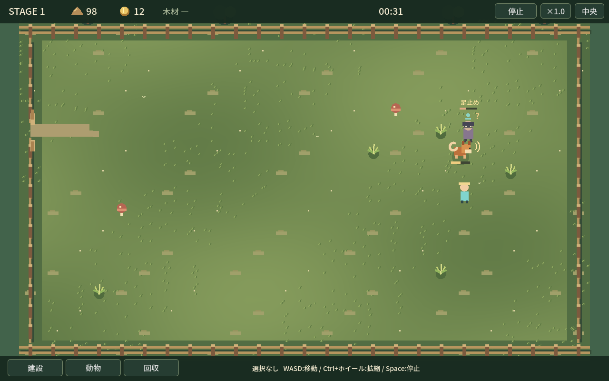

# Stage1 最新レビュー — 静かな牧場・局所演出・解体返却

- Branch: codex/sporehollow-prototype
- 対象実装SHA: 3a4f6aa70132d944c9a4ae0a8728a0f10cc2d002
- 比較基準: e66b0b2（前回実装）/ 214182e（前回レビュー）
- 通常1280×800。実GPU・画面外・非フォーカス・Dummy音声。固定3枚だけを上書き。

## 今回の変化

- 大型リングを廃止。足元の選択線、口元の短い吠え音波、局所ヒット、危険/救出の小アイコン。
- 草の色むら・一部の揺れ・少量の虫。犬の歩行/休養、主人公の呼吸、敵の足運び、施設の影、門の開閉、工事/破壊/操作の土埃。
- 自作の風/鳥と短い操作・戦闘・危険・解決音。襲来中は環境音を下げる。連打制限、3チャンネルで過密を避ける。
- 解体は建築費×残耐久割合×80%を個別切捨て。Ctrlで施設追加、建設モードShift範囲、Delete一括。選択時に返却見込み。停止/占有中は不可。
- HUDはStage/土/Gold/木材/時計/速度。木材は未導入なので「—」、キノコ数は資源ホバー。選択詳細を短文化。

## 固定画面

| 画像 | 内容 |
| --- | --- |
| [placement.png](placement.png) | 開始前の静かな草地、主人公プレビュー |
| [combat.png](combat.png) | seed17の通常戦闘。大きい吠えリングを除き犬と侵入者を見せる |
| [harvest_or_build.png](harvest_or_build.png) | 壁2つを選択してDelete見積り土12。**耐久8/8＋4/8の操作fixture**（片方のHPを4に設定） |

## 検証

166回帰、32seed×6条件＝192試走、Windows export/生成exe headless起動が成功。戦闘判断は前版と同じ結果（正面32勝、遠め無指示24勝8敗、待機地点指示32勝、未出撃32敗）。ひるみや新種/Stageは追加しない。

実GPU入力で施設Ctrl複数選択、Deleteで土12返却、停止中拒否、二重返却なしを確認。単体テストでは満耐久/半壊/重損/工事中/破壊済み/門を検証。前回の動物複数選択・休養・直接クリックも維持。

16種類の短音を非無音・16bitクリップなしで確認。操作/戦闘の実際の発火と連打抑制、環境音ループも確認。[stage1-observation.json](stage1-observation.json) の polish_checks に波形ピーク・発火回数・返却結果を収録。**実スピーカーの聴感は未評価**。

CI: [WHISTLE RANCH / Windows](https://github.com/shirai-masatomo/whitespace/actions/runs/37025223886) **成功**。対象SHAのcheck・Windows export・exe起動。

## 自己批評

草色をセル単位で強めた案は格子が目立ったので連続補間へ修正。リング撤去後は戦闘中の2体と地面を追いやすい。解体は個別/合計の見込みを確認して実行できる。

音色は仮の合成音で、自然な鳴き声の完成品質ではない。音量・反復感は聴感確認が必要。牧場の絵は簡素なまま、80%返却は準確定、小屋配置と経済の面白さは未確定。画像保存の一時ロックは一時PNGからの置換と短い再試行で対応し、重複撮影を減らした。
