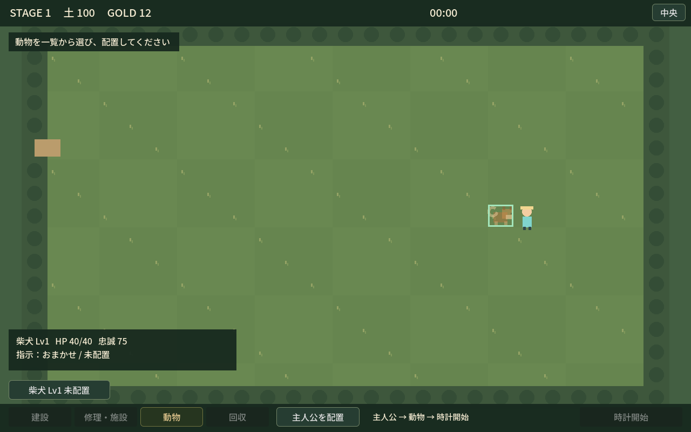
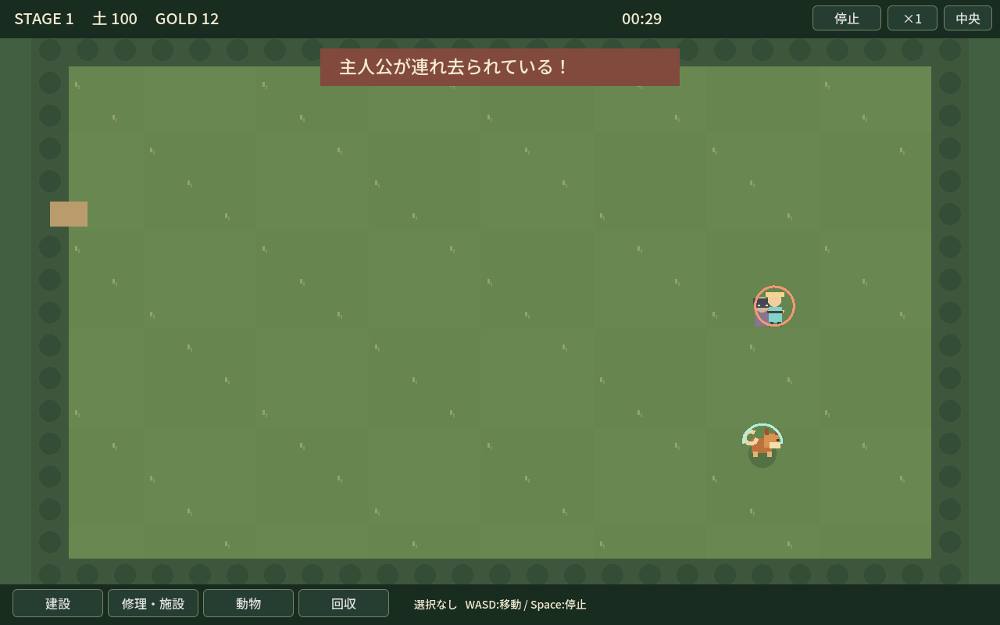

# Stage1 最新レビュー

- Branch: `codex/sporehollow-prototype`
- 対象実装: `2a2e463ba9955444b8eec28aba0a8149fbbcd433`（画像/JSONを保存する後続commitとは分けて記録）
- 通常プレイ解像度: **1280×800**。画面外・非フォーカス・無音で実GPU描画。特殊カメラなし。

## 変更

主人公→個体一覧→動物配置→時計開始に変更。犬の自動配置を廃止し、半透明プレビュー/配置可否/開始前の再配置を追加。侵攻後の配置テレポートは禁止。

大きな右パネルを撤去。盤面の投影面積は **42.5%→83.7%**（境界を含む800×544→1200×714、セル数は同じ）。上下の固定HUDは画面高の12.6%。詳細/パレットは選択中だけ表示。

ホイールは建設・修理/施設・動物・回収の4分類。WASDカメラ、Space停止、個体→命令。短い襲来/拘束/運搬/救出/低HP通知、方向警告、運搬描画、壁のヒビ/欠け/瓦礫、修理見積りを追加。

## 通常画面

| 画像 | 示すもの |
| --- | --- |
| [placement.png](placement.png) | 主人公配置済み、犬未配置、所有リストから犬を選択した半透明プレビュー。開始ボタンはまだ無効 |
| [combat.png](combat.png) | 実入力で犬・壁・門を配置した試走。正面戦闘と簡素HUD。開いた門は主人公の下 |
| [abduction.png](abduction.png) | 別の初期配置/待機指示から実際に連れ去り発生。警告、運ばれる主人公、救出本能で追う犬 |

## Stage1の数値と実測

確定値: 初襲来10秒、誘拐者1体、追加Waveなし。犬攻撃10、敵HP50/動物攻撃5/施設攻撃2。土100、壁20土/耐久8/建設1秒。施設の配置・残耐久・破壊状態を次Stageへ持ち越す。

仮値: 犬HP40、攻撃間隔1.2秒（0.25秒tickで実際は1.25秒）、救出速度1.5倍。敵反撃1.0秒/継続4秒/再反撃待ち2秒。門30土/耐久6、修理は建設費×回復耐久÷最大耐久を切り上げ、足りる分だけ回復。

| 比較・試走 | 実際の結果 |
| --- | --- |
| 正面1対1、反撃1.0秒 | 勝利、犬HP20/40。採用する仮値 |
| 正面1対1、反撃1.2秒（実効1.25秒） | 勝利、犬HP20/40 |
| 壁/門＋近い配置 | 勝利、犬HP20/40、43.5秒 |
| 主人公(3,5)、犬(23,15) | 16秒で連れ去り敗北。犬HP40でも救出が間に合わない |
| 主人公(19,8)、犬(19,13)で待機 | 28.5秒に拘束、29.25秒に運搬、36秒に救出。51秒で勝利、犬HP20 |

[stage1-observation.json](stage1-observation.json) に対象SHA、初期位置、Stage設定、数値、短い攻撃trace、イベント、施設HP、土消費、操作要約を保存。時刻は `tick × 0.25秒`。画像の戦闘・救出は異なる試走で、結果はシナリオ別に記録。

## 検証

`./dev.ps1 check` 成功: 98項目、上記5比較、Windows export、生成exeのheadless起動。`./dev.ps1 visual` 成功: 配置/再配置、4分類、PAUSE制約、個体指示、WASD後の座標選択、修理、購入/施設持越し、正面戦闘、拘束→運搬→救出。

低HP・画面外警告・損傷修理は別の制御された部品検証で描画確認。通常試走のJSONと混ぜていない。短音は実装済みだが非干渉のためDummy出力で検査し、実スピーカーの聞き取りは未確認。

CI: 対象SHAの [WHISTLE RANCH / Windows](https://github.com/shirai-masatomo/whitespace/actions/runs/37008554140) **成功**。check・Windows export・exe smoke・成果物アップロード完了。

## 自己批評・未解決

画面の中心は牧場へ戻り、正面戦闘の不利を操作連打で補う必要はなくなった。良い配置だけで守れるStage1は許容する。一方、少数施設による戦術の幅と戦闘/目的アイコンの直感性はまだ試作。草地・人物・犬の絵は仮品質で、今回の改善を完成アートとは扱わない。Stage2全体の新バランス、Lv5上限は今回の対象外。

固定ファイルを上書きし、過去版はGit履歴で参照する。build/動画/大量フレームはこのフォルダへ入れない。
