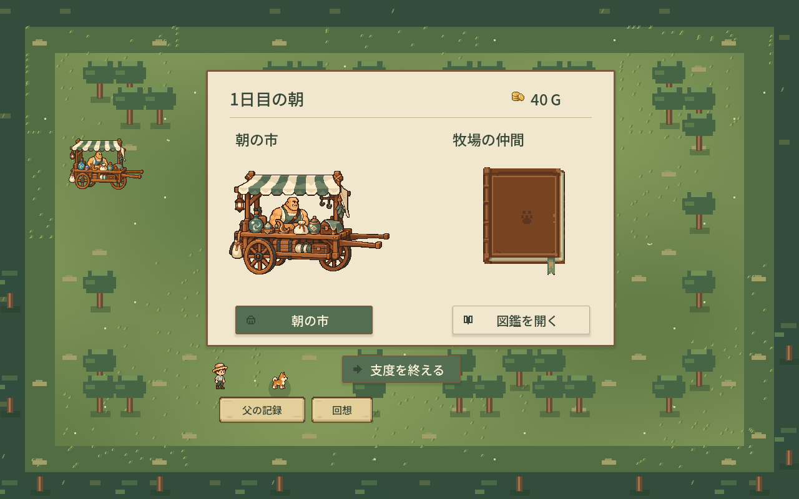
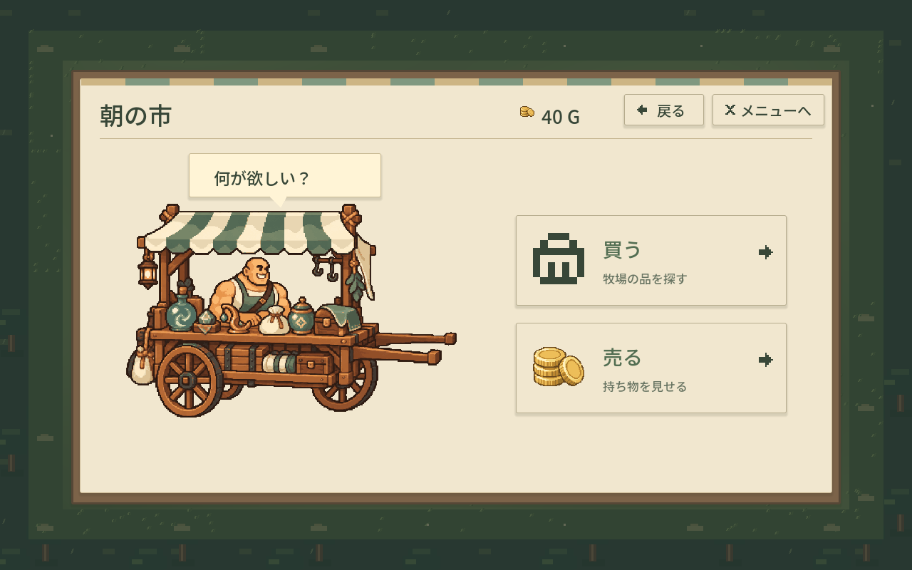
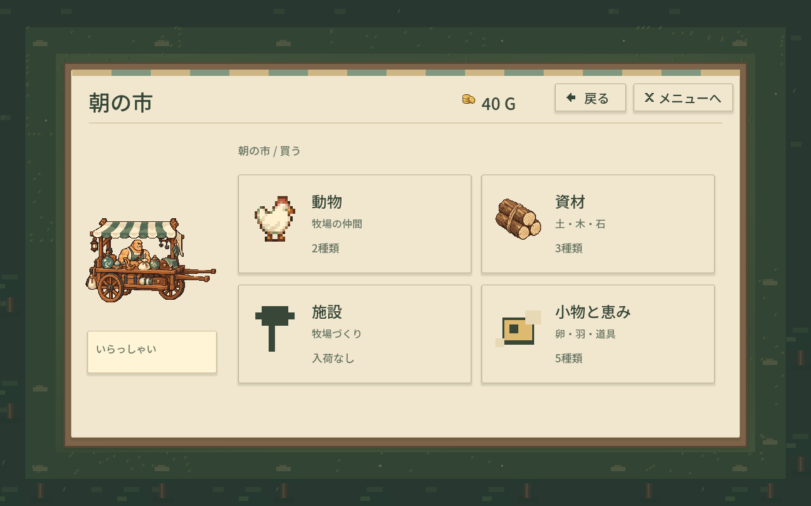
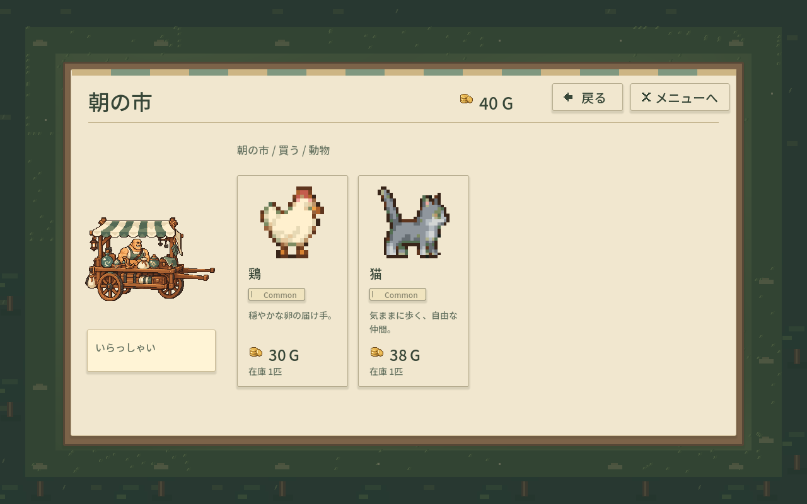
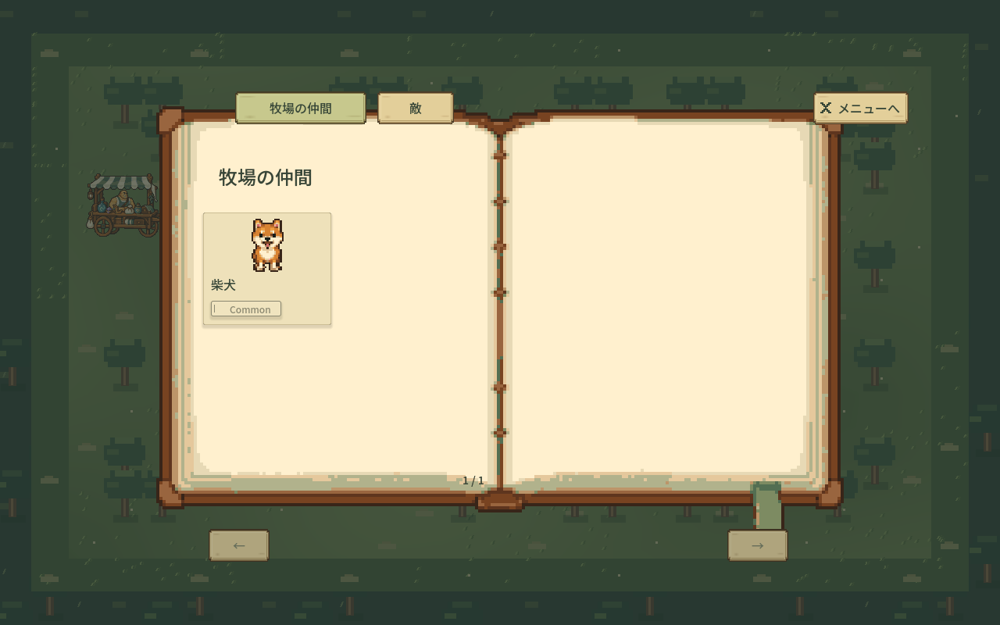
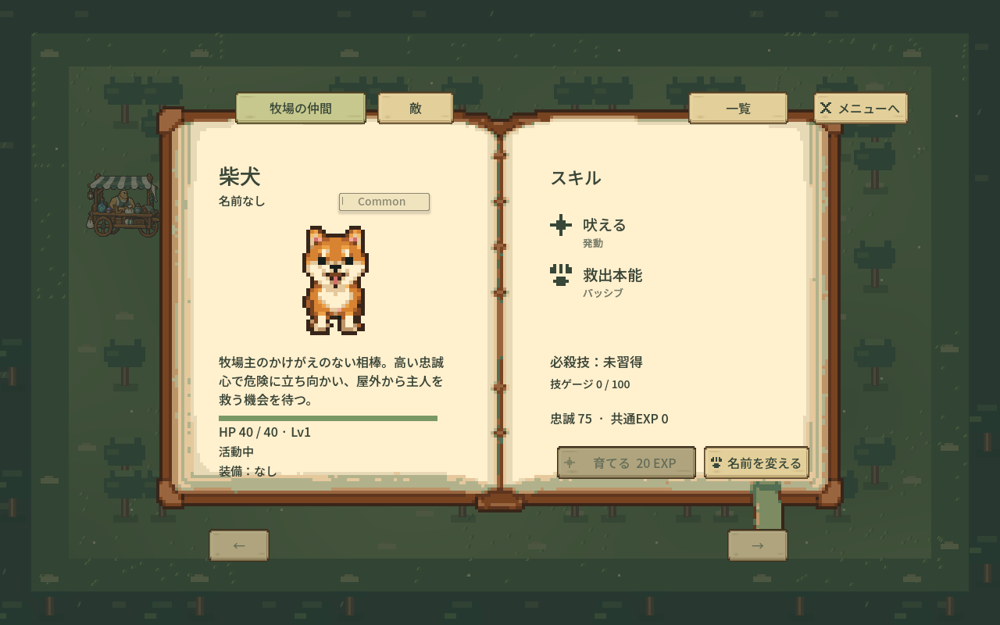
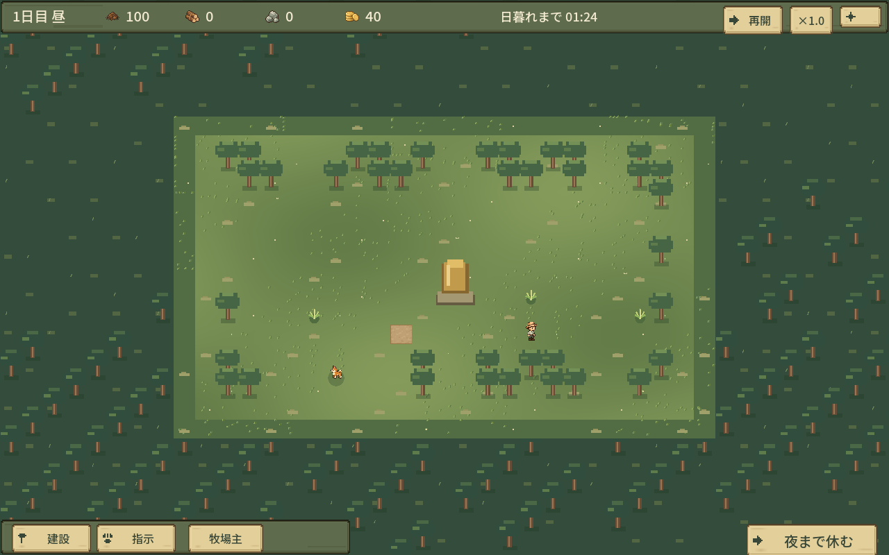
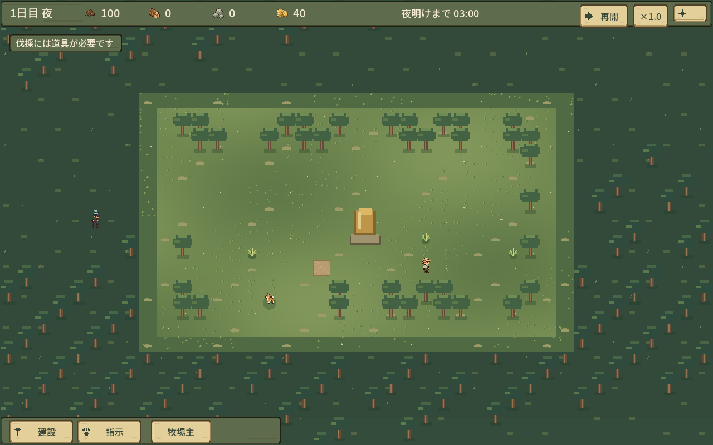
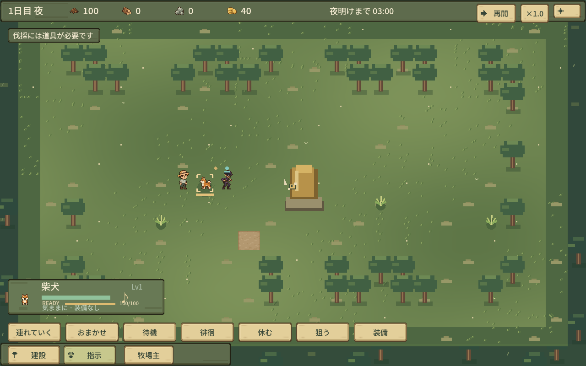
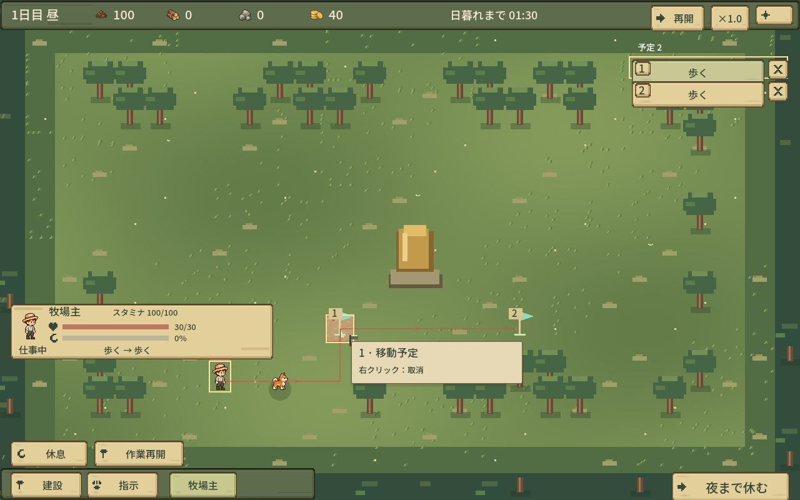

# 代表画面（実装30207f2 / 素材5ac00e7）

1280×800、隔離GPU。01〜06は初日40G。07以降は制御した盤面/時間/位置、09はゲージ・スタミナも設定した表示確認。各状態はui-revision.json。

## 朝の入口

## 商人の入口

## 商品カテゴリ

## 動物商品

## 図鑑一覧

## 柴犬の詳細

## 最大縮小の森

## 森から歩く敵

## 個体READY（制御フィクスチャ）

## 移動Job・旗・経路・取消hover

