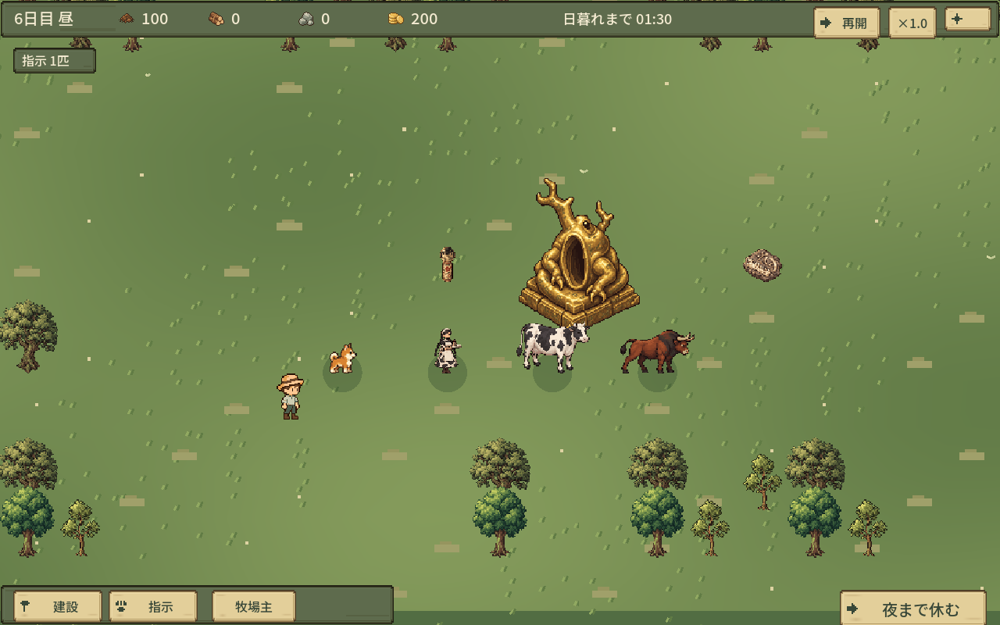
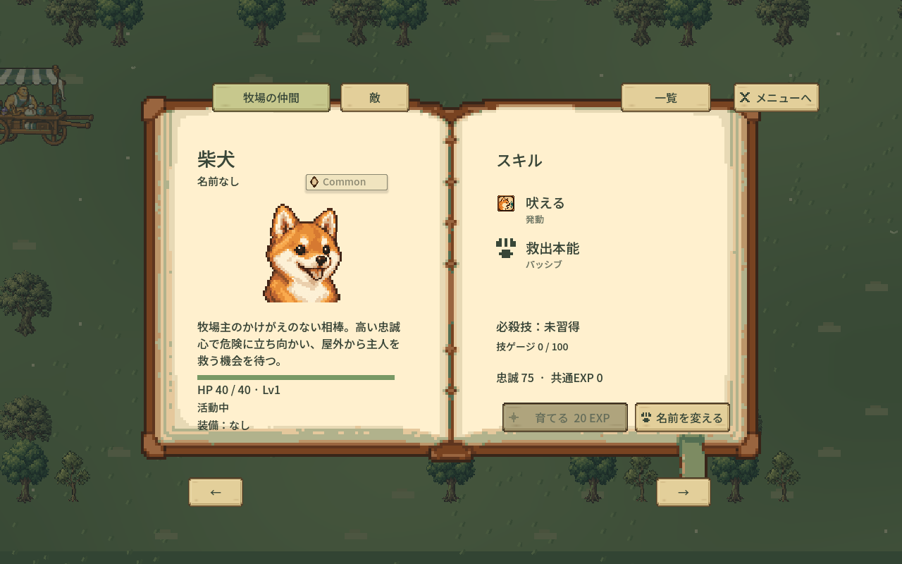
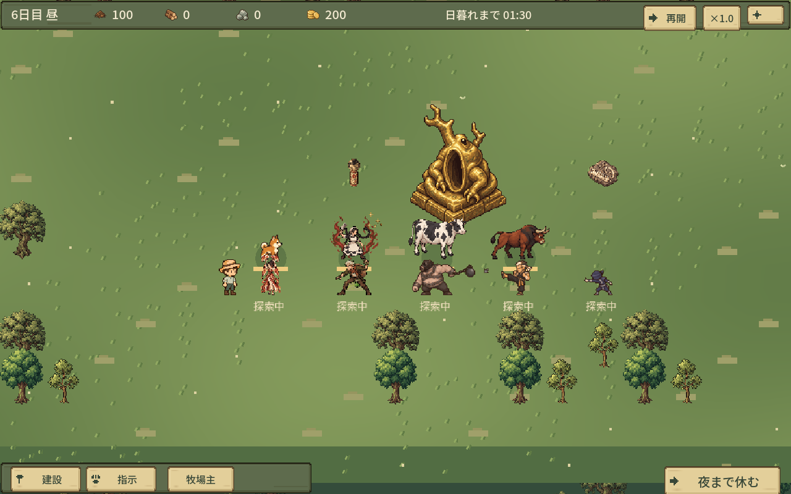

# 採用画像と新キャラクター — 代表3画面

実装 `f6a60ee525cbe63d962a06280a7d7a9533d69d66` / 素材 `a34390e584037cef78c9f49dcec4b18bd44f6f3d`。全画像1280×800、現在のゲーム描画、非対話GPU。day6/500Gの制御条件で、通常の数日プレイ到達画像とは区別する。

## 仲間・森・配置物

通常取引でメイド/乳牛/闘牛を迎え、マウス入力で搾乳・設置・突撃の予約を確認後に撮影。盤面の配置物は描画確認用に置いたもの。

## 図鑑Portrait・レアリティ・スキル

本の既存詳細表示へ採用画像を接続。文章・数値は動的表示。

## 戦闘キーポーズ・正式モーション

メイド激ギレ、舞姫、盗賊、鉄球予備動作、武闘家の蹴り、忍者の手裏剣。表示契機を制御したフィクスチャであり、自然戦闘の一場面ではない。実戦処理はranch_contentほかの回帰ログを参照。

