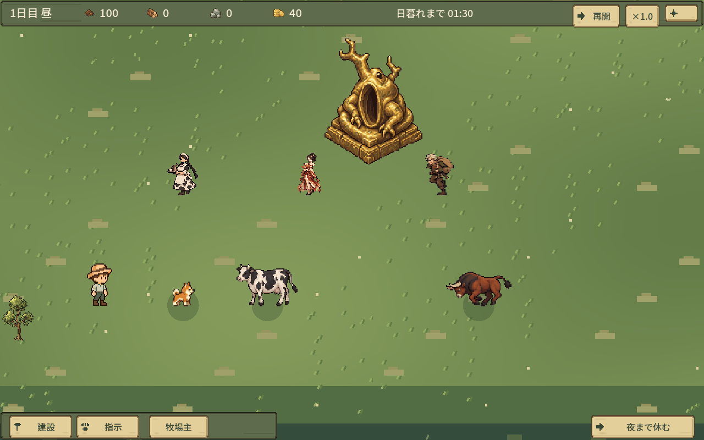
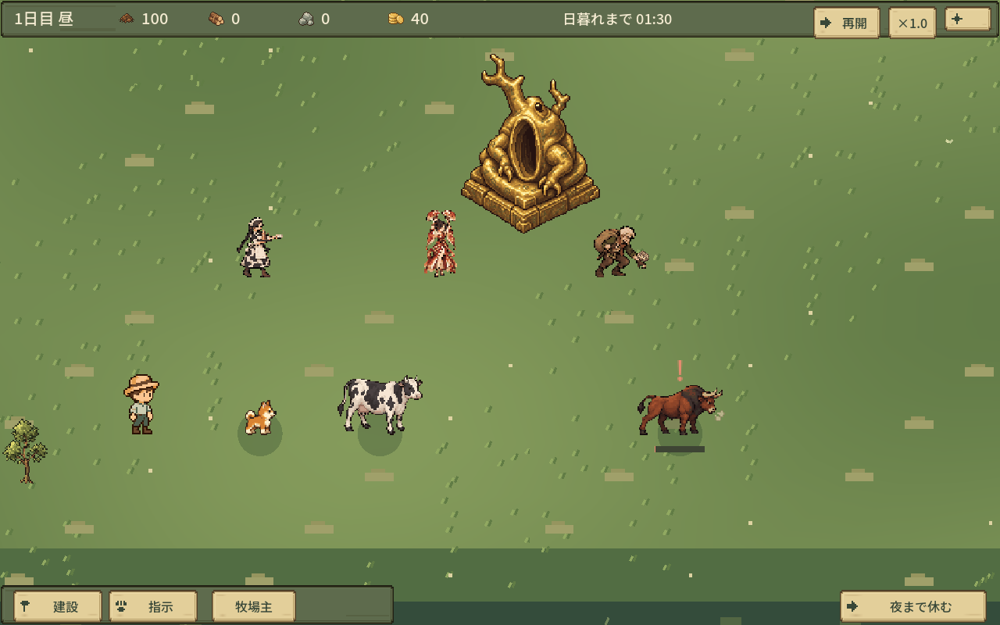
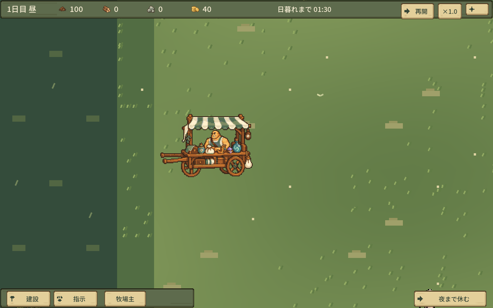

# 追加素材の取り込み確認

実装8b06e28、素材b0e917a11f205190dde0136165a72c189f39e275。起動は[Play.cmd](../../Play.cmd)、ESCの版表示8b06e28。[ビルド対応](build.json)。後続文書コミットはゲームを変更しない。

商人・荷車/メイド/舞姫/盗賊/乳牛/闘牛の正式左右モーション320PNGを無改変で取り込み。実参照とハッシュは[receipt](../../game/six_motion_receipt.json)、各状態の接続は[ART_SPEC](../../ART_SPEC.md)。素材ブランチの古いゲームコードは取り込んでいない。

素材納品済み → ゲーム取り込み済み → 関連状態遷移/隔離描画確認済み。次は人間試遊。

## 確認範囲

- six_motion 422検査：全PNG読み込み、非ループ終端保持、左右移動→左停止、PAUSE、配膳→回転→待機、激ギレ開始/攻撃/終了、倒れ/復帰、搾乳開始/保持/終了、突撃開始/終了。
- 既存ranch_content 93、quality 80、quality_ui 19を接続時に確認。最終実装SHAでsix_motion 422とranch_content_ui 19、Windows export/headless起動を再確認。
- 同じ実装SHAを非対話GPUで422検査・3PNG。PNGは状態を指定した実ゲーム描画で、通常戦闘を長時間観察した動画ではない。[入力・検査](observations.json)、[隔離監査](isolation.json)。
- 足元・等比・左右素材・盗品前後レイヤー・荷車の向きを確認。ゲームの移動速度、ダメージ、回復、衝突を変更していない。Coffeeログへ所属情報だけ追加し、敵/味方の同じIDを混同しない。
- 大量撮影・AI192・review/currentの更新はなし。通常デスクトップ/通常セーブへ干渉せず、ゲームを自動起動していない。

## 代表画像

## 未使用・未確認

商人単体walkは納品・読み込み済みだが、単体で歩くゲーム場面はないため未接続。商人入り荷車に重ねて二人にしない。市場精細版は納品指定どおり既存cart_ui_detail_v1を維持。

正面/背面・専用Portrait・前回記録の不足Skill Iconは今回の納品対象外。全動作を人間が通常プレイで確認したとは扱わない。納品プレビュー/GIFは比較用で、上記PNGは今回のゲーム描画。

元HANDOFFから参照される制作原本は[素材ブランチの制作記録](https://github.com/shirai-masatomo/whitespace/tree/b0e917a11f205190dde0136165a72c189f39e275/projects/sporehollow/art-production/six-characters-motion-v1)で保持。制作途中ファイルを実装へ大量複製していない。
